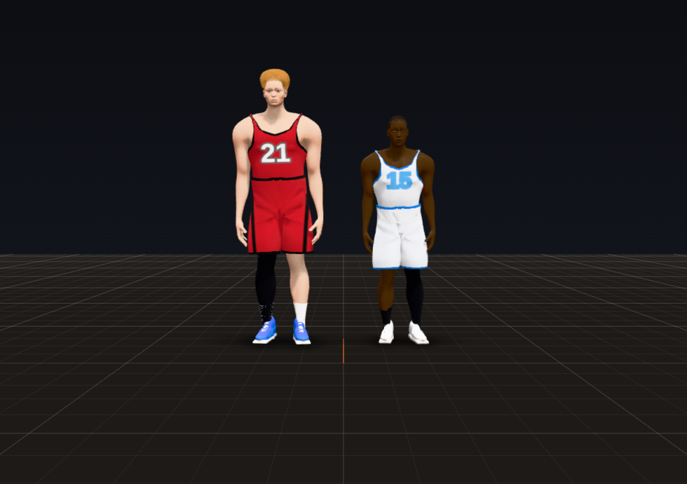
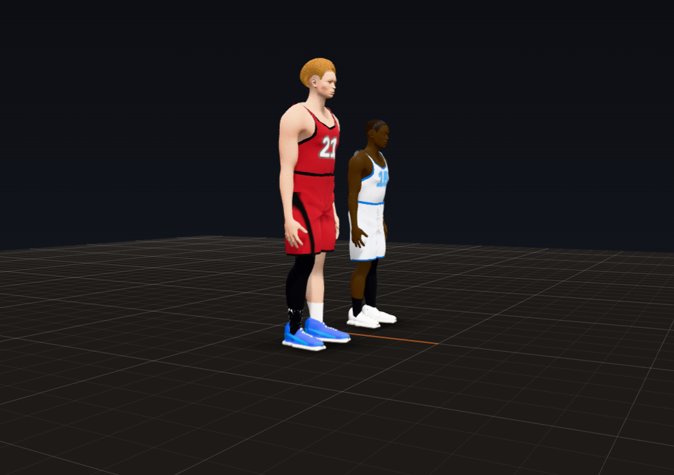
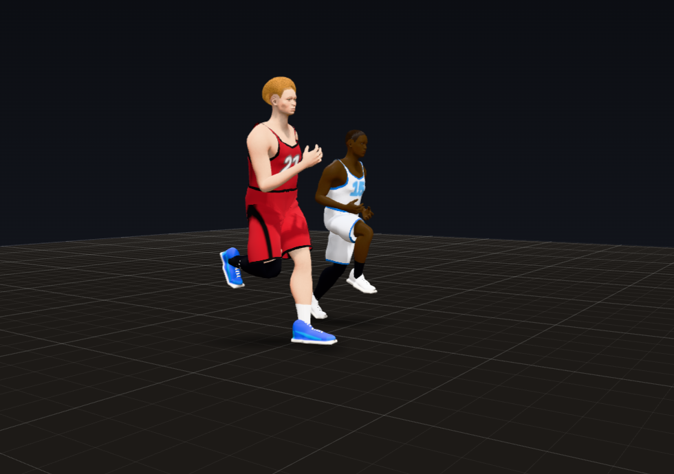

# Trial 2: The Body

**Result: PASS.** In two full quarters (seeds 7 and 21, plus a women's league quarter) the final pose never passed a
human joint range: 0 frames, down from 0.73% and 0.80% of player-frames. A 6'1" guard and a 7'1" center are now built
differently and move like their size. Every bend and twist of the trunk is shared through the spine, and spine and
neck pops fell from 82 to 6 per player-minute.

## How to see it

- **Animation Lab** (`lab.html`): the scenario "Two sizes side by side (stand, then run together)" with the two Height
  sliders (the second slider is new). They stand, then run at the same speed.
- **Debug tools** (Shift+D, in `match_test.html` or the live game):
  - the J layer adds an orange ring on any knee pointing more than 25 degrees off its foot ("knee in" means caving in);
  - the panel shows the selected player's knees against his toes, his height and wingspan, and how his twist and bend
    are split between pelvis, lumbar and thoracic spine.
- **Headless:** `node tools/audit/quarter.js --seed 7` prints the scorecard with a new `body` block (knees over toes,
  counter-rotation, spine sharing, spine pops, cadence by height, the planted-leg guard at work).

## A. What changed

- **`js/match/tune.js`** gets five new groups (every value named, with its source):
  - `body`: proportions by height and wingspan;
  - `limits`: the joint ranges, moved out of the code, plus each spine and neck joint on its own, the weight-bearing
    ankle range and the soft end zone;
  - `spine`: how the lumbar and thoracic joints share a bend, and a finer inertialization of the spine;
  - `look`: how fast the head turns to a target;
  - `hipGuard`: the planted-leg guard.
  - The `debug` group gets the thresholds of the new meters.
- **`js/match/rig.js`**
  - `makeDims(look, kind)` builds each body from its height and wingspan:
    - legs +3.5% per foot of height (taller people are relatively longer legged);
    - head size relative to height `(H / 6.5 ft) ^ -0.55` (the law the 3D mesh already used);
    - the trunk takes what is left, so the head top stays at the same share of height;
    - arms from the player's wingspan (half the difference from a 1.05 H wingspan goes into each arm);
    - officials get an ordinary person's wingspan.
  - Joint ranges come from `Tune.limits`. The spine and neck joints each have their own range. They ease into the end
    of it (a smooth tanh end zone, no dead stop) instead of stopping in one frame.
  - A planted leg is solved with a knee pole: the knee bulges the way the foot points (knee over the toes). If the
    hip cannot twist that far, the knee points as close to the toes as the hip allows.
  - A foot in the air stays inside the ankle's range against its shank (pitch and turn).
  - Inertialization now carries the velocity through a pose jump as well as the position, so a pose change no longer
    kinks the motion.
- **`js/match/human.js`**: the 3D mesh's trunk is moved to the rig's new hip, chest and neck heights (no change for a
  6'6" reference body).
- **`js/match/actor.js`**
  - **Spine chain:** whatever the layers ask for, the lumbar and thoracic joints share it the way a spine does. A twist
    is mostly thoracic (the lumbar spine turns ~9 degrees at most). A forward bend is a little more lumbar.
  - **Head turns:** the head turns to a new look target at a human pace (a critically damped spring behind a short
    lag), and lets go the same way. Before, it snapped there in one frame.
  - **Planted-leg guard:** a planted hip never passes its range.
    - The pelvis goes over the foot instead: the weight shifts over it, just enough, and eases back after.
    - A planted ankle past its weight-bearing range raises the heel about the ball of the foot, or lifts the toes
      about the heel.
    - A foot the body has run away from steps now, even with the other foot still in the air (a quick skip).
    - The pelvis comes down if a planted leg could no longer reach its foot.
    - The last resort, when the pelvis is already held back as far as it goes: the hip stops at its limit and the foot
      slips (counted: 56 to 67 times a quarter).
  - A swinging foot never goes through the floor: its ankle comes up by the depth, and only that leg is solved again.
  - The pose now records the real ankle angle of a foot set by the floor or by its steering, so the joint limit meter
    checks what is really drawn.
- **`js/match/debug.js`**: body meters (knees over toes, hip and shoulder counter-rotation, spine sharing, spine and
  neck pops, cadence by height, planted-leg guard activity). A planted ankle is checked against its weight-bearing range.
- **`js/lab/lab.js`**: the "Two sizes side by side" scenario, a second Height slider, and Lab players keep the
  wingspan-to-height gap of the real player they are drawn from.
- The wingspan now reaches the body from the engine's players: `js/ui/live.js`, `match_test.html`,
  `tools/audit/load.js`. Mock players get wingspans (`js/match/mock.js`), and the 3D mesh cache key includes the wingspan
  (`js/match/gl3d.js`).
- **`tools/audit/check.js`**: 20 new known-answer checks, 44 in all.

## B. Scorecard

| Criterion | Grade | Evidence |
|---|---|---|
| Knees and elbows bend one way only, no hyperextension | PASS | knee range 0 to 152, elbow 0 to 150 checked every frame on the final pose; 0 violations in three quarters; the Trial 1 known-answer checks (knee at 160 warns, bent back 8 warns, elbow hyperextended warns) still pass |
| Realistic hip, shoulder, spine, neck and wrist ranges | PASS | AAOS ranges per joint; each spine and neck joint has its own range (lumbar twist 10 each way, from MRI data); planted ankles are checked at their real angle against the weight-bearing range; 0 violations |
| Proportions scale by height and wingspan | PASS | images below; a 7'1" center has legs at 54.1% of his height against 52.2% for a 6'1" guard and a head at 9.4% against 10.2%; 8 in more wingspan gives exactly 8.0 in more T-pose span |
| Spine as a chain (lower, mid, upper) | PASS | twists with one joint carrying over 90%: 53% of twists before, 0% after; a twist is split pelvis / lumbar ~20% / thoracic ~80% |
| Pelvis and shoulders counter-rotate while running | PASS | hip and shoulder-line yaw about the run: correlation -0.74 and -0.75, opposite ways in 86% of frames; hips swing 8.6 degrees each way (p90), shoulders 12.5 (running studies: pelvis and thorax in anti-phase) |
| Knees track over the toes, no caving in | PASS | knee against toe line on planted bent legs: p90 11.3 degrees before, 2.5 after; caving in (over 20 degrees inside) 0.26% before, 0.16% after |
| **PASS when:** the joint limit warning never fires in a full quarter | **PASS** | 0 frames in seed 7, 0 in seed 21, 0 in the women's quarter (before: 4,364 and 5,004 frames) |
| **PASS when:** a tall and a short player look right and move like their size | **PASS** | images; at 14 ft/s the 7'1" center takes 2.81 steps per second and the 6'1" guard 3.03, a ratio of 0.927, exactly the square root of their heights' ratio (leg length scaling); 10.97 ft strides against 10.17 |
| **PASS when:** the torso bends and twists through the spine smoothly | **PASS** | spine and neck pops (a joint's rate jumping over 12,000 deg/s^2 in one step): 81.8 and 84.0 per player-minute before, 5.6 and 6.6 after; the worst spine acceleration fell from 286,000 to 36,500 deg/s^2 |

`node tools/audit/check.js`: 44/44 checks passed (the 24 from Trial 1 and 20 new ones: proportions, soft limits, the
spine chain, the hip guard, the knee meter, feet kept out of the floor).

### Two sizes (the rig, standing tall)

| | 6'1" guard | 6'6" reference | 7'1" center | Real people |
|---|---|---|---|---|
| Legs (hip joint to floor) / height | 52.2% | 53.0% | 54.1% | taller adults have relatively longer legs |
| Head top above the head joint / height | 10.2% | 9.8% | 9.35% | head size is nearly the same across heights |
| Fingertips hanging, from the floor | 26.4 in (36.2% of height) | 28.5 in | 31.5 in (37.1%) | ~37-38% of height, lower with long arms |
| Standing reach | 7'9" | 8'4" | 9'1.5" | NBA combine: ~8'0", ~8'7", ~9'3" (1 to 4 in short, see E) |
| Steps per second at 14 ft/s | 3.03 | 2.97 | 2.81 | leg length scaling predicts 0.927 between the two ends; measured 0.927 |

(Wingspans 6'4.5", 6'9.9" and 7'5.5": the reference arms stand for a 1.05 H wingspan, and each player's arms follow
his own.)

## C. Devil's advocate

1. **"The 7-footer is just a stretched guard."**
   - Before: every body was the same shape scaled by height, with the same leg share, the same head share and a
     1.096 H wingspan for every man.
   - Fixed: legs grow 3.5% per foot of height, heads shrink relative to height, and each player's arms follow his own
     wingspan. The 3D mesh's trunk follows the skeleton.
   - The big man now takes fewer, longer strides at the same speed (2.81 against 3.03 steps per second).
2. **"The torso turns like one block and the head snaps to the ball."**
   - Before: in 53% of twists one spine joint carried over 90% of it. The head turned to a new target in one frame.
     There were 82 spine or neck pops per player-minute, the worst at 286,000 deg/s^2.
   - Fixed:
     - the spine shares every bend and twist, with the thoracic spine taking most of a twist, as a real one does;
     - spine and neck joints ease into the end of their range;
     - the head turns at a human pace;
     - a finer inertialization carries the motion's velocity through pose changes.
   - What is left (6 per player-minute) is mostly the head tracking the ball at the end of its turn range. Trial 13's
     gaze will turn the body instead.
3. **"In a fast defensive slide his legs split wider than a human can, and in his stance his knees point out like a
   cowboy's."**
   - Before: planted hips passed their range in 0.73% of player-frames (up to 70 degrees of adduction), and in the
     defensive stance the knees pointed 13 degrees outside the feet.
   - Fixed: knees are solved over the toes (in the defensive stance now 0.5 to 1.9 degrees off). The planted-leg guard
     keeps every hip in range: the weight goes over the foot, a heel rises or the toes lift, and a foot the body has
     run away from steps. Swinging feet hang from the ankle inside its range.

## D. Regression check (Trial 1)

- All 24 Trial 1 checks pass. One was rewritten: the floor-penetration known-answer test used to make a swinging foot
  dig into the floor, which the animation no longer allows. It now places the toes 3.00 in below the floor directly and
  still reads 3.00 in.
- Determinism: 1500/1500 steps identical at 1x, 0.25x, 0.1x, 144 Hz and a jittery frame rate.
- Browser: every tool toggles on and off during the engine game, speeds step exactly (6/15/30/60 steps per 60
  frames), rewind returns to the identical frame, orbit and isolate work, and Shift+D opens and closes; no page errors.
- Cost: a whole simulation step (engine, director, 13 bodies) is 1.39 ms p50 and 3.3 ms p99 in a single process. The
  new body steps add about 0.1 ms per step.
- The Trial 1 baseline, before and after (files in `docs/gauntlet/baseline/trial02_*.json`):

| Metric | Seed 7 before | Seed 7 after | Seed 21 before | Seed 21 after |
|---|---|---|---|---|
| Final pose past a human joint limit | 0.73% | **0** | 0.80% | **0** |
| Foot points below the floor (per 100 player-frames) | 9.06 | **0.70** | 9.49 | **0.85** |
| Planted feet floating | 0.34% | 0.16% | 0.36% | 0.13% |
| Joint pops (per player-minute) | 407 | 390 | 426 | 415 |
| Body acceleration snaps (per player-minute) | 36.6 | 34.7 | 35.0 | 35.1 |
| Foot contacts sliding over 0.83 in | 6.28% | 6.59% | 6.55% | 6.64% |
| Ball of the foot p99 slide | 0.17 in | 0.12 in | 0.16 in | 0.12 in |
| Catch gap p90 | 10.8 in | 10.2 in | 15.6 in | 12.2 in |
| Hold / shot / pass gap p90 | 3.9 / 7.0 / 12.2 in | 3.6 / 6.9 / 12.0 in | 4.1 / 7.6 / 12.2 in | 3.7 / 7.8 / 12.8 in |
| Torso overlaps (pair-frames) / hands in another body | 128 / 3,168 | 191 / 3,309 | 287 / 2,767 | 351 / 3,152 |

- Two numbers moved the wrong way, and they are named here rather than hidden:
  - **Foot slides over 0.83 in:** +0.3 and +0.1 points. That is within the spread between the two seeds (0.3 points).
    The cause mix is unchanged: flat-footed swivels of planted feet (Trial 3's target), plus the last-resort slips
    above (56 to 67 a quarter).
  - **Torso overlaps and hands inside another body:** up in both seeds. Players with long wingspans now really have
    longer arms, and the choreography does not know yet. Body-to-body contact is Trial 7 and 15 work.

## E. What to watch for

- In the Lab, pick "Two sizes side by side", set Height to 6'1" and the second Height to 7'1", and play at 0.25x:
  - standing: the center's legs, head and arms against the guard's;
  - running: the center's longer, slower strides.
- In a game, press Shift+D, click a defender and watch him slide at 0.25x:
  - no red rings (J);
  - knees over the toes (an orange ring means over 25 degrees off);
  - the pelvis stays over the planted foot.
- When the ball swings side to side, watch a player's head. It turns over about a third of a second instead of snapping.
- Still to come:
  - The pelvis is held back over a planted foot in about 6% of player-frames (p90 5 in, p99 12 in). That happens when
    the feet fall behind a fast slide or cut. Trial 3's foot placement should make the feet keep up.
  - Standing reach is 1 to 4 in short of NBA combine numbers (Trial 11: rim-level reaches).
  - The neck reaches the end of its turn in about 3% of frames (Trial 13: the gaze turns the body).
  - Jump height still grows with body height (Trial 4: real gravity and vertical leap).

## Sources

- Fujii et al., "Kinematics of the lumbar spine in trunk rotation: in vivo three-dimensional analysis using MRI" (lumbar
  rotation ~1.2-1.7 degrees per level): https://pmc.ncbi.nlm.nih.gov/articles/PMC2223353/
- Biomechanics of the spine, range of motion by region (thoracic ~30-35 degrees each way):
  https://www.anatomystandard.com/biomechanics/spine/rom-of-spine.html
- Weight-bearing lunge test norms (~41 degrees of tibial inclination in college-aged adults, up to ~50):
  https://www.physio-pedia.com/Knee_to_Wall_Test and
  https://journals.healio.com/doi/10.3928/19425864-20140501-01
- Thorax and pelvis rotation coordination in gait and running (anti-phase as speed rises):
  https://pmc.ncbi.nlm.nih.gov/articles/PMC6355803/ and
  https://www.sciencedirect.com/science/article/abs/pii/S0167945715300646
- Sitting height and leg length in adults (legs carry most of the height difference):
  https://pubmed.ncbi.nlm.nih.gov/23301801
- Basketball anthropometry by position (centers' longer limbs and arm span):
  https://www.frontiersin.org/journals/psychology/articles/10.3389/fpsyg.2019.02359/full
