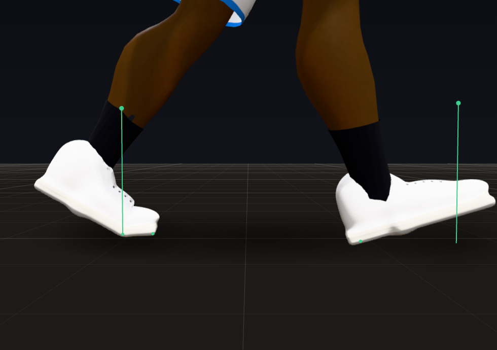
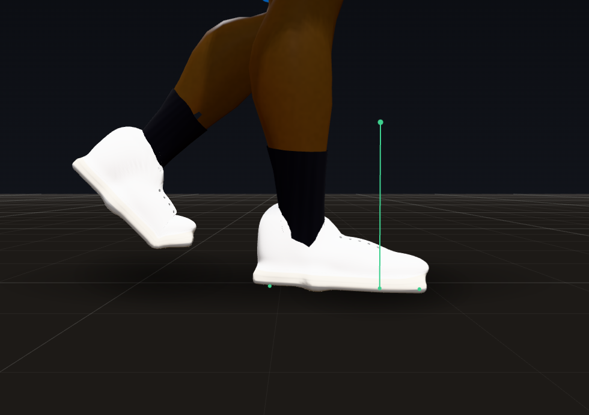
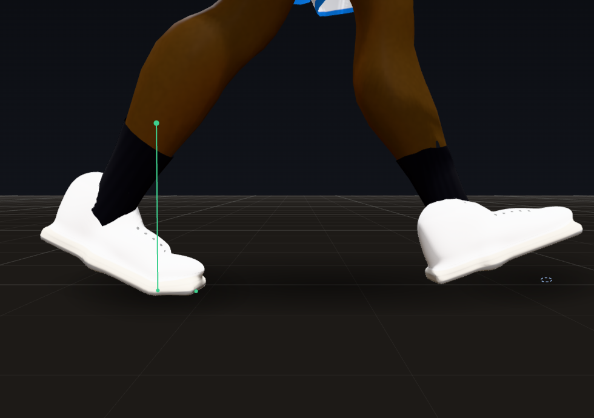
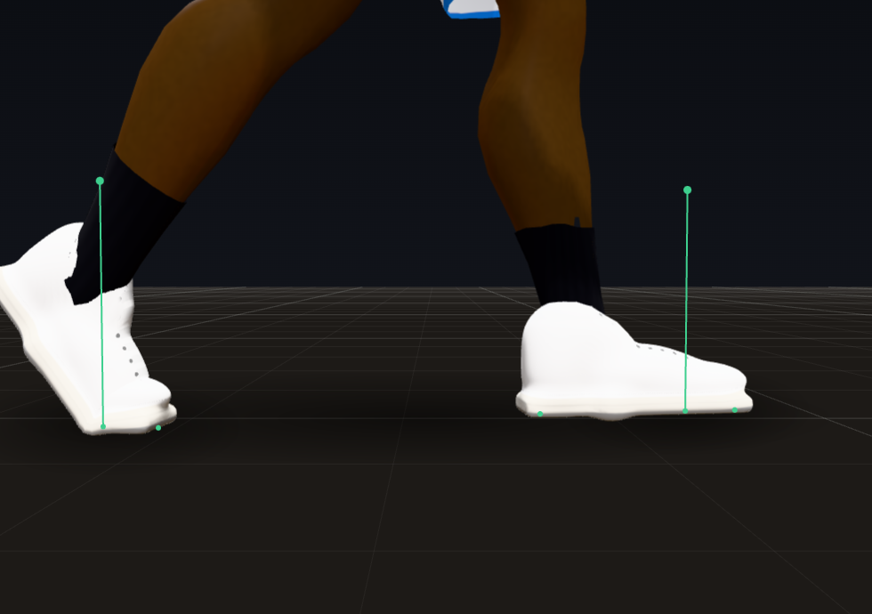
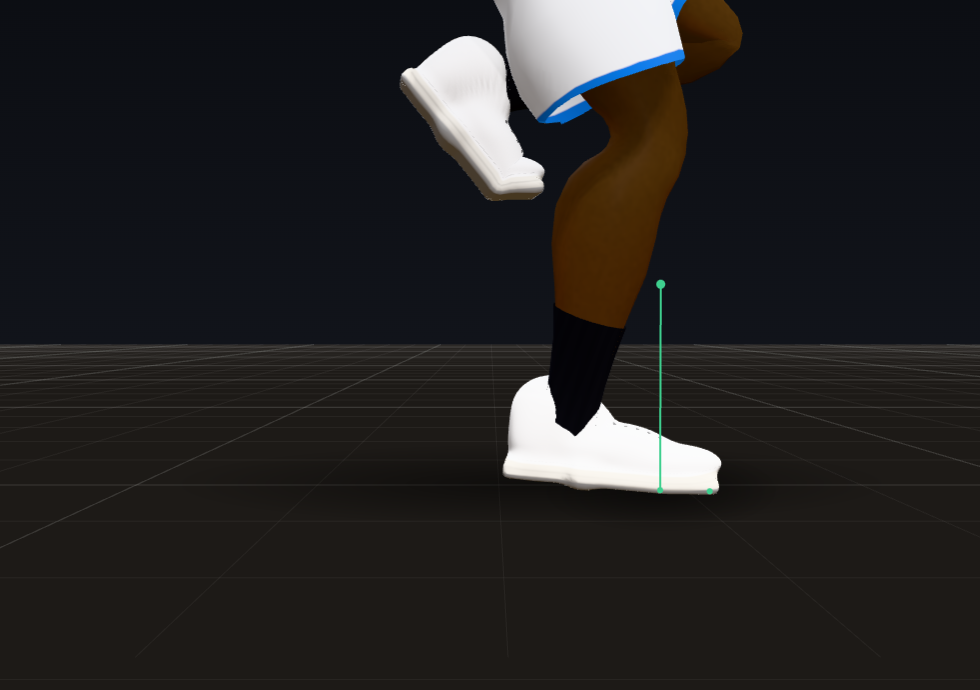
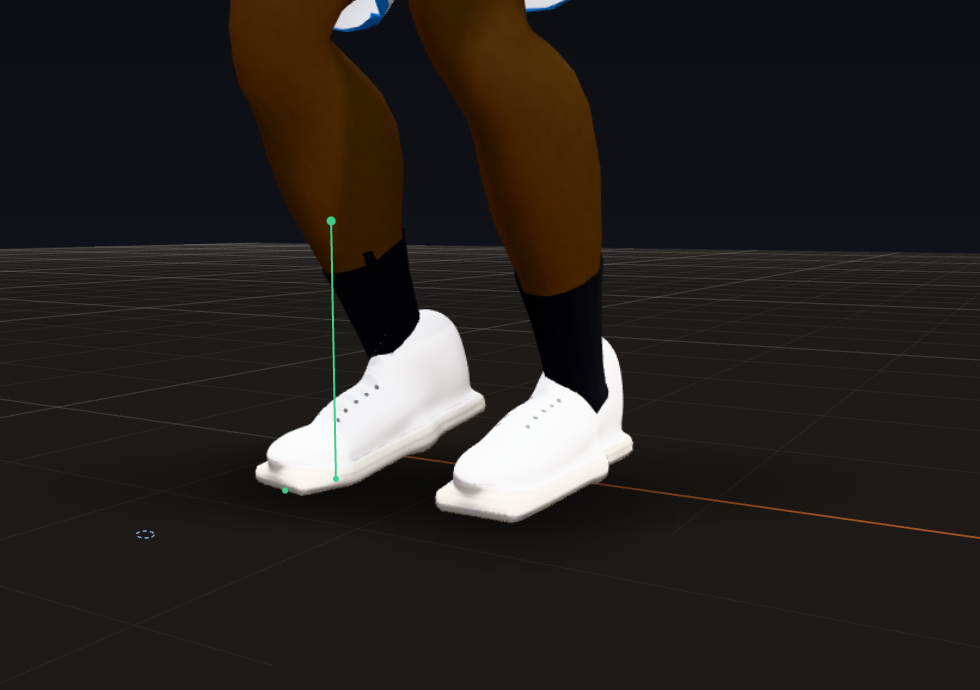

# Trial 3: The Floor

**Result: PASS.** In three full quarters (seeds 7 and 21, plus a women's league quarter) no planted foot slid more
than a quarter inch, no foot went through the floor and no planted foot floated: 0 frames of each, down from 6.6% of
contacts sliding past 0.83 in (worst 19 in), 0.7 to 0.85% of player-frames with a foot in the floor, and 0.13 to 0.16%
of planted feet floating. Walkers and joggers now land heel first and roll to the toes, sprinters land on the forefoot,
a pivot turns on the ball of the foot with the heel up, and 99.8% of the game's 25,000 to 28,000 steps per quarter show a
clear plant, stance and lift (100% in steady gaits).

| Heel strike | Foot flat | Heel off | Toe off |
|---|---|---|---|
|  |  |  |  |

(One walking step of the right foot in the Animation Lab, from a low camera: the heel lands with the toes 18 degrees up,
the forefoot rolls down, the heel comes up over the ball of the foot, and the foot leaves the floor 53 degrees up on its
toes, which stay flat on the floor.)

## How to see it

- **Animation Lab** (`lab.html`), at 0.25x:
  - "Walk" and "Jog": heel strike, foot flat, heel off, toe off on every step;
  - "Sprint": the ball of the foot lands first and the heel settles;
  - "Turn in place 180": the turning foot comes up on its ball, turns, and comes down;
  - "Run and cut 90 degrees" and "Start and stop": the feet keep up with the body through a cut and a stop.
- **Debug tools** (Shift+D in `match_test.html` or the live game): the F layer draws each foot's heel, ball and toe
  contacts (a planted contact that slides shows its slide); purple marks a point through the floor, blue a planted foot
  floating. Neither shows up any more.
- **Headless:** `node tools/audit/quarter.js --seed 7` prints the scorecard with a new `floor` block: every step's lift,
  swing, landing and stance by gait (how long, how high, heel or forefoot first, the ankle at contact, at its deepest
  and at toe-off, how far the landing moved from its first aim), the toes against the way he is going, and cadence and
  step length by speed.
- **Tests:** `node tools/audit/check.js` (61 checks; 17 are this trial's).

## A. What changed

- **`js/match/tune.js`**: a new `floor` group (pivots, landing aim, minimum stance and swing, the pelvis spring, toes
  at the floor, the swinging-foot floor fix) and new `hipGuard` values (reach strain, the most the pelvis drops, the
  last-resort miss). The `debug` group gets the step meter's thresholds.
- **`js/match/actor.js`**
  - **Pivots:** a planted foot turns only as a pivot on the ball of the foot. The heel comes up first (14 degrees over
    0.07 s), the foot turns once the heel is clear of the floor, and the heel comes down when the turn is done. Used for
    the stride, stances, clips and spin moves. Before, planted feet swivelled flat on the floor and the heel swept it.
  - **Heel to toe:** walking and jogging steps land heel first with the toes up and roll down on the heel (the heel
    rocker); sprinting steps land on the forefoot with the heel up and let it settle. The toe-off angle is 64 degrees
    jogging and 68 sprinting, so the ankle leaves the floor plantarflexed the way a runner's does.
  - **Landing aim:** where a foot will land is predicted from where the body will be at contact (its velocity and
    acceleration; a braking body stops, it never reverses; a body that has just stopped keeps no leftover braking),
    turned the way the body will face, and pointed where he is going when he runs forward. It is re-aimed while the
    foot is in the air, but only so fast, and never further from where the hip will be than the leg reaches with the
    pelvis settled a little (`floor.landSettleH`).
  - **A foot lands where the leg put it:** if the leg could not put the ankle on its aim (a hard turn, a soft leg
    trailing, the floor lifting the foot), the landing spot moves to where the foot really is and the last of its
    height is let down over a few frames. Before, the planted target jumped up to 18 in at contact.
  - **Steps:** a foot that just landed stays down at least 0.08 s (0.05 s even when the body has run away from it). A
    lift so late in the stride that its swing would be shorter than 0.15 s is a quick step on its own clock instead.
    Before, a foot could lift and land in the same frame at the spot of an old step (a 19 in jump). Feet put down by
    such a step pivot with the body like any other planted foot.
  - **Feet left behind:** a planted foot that pulls the pelvis down more than about 2.3 in to reach it steps, like one
    whose hip the guard holds at its limit. The guard lowers the pelvis 0.05 H at most, and a planted leg that still
    cannot hold its foot steps as a last resort (9 to 15 times a quarter).
  - **The pelvis comes back up on a spring:** it still goes down at once as far as a planted leg needs, but comes back
    up on an 8 Hz spring at no more than 2.5 ft/s. Before, a foot leaving the floor let it pop up to 12 in in one frame.
  - **Swinging feet never touch the floor:** lifted clear up to 8 times a frame by 1.5 times the depth, and again after
    the pelvis moves over a planted foot (that used to take the other foot, just clear, into the floor).
  - **Trunk squared to a target behind him:** the twist fades to zero straight behind instead of flipping side to side
    past 180 degrees (it swung the trunk ~60 degrees in a frame).
- **`js/match/rig.js`**
  - A stepping leg is solved with the same knee pole as a planted one, so the knee's plane carries straight on at
    lift-off and landing (switching solvers popped the knee every step).
  - Toes that would go through the floor bend up at the ball of the foot, as real toes do (the MTP joint, up to 60
    degrees; normal is 65 to 90).
  - A planted foot past the ankle's loaded range keeps its heading (only its pitch is held), and a foot in the air
    stays inside the ankle's range against its shank.
- **`js/match/anims.js`**: toe-off angles 64 jogging and 68 sprinting (were 52 and 60).
- **`js/match/debug.js`**: the step meter and `floor` scorecard above; a legal pivot's toes are re-anchored to where
  the turn leaves them (not counted as a slide); the first stance the meter sees is not counted (it began before the
  meter did); the toe meter skips a foot while it pivots.
- **`tools/audit/check.js`**: 17 new checks (61 in all), including a pivot that turns 60 degrees with the ball of the
  foot fixed, 100% clear steps at 4.5, 10, 16 and 24 ft/s, heel first walking and jogging, forefoot first sprinting, the
  walking ankle against gait studies, cadence and step length with speed, toes bending at the floor, and the first
  minute of a real game with no slide, sink or float.

## B. Scorecard

| Criterion | Grade | Evidence |
|---|---|---|
| Foot locking with two-bone leg IK, zero sliding | PASS | contacts sliding over 0.25 in: 8.8% and 8.9% before, 0.00% after; worst slide 18.9 and 19.2 in before, 0.10, 0.02 and 0.51 in after |
| Foot placement planning from velocity, direction and stance | PASS | the landing is aimed from where the body will be at contact and re-aimed in flight, inside the leg's reach; a step is planted where the leg really put it (planted feet pushed into the floor by a landing out of reach: 7 per 20,000 frames earlier in this trial, 0 after) |
| Heel to toe walking and jogging, forefoot sprinting | PASS | steady gaits: heel first 100% walking and jogging, forefoot first 100% sprinting; in games walking steps land heel first 75% of the time (0.03% before; the rest are starts, stops and turns) |
| Toes point where he is going (not in shuffles or pivots) | PASS | planted feet over 20 degrees off the way he is going, running forward: 20.6% before, 3.5% after (p90 30 to 16 degrees) |
| Step length and frequency scale with speed | PASS | steady gaits at 5, 11, 17.6 and 26.4 ft/s: 1.8, 2.68, 3.02, 3.22 steps/s and 2.74, 4.1, 5.82, 8.19 ft; step length grows most at low speed and cadence at high speed, as runners do |
| Ankles flex naturally on landing and push-off | PASS | steady walk: 4.8 degrees at heel strike, 13.9 at the deepest, -19.8 at toe-off (gait studies: about 0, 5 to 15, -5 to -20); running toe-off -16 to -18 in steady gaits, -13 to -17 in games (was -5) |
| Feet never clip into the floor or hover | PASS | foot points below the floor: 0.70% and 0.85% of player-frames before, 0 after (all three quarters); planted feet floating: 0.16% and 0.13% before, 0 after |
| **PASS when:** the foot slide meter reads effectively zero on planted feet at every speed | **PASS** | slides by gait in all three quarters: the worst contact in every walking, running, sprinting, sliding and backpedalling context moved 0.02 in or less, except one walking step at 0.10 in and one defensive-stance contact at 0.51 in |
| **PASS when:** at 0.25x, every step shows a clear plant, stance and lift | **PASS** | a step is clear with a stance of 3 frames or more, a swing of 5 frames or more and the foot at least 0.75 in off the floor: 100% in steady gaits at every speed; in games 99.85%, 99.81% and 99.79% (95.6% and 95.3% before). What is left: shuffle steps under 0.75 in high in a defensive slide (26 to 40 a quarter) and a few steps authored into clips (layups and turns) |
| **PASS when:** no foot ever floats or sinks | **PASS** | 0 frames in seed 7, 0 in seed 21, 0 in the women's quarter, for planted, swinging and airborne feet |

### Before and after (per quarter)

| Metric | Seed 7 before | Seed 7 after | Seed 21 before | Seed 21 after | Women after |
|---|---|---|---|---|---|
| Contacts sliding over 0.83 in | 6.59% | **0** | 6.64% | **0** | 0 |
| Worst slide | 18.9 in | 0.10 in | 19.2 in | 0.02 in | 0.51 in |
| Foot points below the floor (% of player-frames) | 0.70 | **0** | 0.85 | **0** | 0 |
| Planted feet floating | 0.16% | **0** | 0.13% | **0** | 0 |
| Steps with a clear plant, stance and lift | 95.6% | 99.85% | 95.3% | 99.81% | 99.79% |
| Walking steps landing heel first | 0.03% | 75.6% | 0.03% | 74.7% | 75.3% |
| Toes over 20 degrees off the way he goes | 20.7% | 3.5% | 20.5% | 3.4% | 3.5% |
| Joint pops (per player-minute) | 390 | 215 | 415 | 227 | 201 |
| Knees caving in over the toes | 0.16% | 0.02% | 0.17% | 0.03% | 0.01% |
| Pelvis held over a planted foot (player-frames) / p99 | 5.7% / 11.5 in | 3.2% / 8.6 in | 6.0% / 12.2 in | 3.1% / 8.6 in | 4.0% / 8.0 in |

And from a probe of the first 20,000 frames of seed 7: the pelvis rising more than 3 in in one frame (outside jumps)
fell from 430 frames to 19 and dropping more than 3 in from 236 to 42; the biggest rise fell from 12.5 in to 6.0 in.

## C. Devil's advocate

1. **"His feet skate: the planted foot slides around under him."**
   - Before: 6.6% of contacts slid past 0.83 in, the worst 19 in. Planted feet swivelled flat on the floor as the body
     turned, and feet the body ran away from were dragged.
   - Fixed: planted feet turn only as pivots on the ball of the foot with the heel up; a foot left behind steps; a foot
     lands where the leg put it; no foot lifts and lands in the same frame. Now 0 contacts past 0.25 in in three
     quarters.
2. **"The feet land flat like a robot's and every step looks the same."**
   - Before: 99.6% of walking and running landings were flat, and the ankle at a runner's toe-off was only -5 degrees.
   - Fixed: walkers and joggers land heel first and roll through (the heel rocker), sprinters land on the forefoot, and
     the ankle pushes off plantarflexed (-20 walking, -16 to -18 running). Steady gaits match gait studies.
3. **"His hips drop and pop, and his toes dig into the floor when he turns hard."**
   - Before: turning hard at a run, the landing aim swung out of reach and the pelvis dropped up to a foot to reach it.
     A stance foot leaving the floor let the pelvis pop up 12 in in one frame, and swinging toes dipped up to 2.7 in
     through the floor.
   - Fixed: landings are aimed inside the leg's reach, the pelvis comes back up on a spring (430 pops over 3 in down to
     19), swinging feet are lifted clear (again after the pelvis moves) and their toes bend at the floor.
   - What is left is Trial 4's: 42 drops over 3 in per 20,000 frames come from the pose itself jumping (a stance or
     gait change), and the choreography still turns bodies at up to 600 degrees per second.

## D. Regression check

- **Trial 1:** all 24 of its checks pass, and the determinism check still gives 1500/1500 identical steps at 1x,
  0.25x, 0.1x, 144 Hz and a jittery frame rate. In the browser every debug tool toggles on and off during an engine
  game, the speeds step exactly (6, 15, 30 and 60 steps per 60 frames), rewind returns to the identical frame, orbit
  and isolate work, and Shift+D opens and closes in `match_test.html` and the live game. No page errors.
- **Trial 2:** all 20 of its checks pass. Final poses past a human joint limit: 0 in all three quarters. Knees over
  the toes improved (caving in 0.16% to 0.02%). Spine pops stay at 5.8 to 6.2 per player-minute, and spine and neck
  acceleration stays at p99 7,350 to 7,450 deg/s^2, as in Trial 2. One neck turn in a turn move (23 degrees in a frame,
  seed 21) is left for Trial 13.
- **Cost:** a whole simulation step (engine, director, 13 bodies and the meters) is 1.68 ms p50 and 3.8 ms p99 in a
  single process, against 1.58 and 4.8 before this trial.
- Other scorecard lines stay within the spread between seeds: hand gaps to the ball (dribble p90 0.5 to 0.8 in),
  counter-rotation (-0.75), look coverage.
- Scorecards: `docs/gauntlet/baseline/trial03_*.json`.

## E. What to watch for

- In the Lab, play "Walk" at 0.25x and watch one foot: heel down with the toes up, the forefoot rolls down, the heel
  lifts over the ball, and the toes stay flat on the floor until the foot leaves. Then "Sprint" at 0.25x: the ball of
  the foot touches first.
- In the Lab, "Turn in place 180" at 0.25x: the turning foot's heel comes up before it turns and comes back down after.
  No heel or toe sweeps the floor.
- In a game, Shift+D and the F layer at 0.25x: watch a player cut or stop. No purple (sink) or blue (float) marks, and
  planted contacts do not move.
- Still to come:
  - **Trial 4:** bodies still turn and stop too fast for their feet (instant turns are 59 to 61% of turns), and the
    choreography's changing goals move a landing 11 to 16 in (p50) from its first aim. The remaining pelvis drops come
    from pose changes.
  - **Trial 5:** 26 to 40 steps a quarter clear the floor by less than 0.75 in, most of them shuffle steps in a
    defensive slide.
  - **Trials 7 to 9:** steps authored into clips (layups, turns, dunks) can have a stance of one or two frames.

## Sources

- Pivot footwork, on the ball of the foot with the heel free to come up and the ball never sliding:
  https://www.coachesclipboard.net/Footwork.html and
  https://medium.com/the-ever-learning-basketball-coach/teaching-skills-footwork-pivots-jab-steps-cross-steps-rips-e843906d5f8e
- Ankle angles in normal walking (about neutral at heel strike, 5 to 15 degrees of dorsiflexion after midstance, -5 to
  -20 at push-off): https://public.websites.umich.edu/~mvs330/f97/amputee/results2.html and
  https://www.frontiersin.org/journals/surgery/articles/10.3389/fsurg.2022.915090/full
- Foot strike and running speed (most runners keep their strike as they speed up, the contact point moves forward to
  about 22 km/h, sprinters land on the forefoot): https://www.ncbi.nlm.nih.gov/pmc/articles/PMC8593104/ ,
  https://www.ncbi.nlm.nih.gov/pmc/articles/PMC7504700/ and https://runnersconnect.net/footstrike-pattern-for-runners/
- Step length and cadence with speed (step length changes most at low speeds, cadence at high speeds):
  https://journals.plos.org/plosone/article?id=10.1371%2Fjournal.pone.0184273
- First MTP joint (toe) extension, 65 to 90 degrees:
  https://podiatry-anatomy-app.qut.edu.au/content/joints/1st-mtp-joint-rom.html
- Vertical motion of the centre of mass (about 3 cm walking, 6 to 9 cm running): https://pubmed.ncbi.nlm.nih.gov/15685471/
  and https://runnersconnect.net/improve-your-vertical-oscillation-for-better-running-performance/
- Foot IK and the pelvis (lower the pelvis for an unreachable foot when standing, not when moving, where a stretched leg
  is normal): http://peyman-mass.blogspot.com/2015/06/foot-placement-using-foot-ik.html
- Procedural foot planting and step prediction, from game developers' forums and devlogs:
  https://devforum.roblox.com/t/r6-ikpf-inverse-kinematics-procedural-footplanting/1472311 ,
  https://discussions.unity.com/t/how-to-add-foot-alternating-procedural-animation/939467 and
  https://piecesgames.itch.io/baluchon/devlog/193685/procedural-walking-system
