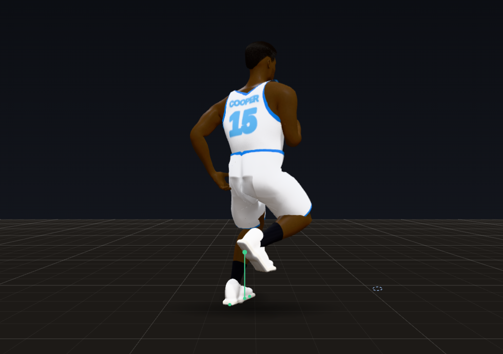
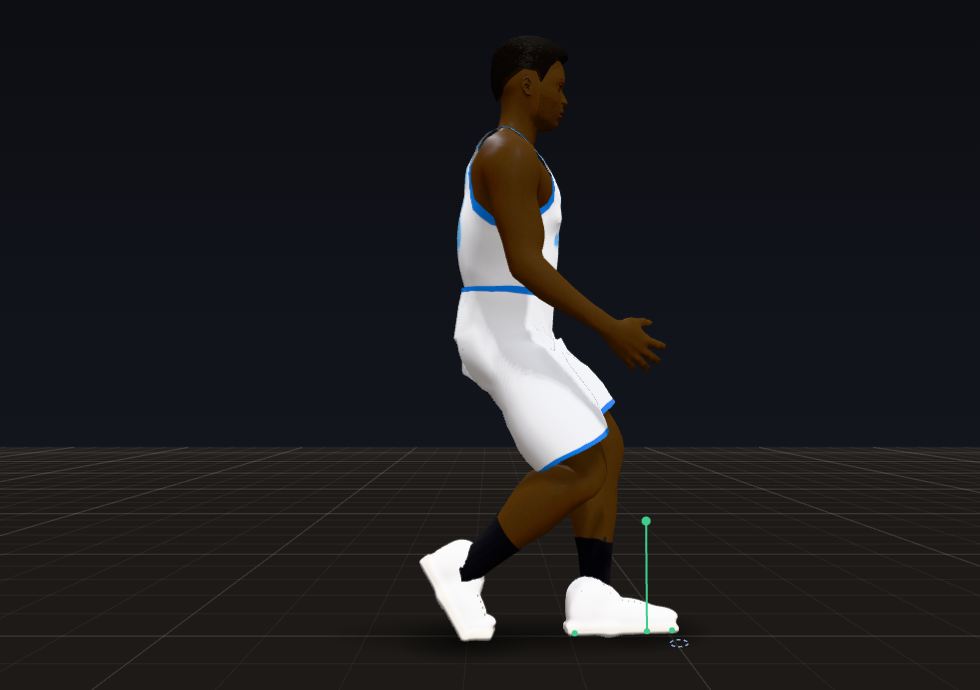
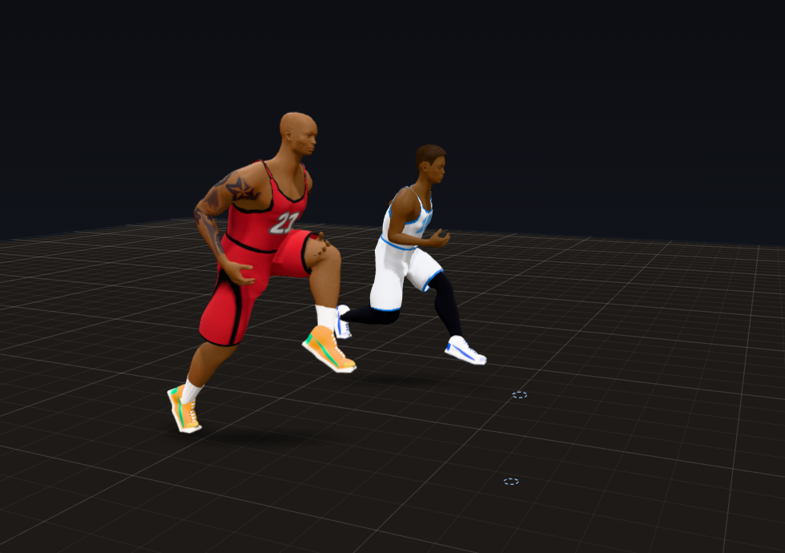
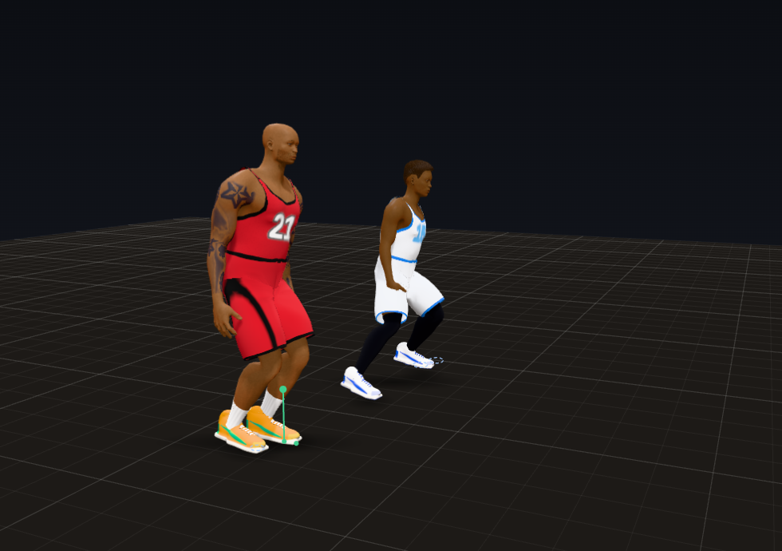

# Trial 4: The Weight

**Result: PASS.** In three full quarters (seeds 7 and 21, plus a women's league quarter) nobody started, stopped, turned
or changed speed at once, and the hips never jumped: 0 body acceleration snaps, 0 instant turns, 0 turn snaps and 0 hip
jumps, down from 23 to 34 acceleration snaps and ~122 turn snaps per player-minute, 60% of turns starting at full rate,
and 185 to 283 hip jumps a quarter. Every one of the 758 hard cuts from jogging speed up went off a foot planted
on the side the push came from, with the hips dropping 1.5 in or more (6.7 to 7.2 in at the median);
before, only 55.2 to 56.7% of hard cuts dropped them that far. Every one of the 2,526 hard stops
dropped them too. A 7-0 260 lb center with the same ratings as a 6-2 185 lb guard now gets going, stops, turns round and
cuts later; before, the two moved identically.

| Hard cut | Hard stop |
|---|---|
|  |  |

(Animation Lab. Left: "Run and cut 90 degrees" from behind, as the cut goes right: the left foot planted 12 in out on
the outside, the hips 4.3 in down and the body leaning into the turn. Right: "Start and stop" from the side at the stop:
the braking foot planted 19 in out ahead, the trunk tipped back 10 degrees, the hips 4.6 in down.)

| The guard gets going first | The center carries its speed longer |
|---|---|
|  |  |

(Animation Lab, "Guard and center: start, cut, stop together": a 6-2 185 lb guard (white) and a 7-0 253 lb center (red)
with the same ratings. At 1.6 s the guard is already 0.9 ft ahead and both lean 10 degrees into the push. Half a second
into the stop from 24 ft/s, the guard is down to 7.5 ft/s and the center still at 9.0; the guard stops in 10.0 ft, the
center in 10.5.)

## How to see it

- **Animation Lab** (`lab.html`), at 0.25x:
  - "Guard and center: start, cut, stop together" (new): the center falls behind at the start, turns the corner
    behind the guard and takes half a foot more to stop;
  - "Run and cut 90 degrees": the outside foot plants, the hips drop and stay down through the stride, the body pushes
    off the other way;
  - "Start and stop": short, quick braking steps, the braking foot out ahead, the trunk back, the hips low;
  - "Turn in place 180": the turn speeds up and slows into its end instead of spinning at full rate from the first
    frame.
- **Debug tools** (Shift+D in `match_test.html` or the live game): the selected player's panel shows the body's weight,
  how hard it is braking and cutting, and how far the hips are down; the session lines count hard cuts and hard stops
  (with the share on a planted foot and with the hips down), turn snaps and hip jumps. The V layer draws velocity and
  acceleration.
- **Headless:** `node tools/audit/quarter.js --seed 7` prints the scorecard with a new `weight` block: hard cuts and hard
  stops (how many, the share with a plant and with a hip drop, how deep the drop, the peak push, what the misses were),
  turn snaps, hip jumps, and each weight class's push and turn acceleration.
- **Tests:** `node tools/audit/check.js` (72 checks; 11 are this trial's).

## A. What changed

- **`js/match/tune.js`**: a new `weight` group (every value below), plus `floor.airGuardSw`, `floor.toeTipDegps`,
  `floor.slideLiftH` and `floor.backLiftCut`, and the weight meter's thresholds in `debug`.
- **`js/match/actor.js`**
  - **The body is a mass.** A player's push (acceleration) is the ratings times (weight / 215 lb)^-1/3: leg force grows
    with muscle cross-section, so a heavier body gets less push per pound. Braking is 1.35 times the push (was 1.7, all
    at once). The push toward the velocity wanted builds up at a human rate of force development (320 ft/s^3, 480
    braking: a full push in about 0.06 s) and eases in proportion over the last few ft/s, so an arrival goes 3 to 4 in
    past its spot and settles back. Before, the whole push switched on and off in one step.
  - **Turning.** The facing has an angular acceleration: 70 rad/s^2 for a 6'6" 215 lb body, less for a taller and
    heavier one (rotational inertia grows with mass times height squared), never more than 150 rad/s^2 for anyone. The
    turn speeds up, then brakes into its target, and settles only from a rate it can stop in one step. Before, 60% of
    turns started at full rate in one step.
  - **Only a foot on the floor pushes.** With both feet in the air running, a body pushes 35% (braking goes on through a
    step's own flight). Off the floor longer than a step's own flight (a skip off a foot the body ran away from), 10%,
    braking or not: a body braked and cut in the air for a third of a second. A push across the way the body goes comes
    from a planted foot on the side the push comes from, graded by how far out it is (fully at 0.04 of the height, 30%
    from a foot under the body or on the inside), and a foot planted well outside pushes 1.4 times harder: a real cut's
    force goes down through the plant. In the air a push across cannot start or grow; it carries on only what the last
    foot down gave. Before, a cut could be made in a stride's flight off a foot under the body and land on the inside
    foot.
  - **Braking.** Harder than 8 ft/s^2, the steps quicken toward 4.2 per second, the landing foot goes down out ahead by
    a share of the lean the braking needs, the trunk tips back and the hips drop.
  - **Cutting.** The landing foot goes to the outside of the cut, the push comes off it, and the hips drop.
  - **The hip drop.** At a full brake or cut the hips go 0.04 of the body's height (3.1 in on a 6'6" player) below the
    level they rode at before the push, not just below wherever the legs carry them (short braking steps carried them
    back up by as much). That level follows the hips down during a real push, never up: kept at the running height from
    before a defender's crouch, a cut out of the crouch let the hips rise 4 to 6 in through it. The drop is held 0.2 s at
    its deepest and let back up over 0.35 s, so the hips stay down through the stride's flight instead of bobbing up
    between plants; a runner's heel kick comes down with them. A defender's slide is low already: it drops only from
    5 ft/s, fully from 8.
  - **The pelvis never jumps.** Three rules:
    - the pose's own pelvis height glides over a jump (inertialized: a change past what its motion explains by 0.012 of
      the height in a step is taken out and eased back in, half-life 0.08 s) and moves no faster than 7 ft/s: a stance,
      stride or move switching it dropped or lifted the hips up to ~5 in in a frame, and a move fading in over 0.06 s
      from a slide's low hips lifted them 12 in in four frames;
    - the pelvis as a whole goes down no faster than 9 ft/s, whatever takes it there (the legs' reach, a cut's drop,
      the pose; a landing from a 2 ft jump falls at ~11 ft/s). Past that a leg left short of its foot has its heel come
      up, then its foot leaves the floor as a quick step before it can slide: a body run away from a planted foot (a
      fast sideways run, a move's step) dropped the hips 3 to 9 in in a frame;
    - a heel rolls up on a planted foot the body leaves in any direction (it did only for a foot behind the facing, so
      sideways runs and backpedals left it flat and stretched the leg), and a move that starts with a foot in the air
      aims that foot within the leg's reach (the rebound kept the stride's landing spot, up to 7 ft away, reached for it
      in a tenth of a second and dropped the hips 10 in at contact).
  - **Moves (clips) as a mass.** A move's root motion is followed exactly while that takes no more than a body's push
    (55 ft/s^2) and caught up after; a move that leaves faster than the body is going starts on a slow clock. A move
    ending before it moves the body leaves that step to the steering (the body used to stand still for a step), and a
    move starting on a body just knocked carries the knock's speed.
  - **Contact inside the same limit.** A knock is a push that builds and eases over 0.34 s (it used to start at full
    speed in one step), and its own acceleration comes out of what the steering may use that step. Contact pushes from
    touching bodies are added to the body's own push and the two together never pass 55 ft/s^2; a deep overlap's push
    comes first. The post-up bump (`choreo.js`) is a knock now; it kicked the defender's speed by 4.5 ft/s in one step.
  - **Seeing each other.** A body looks as far ahead as the two can close in 1.2 s (at least 10 ft): two bodies running
    at each other at full speed, ~35 ft/s between them, were seen only 10 ft apart and ran into each other. Past 10 ft
    it brakes only for one it would really run into.
  - **Floor fixes found on the way** (Trial 3's own measures missed them):
    - a leg in the air is held with its knee over its own line only from a quarter of the way into the swing: a leg
      planted far out to the side in a hard turn was snapped in on its first frame off the floor, the ankle up to 17 in;
    - a foot that leaves the floor flat tips toes-down no faster than 600 deg/s (an ankle's speed at toe-off): a first
      step from a standstill tipped it 57 degrees in one frame and the floor threw the ankle up 6.5 in;
    - a foot in the air at take-off is lifted clear of the floor a few times over, not once (a putback's take-off left
      the toes 0.9 in in the floor for a frame);
    - a foot lifting on a stride's flip starts its swing where it leaves the floor, and a placed body keeps nothing of
      a swing from before: after a placement the first frame of a swing reached for a spot up to 55 in away;
    - a slow slide's shuffle step lifts the ankle 0.045 of the height (was 0.035) and a backpedal's step 35% less than
      a forward one (was 45%): their lowest steps scraped under 0.75 in.
- **`js/match/view.js`** (body contact): bodies push apart through their velocities, a spring and damper on the overlap
  (at most 40 ft/s^2) and a harder push for a deep one taken first from the body's limit; two players about to run into
  each other by accident ease off from 1.2 ft; a move (a layup, a dunk) running at a man in its way bends away at a
  body's push while the man brakes; two moves give way to each other. Nobody is moved apart in one step any more: the old
  push of up to 0.4 ft a step made 100 to 460 ft/s^2 in a step when two bodies met deep.
- **`js/match/rig.js`**: each body's weight (`dims.mass`); the in-air knee guide eased in (above).
- **`js/match/debug.js`**: the weight meter (below), the hip jump meter and the panel lines; a body placed somewhere new
  (a substitute put on the floor, over 3 ft in one step) is a new start for the foot and speed meters, not a slide or a
  snap.
- **`js/lab/lab.js`**: the "Guard and center" scenario (a scenario can pick its own two sizes).
- **`tools/audit/check.js`**: 11 new checks (72 in all): the guard against the center with the same
  ratings (start, stop, turning a run round, a 90 degree cut, a standing turn), top speed, no step past a body's limit,
  the hips' bob walking and running, hard cuts and stops on a planted foot with the hips down, no hip jump and no pop at
  lift-off, two bodies running at each other, and the first minute of a real game with no snap, no hip jump and every
  hard cut planted and dropped.

**How it is measured.**

- A body acceleration snap is the root's speed changing more than 60 ft/s^2 (1.9 g) between two steps; a turn snap is
  the facing's turn rate changing more than 180 rad/s^2; an instant turn is a still facing turning faster than 4 rad/s in
  its first step; a hip jump is the pelvis moving more than 3 in up or down in one step with the body on the floor (a
  jump's own flight and a body placed somewhere new aside).
- A hard push is one across or against the way the body goes of 18 ft/s^2 or more, from jogging speed up (10 ft/s, the
  gauntlet's own 3 m/s jog), peaking past 22. It is a hard cut when it is mostly across the way the body goes (by the
  whole push over it) and turns its path 35 degrees or more within 0.7 s, and a hard stop when it is mostly against it
  and sheds 30% of its speed.
- A cut shows a plant when a foot is planted on the side the push comes from (the floor pushes the body away from it:
  outside the cut, or out ahead braking into it) at some point during it; a stop, when a foot is planted out ahead. It
  shows a hip drop when the pelvis goes 1.5 in or more below the level it rode at over the 0.3 s before, with the body's
  own braking or cutting drop and a stretched leg's pull taken back out of that level (so a run of cuts, or a long
  stride's dip just before one, is not measured from hips already down).
- Below jogging speed, from 8 to 10 ft/s, 988 more pushes would count as hard cuts; 3 of them have
  no foot planted on the push side (E, below).

## B. Scorecard

| Criterion | Grade | Evidence |
|---|---|---|
| The pelvis / centre of mass is the root; everything follows it | PASS | the root moves as a point mass under a limited push (above); legs, feet and trunk are solved from it every step, and nothing moves the root outside that push (the old one-step shoves in contact, knocks, the post-up bump and move endings are gone); the pelvis's height never jumps either (0 hip jumps, from 185 to 283 a quarter) |
| Real acceleration and deceleration limits per player; nobody stops, starts or turns instantly | PASS | 0 acceleration snaps, 0 instant turns, 0 turn snaps in all three quarters; in a lab run the hardest change of speed is 55.0 ft/s^2 in a step (the limit) and of turn rate 138 rad/s^2; limits by weight and ratings (below) |
| Lean into acceleration | PASS | the trunk tilts with the push (tan ~ a / g, half of it at the hips), ~10 degrees forward at a full push, on critically damped springs |
| Braking: lean back, lower hips, plant a braking foot, choppy steps | PASS | hard stops with the hips dropping: 100% in all three quarters (62 to 68% before), median 7.0 to 7.5 in; with a foot planted out ahead: 97.3 to 97.9% (96.2 to 97.0% before; the rest are walking-speed backpedals and shuffles, Trial 6); braking steps quicken toward 4.2 per second; the trunk tips back ~10 degrees |
| Cuts: hard plant foot on the outside, hips drop, push off the new way | PASS | 758 hard cuts: 100% on a foot planted on the push side and 100% with the hips down 1.5 in or more (median 6.7 to 7.2 in) |
| Spring-damper (second order) dynamics on root, spine, head and arms, with overshoot, settle and follow-through | PASS | the root's position and facing are second order now (a limited, rate-limited push; an angular acceleration): an arrival goes 3 to 4 in past its spot and settles back, a standing 90 goes 1.4 to 1.5 degrees past and settles in ~0.5 s; the hips' drop, the trunk lean and the braking and cutting shape follow critically damped springs; the pose's pelvis height is inertialized; the spine, neck, head and arms trail and follow through on lag springs (kept from before the gauntlet) and pose switches are inertialized |
| Vertical bob: the body rises and falls each step, more when running | PASS | the pelvis per step at steady speeds: 1.76 in walking (4.5 ft/s), 2.68 in at 10 ft/s, 3.04 in at 16 (studies: ~1.8 to 4.8 cm walking by speed, 6 to 9 cm running) |
| Bigger players have more momentum and take longer to change direction | PASS | same ratings, 185 lb guard vs 260 lb center: 0.78 vs 0.87 s to 15 ft/s, 12.6 vs 14.0 ft to stop from 26.9 ft/s, 0.53 vs 0.60 s to turn a 15 ft/s run round, 0.57 vs 0.63 s through a 90 degree cut (before: identical, 0.73 s, 9.9 ft, 0.43 s and 0.43 s for both) |
| **PASS when:** zero instant stops, instant turns or instant speed changes anywhere | **PASS** | 0 acceleration snaps (23.4 to 34.0 per player-minute before), 0 instant turns (60% of turns before), 0 turn snaps (121.5 to 125.3 per player-minute before), in seeds 7 and 21 and the women's quarter, and in the first minute of seed 7 and every lab run |
| **PASS when:** every hard cut shows a visible plant foot and hip drop | **PASS** | 758 of 758 hard cuts in three quarters (247, 277 and 234), every one in the first minute of seed 7 and in the lab's cut course; before, 96.9 to 98.4% planted and 55.2 to 56.7% dropped |
| **PASS when:** motion never snaps; everything settles | **PASS** | no snap of speed, turn or hip height anywhere (above); joint pops down 13 to 18% (215, 227 and 201 per player-minute to 175, 197 and 175), spine and neck pops halved (from 5.8 to 6.2 per player-minute to 2.6 to 3.0); no lift-off pop in the lab (the ankle's motion changes at most 606 ft/s^2 leaving the floor, a pop is 1,500); arrivals and turns overshoot a little and settle. The pops left are mostly toes at contact and dribbling hands (Trials 5 and 8) |
| **PASS when:** big men feel heavier than guards | **PASS** | the lab above; in games the heaviest class (248 to 271 lb) pushes 23.6 to 25.3 ft/s^2 at the top (p90) against 29.7 to 31.1 for the lightest (176 to 187 lb), and turns at 57 to 67 rad/s^2 against 91 to 98 (before: 32 to 33 against 36 to 38, and ~480 against ~530, snaps included). In the Lab the center falls behind the guard from the start, turns the corner behind the guard and stops half a foot later from the same speed |

### Before and after (per quarter)

| Metric | Seed 7 before | Seed 7 after | Seed 21 before | Seed 21 after | Women before | Women after |
|---|---|---|---|---|---|---|
| Acceleration snaps (per player-minute) | 32.9 | **0** | 34.0 | **0** | 23.4 | **0** |
| Instant turns (share of turns) | 59.5% | **0** | 61.5% | **0** | 60.5% | **0** |
| Turn snaps (per player-minute) | 121.5 | **0** | 125.3 | **0** | 122.3 | **0** |
| Hip jumps (pelvis over 3 in in a step) | 232 | **0** | 283 | **0** | 185 | **0** |
| Hard cuts | 336 | 247 | 386 | 277 | 254 | 234 |
| Hard cuts: a foot planted on the push side | 97.3% | 100.0% | 98.4% | 100.0% | 96.9% | 100.0% |
| Hard cuts: hips down 1.5 in or more | 55.7% | 100.0% | 55.2% | 100.0% | 56.7% | 100.0% |
| Hard cuts: hip drop (median) | 1.58 in | 7.20 in | 1.63 in | 7.18 in | 1.67 in | 6.73 in |
| Hard stops | 1097 | 825 | 1168 | 936 | 940 | 765 |
| Hard stops: a foot planted out ahead | 96.6% | 97.5% | 96.2% | 97.9% | 97.0% | 97.3% |
| Hard stops: hips down 1.5 in or more | 65.2% | 100.0% | 67.6% | 100.0% | 62.3% | 100.0% |
| Push at the top (p90), light / mid / heavy (ft/s^2) | 37.5 / 34.4 / 33.3 | 31.1 / 26.6 / 25.3 | 38.2 / 36.4 / 32.0 | 30.7 / 27.5 / 23.6 | 36.0 | 29.7 |
| Turn acceleration (p90), light / mid / heavy (rad/s^2) | 536 / 476 / 472 | 91 / 72 / 67 | 528 / 506 / 482 | 91 / 72 / 57 | 519 | 98 |
| Joint pops (per player-minute) | 215 | 175 | 227 | 197 | 201 | 175 |
| Spine and neck pops (per player-minute) | 5.8 | 2.6 | 6.1 | 2.9 | 6.2 | 3.0 |
| Torso overlaps (pair-frames) | 179 | 97 | 277 | 149 | 276 | 196 |

("Before" is the Trial 3 code measured with this trial's meter. The hard cut and stop counts fell because a cut or a
stop is no longer a one-step lurch that counts as hard; weight classes: light under 205 lb, heavy 240 lb and over.)

## C. Devil's advocate

1. **"They still stop on a dime, turn like a top and bounce off each other."**
   - Before: 23 to 34 times per player-minute a body's speed changed by more than 60 ft/s^2 in one step, 60% of turns
     started at full rate, and the turn rate jumped ~122 times a player-minute. Braking hit 1.7 times the push at once:
     a 27 ft/s runner stopped in 9.9 ft and 0.75 s. Overlapping bodies were pushed apart by up to 0.4 ft in a step.
   - Fixed: the push builds and eases, braking is 1.35 times the push, the facing has an angular acceleration and
     settles into its target, contacts and knocks share the same limit, and every scripted one-step change (moves
     ending, the post-up bump, the old separation) is gone. Now 0, 0 and 0 in three quarters; the same runner stops in
     12.6 ft (a 260 lb center in 14.0 ft), and two players running at each other at 24 ft/s pass ~5 ft apart.
2. **"A cut is a slide round a curve, turned in mid-air, and the hips bob about."**
   - Before: the hips dropped in only 55 to 57% of hard cuts, by ~1.6 in at the median; a cut could be made in a
     stride's flight or off the inside foot; and the pelvis jumped 3 in or more in a single frame 185 to 283 times a
     quarter (up to 11.9 in).
   - Fixed: the push across comes from a foot planted on its side, graded by how far out it is, and cannot start in the
     air; the landing foot goes to the outside; the hips drop 0.04 of the height below where they rode and stay down
     through the stride; the pelvis can neither jump in its pose nor be dropped faster than a body crouches. Now every
     hard cut is planted and dropped (median 6.7 to 7.2 in) and there are no hip jumps.
3. **"Big men and guards move the same."**
   - Before: with the same ratings a 260 lb center and a 185 lb guard moved identically (0.73 s to 15 ft/s, 9.9 ft to
     stop, 0.43 s through a 90 degree cut). Only the ratings made a difference.
   - Fixed: the push per pound and the turn acceleration come down with weight and height. The center is ~0.1 s later
     to 15 ft/s, stops 1.4 ft longer, turns a run round 0.07 s later and cuts 0.06 s later; in games the heaviest class
     pushes 19 to 23% less and turns 26 to 37% less hard at the top (p90)
     than the lightest. The effect is on purpose moderate: ratings still matter most, and a quick big stays quick.

## D. Regression check

- **Trial 1:** all of its checks pass, and the determinism check gives 1500/1500 identical steps at 1x, 0.25x, 0.1x,
  144 Hz and a jittery frame rate (the pelvis's downward limit is kept from each step's own solve only: taken from the
  extra solves of a drawn frame too, the game went its own way after 13 steps at 144 Hz).
  In the browser every debug layer toggles on and off during an engine game, the speeds step exactly (6, 15, 30
  and 60 steps per 60 frames), pause and single steps work, rewinding 30 frames and stepping back returns to the
  identical live frame, isolate and orbit work, and Shift+D opens and closes in `match_test.html` and the live game.
  No page errors. The overlay draws in 7.5 ms with every layer on (a debug view, not the game).
- **Trial 2:** all of its checks pass. Final poses past a human joint limit: 0 in all three quarters; knees caving in
  0.03%; counter-rotation unchanged (-0.76 to -0.73). Spine and neck pops fell by half.
  The dribbling hand sits a little further from the ball at the far end (p90 0.73, 0.75, 0.53 in to
  1.00, 0.82, 0.64 in; Trial 8).
- **Trial 3:** all of its checks pass. No contact slid past 0.25 in (worst 0.09 in), no foot went through the
  floor and no planted foot floated, in all three quarters. Steps with a clear plant, stance and lift: 99.85,
  99.81 and 99.79% to 99.79, 99.71 and 99.75%. Walking steps landing heel first:
  75.6, 74.7, 75.2% to 70.1, 69.2, 72.4%; steady walking is still 100% heel first (Trial 3's
  check), and which game steps now land flat is for Trial 5 (the gaits). The planted-leg guard holds the pelvis over a
  planted foot in 5.7 to 6.6% of player-frames (3.0 to 4.0%), most likely because
  lower hips bend the planted legs further. Five floor faults Trial 3's measures missed are fixed (above),
  and the foot meter now ignores placements.
- **Cost:** the game step alone for 10 players is 1.88 to 1.96 ms at the median and 4.1 to 4.5 ms at p99,
  against 1.43 to 1.44 and 3.1 to 3.3 ms on the Trial 3 code (same machine, one process, seeds 7 and 21): about
  0.05 ms more per body, well inside a 60 fps frame (16.7 ms).
- Scorecards: `docs/gauntlet/baseline/trial04_*.json`.

## E. What to watch for

- In the Lab, "Guard and center: start, cut, stop together" at 0.25x: the center is behind from the first steps, turns
  the corner behind the guard and takes half a foot more to stop. Both lean into the start and back into the stop.
- In the Lab, "Run and cut 90 degrees" and "Start and stop" at 0.25x: the outside foot plants on the cut; the braking
  foot lands out ahead and the steps shorten on the stop; the hips go down and stay down through the stride, then come
  back up over a third of a second.
- In a game, Shift+D: select a player and watch "brake", "cut" and "hips down" in the panel as the player moves; the
  session line counts hard cuts and stops, turn snaps (0) and hip jumps (0).
- Still to come:
  - **Below jogging speed:** of the 988 hard pushes across from 8 to 10 ft/s, 3 have no foot on the
    push side, all three ending at a walk (the kinds traced on the way: a backpedal reversed with no foot planted behind
    the body, and a cut at a jog carried through a stride's flight; Trials 5 and 6: the backpedal, the slide and the
    turn out of them). All 988 drop the hips.
  - **Trial 5:** toes popping at contact (the swing's speed at touchdown) and the stride's own vertical bob, which kinks
    at each contact.
  - **Trial 6:** hard stops at walking speed in backpedals and shuffles often have no foot planted out ahead
    (2.1 to 2.7% of hard stops); closeouts will need their own choppy deceleration steps.
  - The hips go deep: a hard cut drops them 6.7 to 7.2 in at the median below where they rode (a
    stride's low point included). `Tune.weight.cutDropH` and `brakeDropH` set it; the effect of weight is moderate on
    purpose, and `Tune.weight.massExp` and `turnHeightExp` scale it.

## Sources

- Decelerations in team sports are more frequent and harder than accelerations (high-intensity decelerations beyond
  -2.5 m/s^2 outnumber equivalent accelerations; maximal ones reach several m/s^2 more): Harper, Carling and Kiely,
  *Sports Medicine* 2019, https://pubmed.ncbi.nlm.nih.gov/31506901/ ; early horizontal deceleration across steps and
  approach speeds: Hitchens et al. 2026, https://pmc.ncbi.nlm.nih.gov/articles/PMC13408429/
- Faster change of direction goes with greater braking and propulsive forces, a larger trunk inclination and a lower
  centre of mass: Singh et al., *Sports Medicine* 2025, https://link.springer.com/article/10.1007/s40279-025-02278-3
- Lowering the centre of mass in the steps before a side-step cut: https://pmc.ncbi.nlm.nih.gov/articles/PMC13079857/
- Faster acceleration comes with an earlier move from upright to a forward trunk lean:
  https://pubmed.ncbi.nlm.nih.gov/37481884/
- Vertical motion of the centre of mass (1.8 to 4.2 cm walking as speed rises; 6 to 9 cm running):
  https://pubmed.ncbi.nlm.nih.gov/15685471/ and
  https://runnersconnect.net/improve-your-vertical-oscillation-for-better-running-performance/
- Guards accelerate more often and harder than forwards and centers in match play:
  https://www.researchgate.net/publication/329764468_Comparing_external_total_load_acceleration_and_deceleration_outputs_in_elite_basketball_players_across_positions_during_match_play
- Critically damped springs and inertialization for game animation: D. Holden, "Spring-It-On: The Game Developer's
  Spring-Roll-Call", https://theorangeduck.com/page/spring-roll-call
