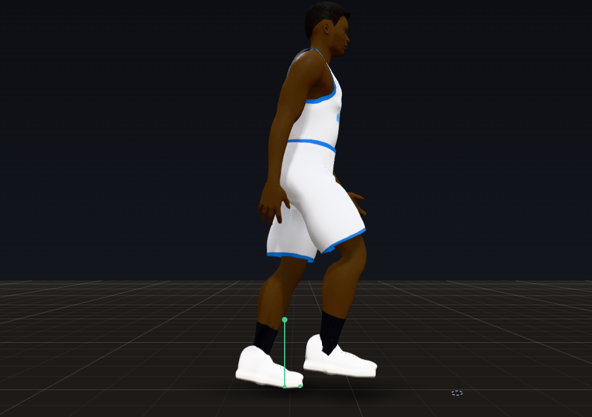
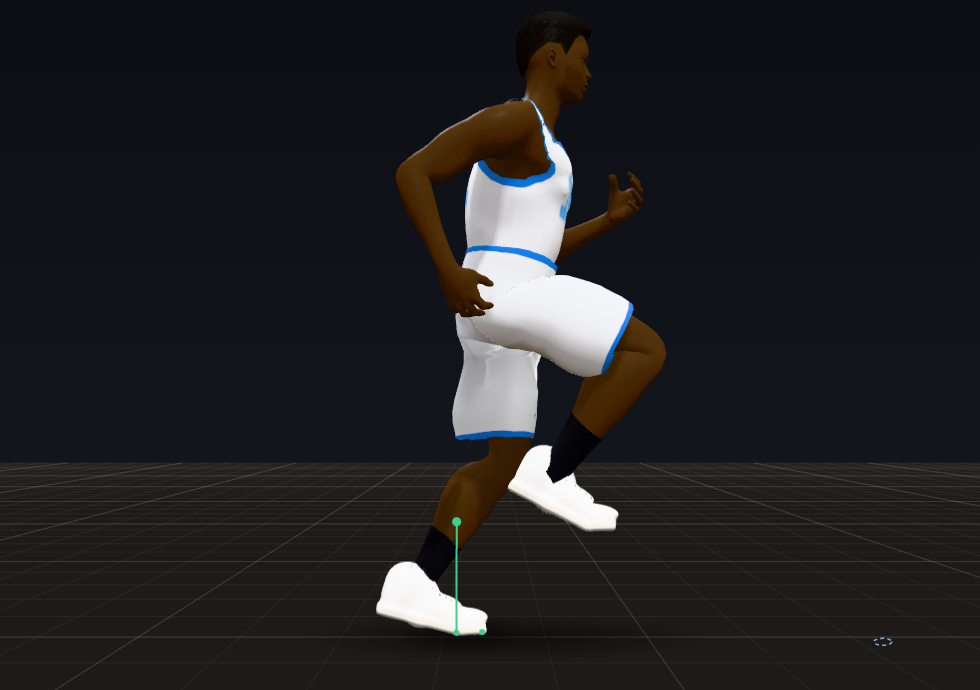
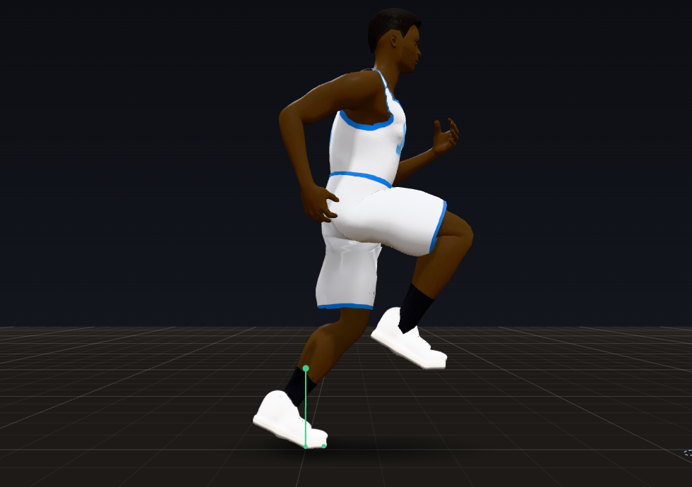
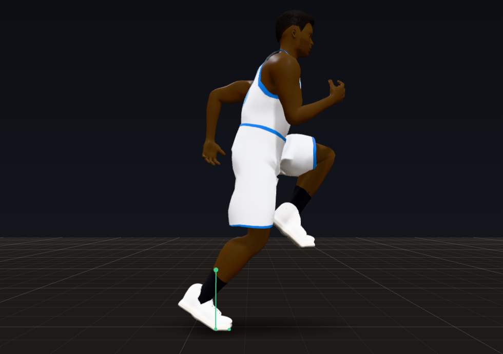
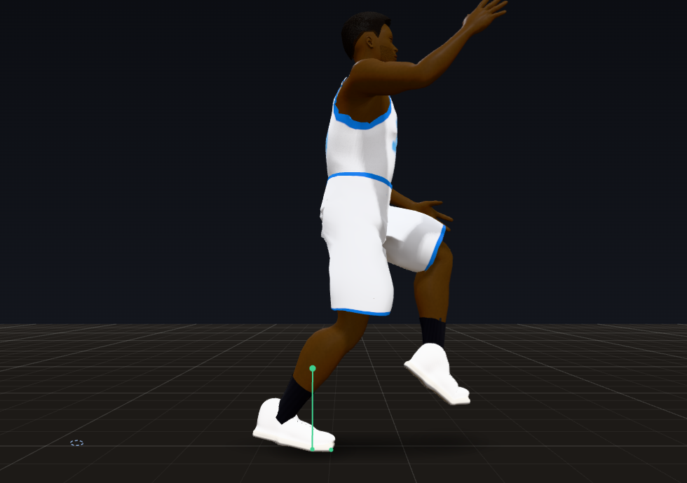
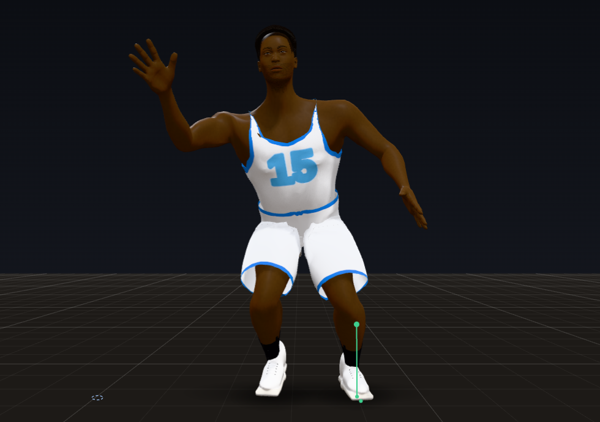
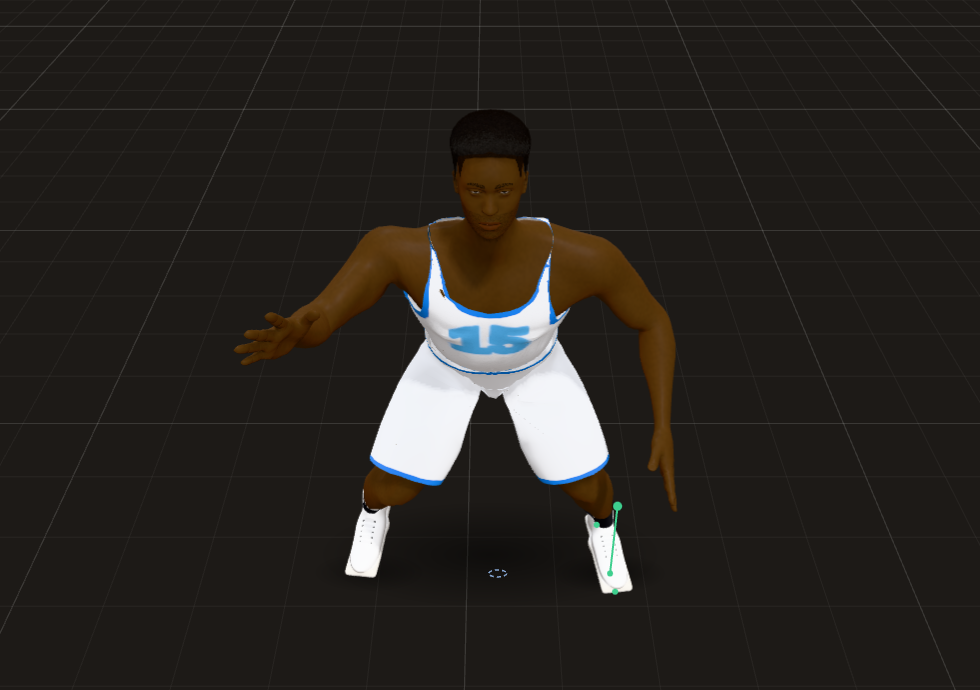
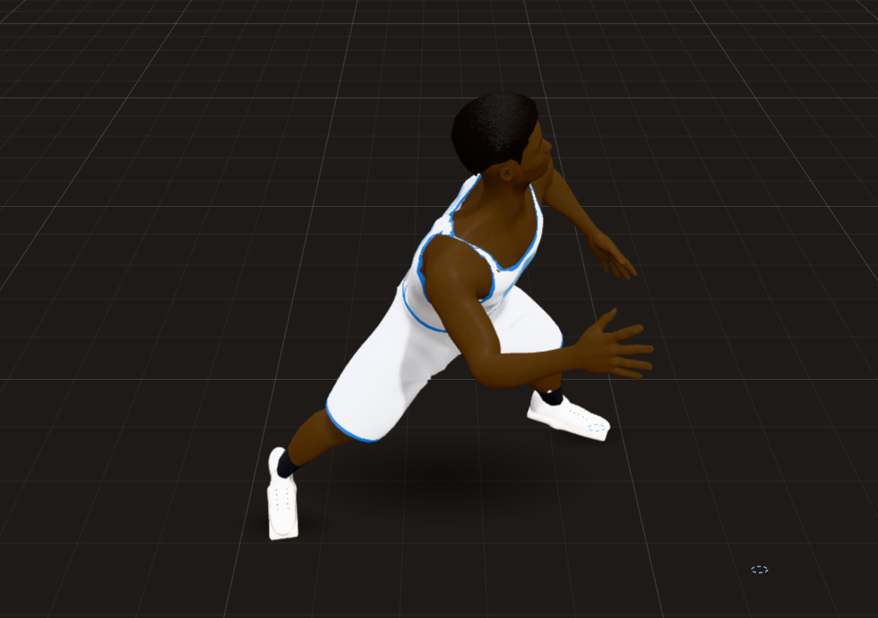
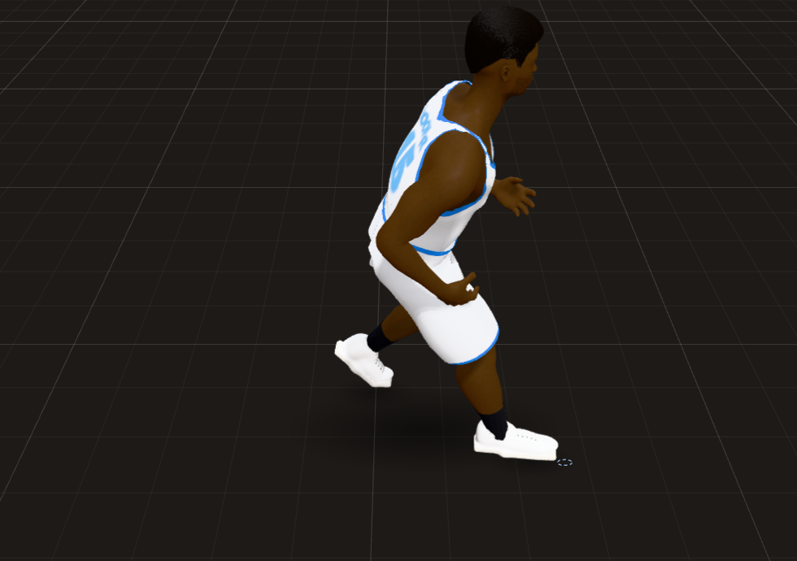

# Trial 5: The Gaits

**Result: PASS, with two live-game items carried to later trials.** Walk, jog, run, sprint, backpedal and the
defensive slide each have their own signature on every body (72 steady runs: a 6-1 185 lb guard, a 6-6 215 lb wing,
a 7-0 255 lb center and a 5-11 160 lb woman, three paces each), and named blind from what a viewer sees, 70 of 72 runs
come out as the right gait; the two misses are neighbours at a pace border. Every scripted change of gait (11 on the
game's own code in Node, 14 in the browser's Animation Lab) runs with 0 joint pops, 0 snaps and 0 hip jumps, down from
143 pops on the Trial 4 code, and a 0.25x replay is the same frames. Each arm now swings with the opposite leg: in every
steady walk, jog, run, sprint and backpedal the arm forward is the one opposite the thigh forward in 99.6 to 100% of
frames; on the Trial 4 code a jog, run or sprint got that right only 33 to 58% of the time and a backpedal 0 to 2% (its
arms swung with the leg on their own side). In live games, joint pops fell from 175 to 197 per player-minute to 36 to 47,
and pops while moving from ~140 to ~4 per minute of movement.

Not zero yet in live 5-on-5: a pop still follows 2.3 to 2.8% of the game's changes of gait (69 to 76% of them around the
defensive slide, which Trial 6 rebuilds), and where the gait swings the arms, 0.6 to 2.1% of frames have the wrong arm
forward for a moment (braking and late steps, below).

| Walk | Jog | Run | Sprint |
|---|---|---|---|
|  |  |  |  |

(Animation Lab, the same 6-6 body from the side, each at the moment a thigh is driven highest. Walk, 4.9 ft/s: a foot
always down, the thigh 38 degrees up, the arms hanging and swinging small, elbows 14 to 28 degrees. Jog, 11 ft/s: the rear
heel kicks up, the thigh 79 degrees up, elbows bent near 90. Run, 15 ft/s: 87 degrees. Sprint, 28 ft/s: the knee driven
to 105 degrees, the front arm bent to 72 degrees inside the elbow and the back arm to 111 (coaching: 60 to 90 in front,
90 to 120 behind), the trunk ~14 degrees forward. In every one the arm forward is the one opposite the thigh forward.)

| Backpedal | Slide |
|---|---|
|  |  |

(Backpedal at 9.9 ft/s from the side: the step behind him comes down toes first, the heel 12 degrees up, the trunk back.
Slide at 5 ft/s from the front: low, wide, the feet never crossing, the hands out.)

| Sliding with his man | He opens up | The crossover step |
|---|---|---|
|  |  |  |

("Slide with his man, then open up (crossover) and sprint", from high in front. At 2.45 s he slides at 7 ft/s; his man
goes by at 2.5 s; at 2.70 s the hips are 48 degrees round and the lead foot has dropped open; at 2.92 s the trail foot
has crossed over in front of the lead one, the hips square to the way he runs, 15 ft/s and rising.)

## How to see it

- **Animation Lab** (`lab.html`), at 0.25x:
  - "Walk", "Jog", "Run", "Sprint", "Speed ramp 0 to top and back": each arm swings forward with the opposite knee; the
    arms hang walking and bend to ~90 degrees from a jog; the knee drive, the arm drive and the forward lean grow into
    the sprint;
  - "Backpedal": toes first behind him, trunk back, the defender's arms held; "Defensive slide": the feet never cross;
  - the new **Gaits** group, the changes of gait: "Walk into an all-out sprint, then stop", "Stop and go (walk, jog,
    run, stop, run, stop)", "Run with his man, then backpedal as he turns back", "Backpedal, then turn and run as he blows
    by", "Slide with his man, then open up (crossover) and sprint", "Jog, slide across, jog on". None of them pops.
- **Debug tools** (Shift+D in `match_test.html` or the live game): the selected player's panel has a `gait` line (which
  gait, its cadence, its share of the stride on the floor, how much of the gait's arm swing the stance lets through);
  the session lines count pops per minute in each gait, pops just after a change of gait, and how often the arm forward
  is the one opposite the thigh forward.
- **Headless:**
  - `node tools/audit/gaits.js` (new) is a gait lab: every gait at three paces on the four bodies (cadence, step length,
    time on the floor, flight, knee drive, heel kick, arm swing, elbows, trunk lean, bob, landing, which way he travels
    against where he faces, feet crossing, each arm against the opposite leg), the blind naming test, and the 11
    scripted changes of gait with the game's own meters. It takes ~5 s.
  - `node tools/audit/quarter.js --seed 7` has a new `gait` block: pops per minute in each gait, around a change of gait
    and just out of a move; each arm against the opposite leg where the gait swings it; the hands' swing and the elbows.
- **Tests:** `node tools/audit/check.js` (94 checks; 21 are this trial's).

## A. What changed

- **`js/match/tune.js`**: a new `gait` group (every value below), new `floor` values (`liftAnkleMarginDeg`,
  `heelRiseDegps`, `heelRiseSprintDegps`, `heelDropDegps`, `airGuideK`, `swingPullFtps`, `pivot.accel`),
  `hipGuard.shiftFtps`, and the gait meter's thresholds in `debug`.
- **`js/match/anims.js`**
  - **Each arm with the opposite leg.** The legs are placed by the feet, which run a little behind the gait curves' own
    leg keys, so the arm keys are taken that much further round the cycle: 0.04 of a cycle walking, 0.24 jogging, 0.31
    sprinting, and going backwards about half a cycle round the reversed cycle (0.54 at 6 ft/s to 0.44 at 12). At the
    curves' own phase the arms trailed the opposite leg by a quarter to a third of a cycle running and swung with the
    leg on their own side backpedalling.
  - **The trunk turns against the hips on the arms' clock** (the shoulders' line mirrors the hips'), and the pelvis's
    height, sway, tilt and drop ride the stance on the stride's own clock (moved on with the rest, a runner's hips were
    lowest at toe-off instead of mid-stance).
  - A running gait's key poses are fitted to the real stance share only up to 0.44 of the cycle: past 0.49 the fit let
    go at once, and a walk turning into a jog made the arms and hips jump.
- **`js/match/actor.js`**
  - **Gait changes over a step or two.** The pose's mix of walk, jog and sprint follows the pace on a critically damped
    spring (half-life 0.07 s): a quick start or stop crossed the walk to jog change in a frame, the elbows swinging ~37
    degrees in one frame. The slide's and the backpedal's stepping and pose follow the way he goes over 0.12 s.
  - **Backpedal:** each step comes down toes first with the heel 12 degrees up (backward walking and running land on the
    forefoot); in games 89 to 92% of backpedal steps now land toes first, from 45 to 47%.
  - **Slide and crossover:** a slide's swing is a shuffle's (no heel kick, no push off the toes), its feet are kept on
    their own side of each other, and it goes no faster than 12 ft/s (elite players peak ~11 to 12 ft/s over a 5 m
    shuffle) until his hips have come round; a defender opening up turns at most 5 rad/s. Beaten, he drops the lead foot
    open and the trail foot crosses over in front of it into the run.
  - **The swing:** leaves the floor from where the foot is, at the leg's length at toe-off (back to full length by 0.4
    of the swing), with the ankle inside its range off the floor; lifts with no jolt (sin^2, then a smootherstep rise);
    a runner's heel kick comes in toward the hip's line by at most 0.06 of the height, following the lift's own shape;
    it goes round the planted foot only as far as needed, eased (0.03 s); the landing is predicted with the stride time
    eased (0.04 s), and re-aimed ever less over the last quarter of the swing. A foot lifted late in the stride (left
    behind by a turn or a burst) still gets 0.2 s for its swing, landing a little after the stride's contact (Weyand et
    al.: a runner's swing takes about the same time at any top speed; thrown forward in the 0.16 s left, a late lift at a
    turn swung the knee from 60 to 99 degrees in a frame).
  - **The landing:** the foot comes down at the pitch it had in the air and eases to the stride's landing pitch (~90% in
    0.1 s as the weight comes on), and the knee keeps its turn about the hip-ankle line from the air and eases onto the
    planted leg's plane (0.03 s): planted at once, the knee popped.
  - **A planted heel for reach** comes up no faster than 300 deg/s walking to 900 sprinting and back down at 200 (it
    jumped up and down with the leg's reach, the ankle and toes popping); a pivot has an angular acceleration (300
    rad/s^2).
  - **The planted-leg guard moves the pelvis over a planted foot no faster than 10 ft/s**; past that the foot steps (a
    defender opening his hips at ~500 deg/s over a planted foot had his pelvis thrown ~6 in in a frame, every joint above
    popping). This is the trade-off in the regression check below (D).
  - The knee guide for a leg in the air is off: the pole solve keeps a sprinter's knee within 2.7 in of the hip-ankle
    line without it, and it held a slide's wide leg ~38 degrees in and let go at contact, the knee popping both times.
  - The swinging foot's floor fix runs a second pass without the pull cap when the first leaves the foot in the floor.
- **`js/match/rig.js`**: a leg's knee can be turned about the hip-ankle line (the landing swivel above); a hand
  reaching at part weight goes toward the nearest point it can reach, not the target (a hand reaching for a ball ~20 ft
  off swung the arm ~70 degrees in a frame).
- **`js/match/debug.js`**: the gait meter (`gait` in the scorecard, lines in the panel): the gait by class (walk below
  6.2 ft/s, jog to 13, run to 20, sprint; slide and back by direction; stand), pops per minute in each, pops within 0.3 s
  after a change of gait (by change), the first 0.35 s out of a move or with the ball counted apart, and each arm against
  the opposite leg; the meters can count bodies off the court area (the Lab's and the audits' one-body worlds: their
  scripted runs leave the court, and their pops went uncounted).
- **`js/lab/lab.js`**: the Gaits group (six changes of gait) and the meters counting the whole scenario.
- **`tools/audit/gaits.js`** (new) and **`tools/audit/check.js`** (21 new checks, 94 in all): the blind naming, the
  walk's signature, flight and knee drive and lean in the running gaits, cadence and step length gait by gait, the
  backpedal toes first facing the play, the slide's feet never crossing, each arm with the opposite leg, the arm swing
  growing with the pace and compact sprinting arms, no pop in 72 steady runs, each of the 11 changes of gait with no pop,
  snap, hip jump or floor fault, and the crossover step.

**How it is measured.**

- A pop is a joint (hand, elbow, knee, toe, head) accelerating past 1,500 ft/s^2 in the body frame in one step (Trial 1's
  meter). A snap and a hip jump are Trial 4's.
- The blind naming: each run's twelve features (steps per second, step length in heights, share of time on the floor,
  flight, peak hip and knee flexion, shoulder swing, elbow, trunk lean, bob, travel against facing, feet crossing),
  scaled over all runs; each run is named by the nearest gait average over the other three bodies' runs, so no body is
  named by itself.
- Each arm against the opposite leg: the left shoulder's flexion minus the right's against the right hip's minus the
  left's (a contralateral swing keeps them in step, and the split takes out what the two sides share, a stance's arms
  held up or a crouch). The arm forward is the one opposite the thigh forward when the two have the same sign, taken about
  the middle of each one's swing over the last stride, counted where both are past a quarter of their half-range (a gait
  lab's count). In games it is counted where the gait swings the arms at least half its full swing: a defender's stance
  holds the arms up or out and takes 10 to 30% of it.

## B. Scorecard

| Criterion | Grade | Evidence |
|---|---|---|
| Walk | PASS | a foot always down (flight 0, on the floor 0.58 to 0.62 of the stride), heel first (toes 19 to 20 degrees up), 1.46 to 2.03 steps/s and 0.34 to 0.46 heights a step at 3.5 to 5.5 ft/s, arms hanging (elbows 21 degrees), bob 1.5 to 2.4 in (studies: ~1.6 to 2.0 steps/s, ~0.41 to 0.45 H, ~60% stance, heel strike) |
| Jog | PASS | 2.41 to 2.81 steps/s at 8 to 11 ft/s, a flight every step (23 to 42%), the heel kicking up (knee 128 to 131 degrees), elbows at 93 degrees, lean 8 degrees |
| Run | PASS | 2.77 to 3.18 steps/s at 14 to 18 ft/s, 0.72 to 0.96 heights a step, on the floor 0.21 to 0.28 of the stride, knee drive 81 to 101 degrees, lean 8.6 to 12.6 |
| Sprint: higher knees, bigger arm drive, forward lean | PASS | against the jog: knee drive 106 against 79 degrees, shoulder swing 95 against 67 degrees, lean 13.6 against 8.4; 3.2 to 4.0 steps/s, on the floor 0.17 to 0.21 of the stride (elite sprinters ~0.2), forefoot first |
| Backpedal (retreating while facing the ball) | PASS | travels straight back while facing the play (180 degrees off the facing), each step toes first (heel 11 to 12 degrees up), trunk back 8.5 to 15.7 degrees, no pop at 5 to 9 ft/s |
| Shuffle / slide, feet never cross | PASS | sideways (90 degrees off the facing), the feet crossing in 0% of frames on all four bodies at 4 to 10 ft/s, 3.5 to 5.7 steps a second, low (knees 80 to 94 degrees) |
| Crossover step (turning from a shuffle into a sprint when beaten) | PASS | "Slide, then open up and sprint": his man goes by at 2.5 s, the lead foot drops open, the hips come round, and at 2.85 s the trail foot crosses over in front of the lead one, then he runs; no pop, snap or hip jump (Trial 4 code: 30 pops) |
| Arm swing opposite to legs, amplitude with speed, compact in sprints | PASS | the arm forward is the one opposite the thigh forward in 100% of frames in all 48 steady forward runs and 99.6 to 100% of 12 backpedal runs, shoulder against opposite hip r 0.88 to 0.95, within 18 degrees of the cycle (Trial 4 code: 33 to 58% running, 0 to 2% backpedalling); the shoulder swing grows 35, 67, 75, 95 degrees walk to sprint; sprinting elbows at 89 degrees |
| Transitions blend through momentum, never pop | PASS | 11 scripted changes of gait in Node and 14 in the browser Lab: 0 pops, 0 snaps, 0 hip jumps, no floor or joint-range fault (Trial 4 code: 143 pops in the 11) |
| **PASS when:** a basketball fan could name each gait with labels hidden | **PASS** | named blind, 70 of 72 runs (leave one body out); the two misses are neighbours at a pace border: the 7-0 center's run at 14 ft/s named a jog and the woman's run at 18 ft/s named a sprint. The forward gaits by their form alone (no travel direction, no crossing): 47 of 48. The images above, one moment of each gait. (The Trial 4 code named 71 of 72: the gaits' cadence and stride already differed; this trial's work is what is inside them) |
| **PASS when:** transitions have zero pops or snaps at 0.25x | **PASS** (scripted), not yet in live play | the 25 scripted changes of gait above, 0 pops and 0 snaps; the clock is fixed-step, so 0.25x shows the same frames (1500 of 1500 identical steps at 0.25x, 0.1x, 144 Hz and a jittery frame rate). In live games a pop still falls within 0.3 s after 2.3 to 2.8% of the meter's changes of gait (431 to 574 of 18,280 to 20,686 a quarter), 69 to 76% of them around the defensive slide (Trial 6) |
| **PASS when:** arm swing is always in sync with the opposite leg | **PASS** (steady gaits), 97.9 to 99.4% in live play | 100% in every steady walk, jog, run and sprint and 99.6 to 100% backpedalling, on four bodies at three paces each; in live games, where the gait swings the arms, 97.9 to 98.2% walking, 98.8 to 98.9% jogging, 99.2 to 99.4% running, 99.1 to 99.2% sprinting; the misses last a frame or a few (a braking step, a foot lifted late) |

### The gaits (Animation Lab measures, four bodies, three paces each)

| Gait | Pace (ft/s) | Steps/s | Step (heights) | On the floor (of the stride) | Flight | Knee drive (hip flexion) | Heel kick (knee) | Shoulder swing | Elbow | Lean | Bob (in) | Landing |
|---|---|---|---|---|---|---|---|---|---|---|---|---|
| Walk | 3.5 to 5.5 | 1.46 to 2.03 | 0.34 to 0.46 | 0.58 to 0.62 | 0% | 38 to 40 | 65 to 67 | 35 | 21 | 5 | 1.5 to 2.4 | heel first, toes 19 to 20 up |
| Jog | 8 to 11 | 2.41 to 2.81 | 0.47 to 0.66 | 0.29 to 0.38 | 23 to 42% | 76 to 81 | 128 to 131 | 67 | 93 | 8.4 | 2.4 to 2.9 | rearfoot, toes 5 to 7 up |
| Run | 14 to 18 | 2.77 to 3.18 | 0.72 to 0.96 | 0.21 to 0.28 | 44 to 58% | 81 to 101 | 129 to 145 | 67 to 86 | 90 to 93 | 8.6 to 12.6 | 2.5 to 3.7 | midfoot |
| Sprint | 22 to 28 | 3.16 to 4.00 | 0.99 to 1.18 | 0.17 to 0.21 | 59 to 67% | 102 to 110 | 145 | 95 | 89 | 13.6 | 3.3 to 3.9 | forefoot, heel 4 to 6 up |
| Backpedal | 5 to 9 | 2.02 to 3.11 | 0.35 to 0.49 | 0.41 to 0.61 | 0 to 17% | 80 to 99 | 84 to 108 | 4 to 13 (held) | 58 to 69 | 8.5 to 15.7 back | 0.6 to 1.9 | toes first, heel 11 to 12 up |
| Slide | 4 to 10 | 3.48 to 5.71 | 0.16 to 0.30 | 0.48 to 0.57 | 0 to 5% | 66 to 73 | 80 to 94 | 4 to 7 (held out) | 59 to 66 | 0 | 0.4 to 1.3 | flat to forefoot |

(The jog's high heel kick is kept on purpose: the user's own jogging references. Studies: walking ~1.6 to 2.0 steps/s
with ~60% stance; running at ~5 m/s ~2.9 steps/s; top sprinting ~0.2 of the stride on the floor, the elbows near 90
degrees and the arm swing growing with the pace; sources below.)

### Before and after

| Measure | Trial 4 code | Trial 5 |
|---|---|---|
| Scripted changes of gait: pops (11 scripts) | 143 | **0** |
| Steady runs with a pop (72 runs) | sprint 25, backpedal 7, slide 18 pops | **0** |
| Arm forward opposite the thigh forward, steady jog / run / sprint | 33 to 58% | **100%** |
| The same, backpedal | 0 to 2% (arms with the same-side leg) | **99.6 to 100%** |
| Shoulder against opposite hip (r), jog / run / sprint | -0.23 to 0.09 | **0.92 to 0.95** |
| Backpedal steps landing toes first, in games | 45 to 47% | **89 to 92%** |
| Joint pops per player-minute, seed 7 / 21 / women | 175 / 197 / 175 | **40 / 47 / 36** |
| Pops per minute of movement, in games | 141 to 157 (3 seeds, 3 minutes each) | **4.0** (12 seeds, 3 minutes each); 4.1 / 4.7 / 4.1 in the three quarters |
| Blind naming | 71 / 72 | 70 / 72 |

## C. Devil's advocate

1. **"A jog and a run look the same."**
   - True at the border: the 7-0 center's run at 14 ft/s is named a jog, and the woman's at 18 a sprint. The jog, run
     and sprint are one continuum by pace in the game (a run is a mix of the jog and sprint poses), as in life.
   - What separates them: at 8 to 11 ft/s the jog takes ~2.6 steps a second of ~0.57 heights, the arms swing 67 degrees
     at the shoulder; at 14 to 18 the run takes ~3 steps of ~0.84 heights, and the knee drive, the arm swing and the lean
     grow with the pace into the sprint's 106 degrees of knee drive, 95 of shoulder swing and 13.6 of lean.
   - The jog's heel kick (knee ~130 degrees, studies put jogging nearer 90 to 110) is kept high on purpose (the user's
     jogging references); it is `gait.sprintLiftH` and the jog lift in `anims.gaitParams`.
2. **"It is clean in the lab and pops in the game."**
   - Before: the scripted changes of gait popped 143 times on the Trial 4 code, and games popped ~140 times per minute of
     movement.
   - Now: 0 in the 25 scripts, ~4 per minute of movement in games, 36 to 47 per player-minute in all (from 175 to 197).
   - Not zero in games: 69 to 76% of the pops left after a change of gait are around the defensive slide, where a
     defender following his man flips between sliding, backpedalling and walking several times a second; the slide's
     planted foot is also where the pelvis cap below makes a foot step. Trial 6 (the defense) takes it on.
3. **"The arms are right on average, but not always."**
   - In every steady gait on every body: 100% (99.6% backpedalling). In games, where the gait swings the arms, 97.9 to
     99.4%: the misses are a frame or a few, at a braking step or a foot lifted late, where the legs leave the stride's
     schedule and the arms keep to it. A clock for the arms that follows the late leg did not move the number (tried and
     taken out); the braking step's own shape (the thigh far forward at contact) is the rest, and Trial 7 (the offensive
     footwork: jab steps, stops, pivots) is where those steps get their own arm action.
   - A defender's stance holds the arms up or out and lets only 10 to 30% of the swing through; those frames are not
     counted as a swing (in the scorecard, `armsSwingingPct` says how much of each gait they are).

## D. Regression check

- **Trial 1:** all of its checks pass (94 of 94 in all), and the determinism check gives 1500/1500 identical steps at
  1x, 0.25x, 0.1x, 144 Hz and a jittery frame rate. In the browser every debug layer toggles on and off during an engine
  game, the speeds step exactly (6, 15, 30 and 60 steps per 60 frames), pause and single steps work, rewinding 30 frames
  and stepping back returns to the identical live frame, isolate and orbit work, and Shift+D opens and closes. No page
  errors. The overlay draws in 7.3 ms with every layer on.
- **Trial 2:** 0 final poses past a human joint limit in all three quarters; knees caving in 0.05 to 0.07% of planted
  frames (0.03%); counter-rotation stronger (hips against shoulders r from -0.73, -0.75 and -0.76 to -0.77, -0.78 and
  -0.79); spine and neck pops 2.5 to 2.8 per player-minute (2.6 to 3.0). The dribbling hand sits closer to the ball (p90 1.00, 0.82, 0.64 in to
  0.63, 0.67, 0.47 in).
- **Trial 3:** no contact slid past 0.25 in (worst 0.11 to 0.12 in, from 0.07 to 0.09), no foot through the floor, no
  planted foot floating. Steps with a clear plant, stance and lift: 99.79, 99.71 and 99.75% to 99.72, 99.64 and 99.60%;
  steady walking is still 100% heel first, while game walking steps landing heel first went from 69 to 72% to 65 to 67%
  (more land flat or on the forefoot out of turns). **The planted-leg guard's last resort (a planted foot made to step
  because its hip reached the end of its range) went from 9 to 21 a quarter to 436 to 495**, from 0.06 to 0.12 per
  player-minute to 2.6 to 3.1: the price of never moving the pelvis faster than 10 ft/s over a planted foot. Over 12
  seeds, 3 minutes of play each: at 10 ft/s, 73 forced steps and 4.0 pops per minute of movement; at 14, 38 and 4.0 (but
  a defender turning to run out of a backpedal popped in the scripts, and at 12 too); at 20, 17 and 5.9. With no cap
  (seeds 7 and 21), 1 to 5 forced steps and 6 to 7 pops per minute of movement. Most are a sliding defender's lead foot,
  crossed in under him; they read as a quick reset step. Trial 6 takes it on with the slide.
- **Trial 4:** 0 acceleration snaps, 0 instant turns, 0 turn snaps and 0 hip jumps in all three quarters; every hard cut
  (774) on a planted outside foot with the hips down; hard stops on a foot planted out ahead 98.6, 99.4 and 99.2% (97.5,
  97.9 and 97.3%), all with the hips down.
- **Cost:** the game step alone for 10 players is 2.16 to 2.24 ms at the median and 4.2 to 5.7 ms at p99, against 1.94
  to 2.01 and 3.9 to 4.2 ms on the Trial 4 code (same machine, one process, seeds 7 and 21, twice each): ~0.02 ms more
  per body, well inside a 60 fps frame (16.7 ms).
- Scorecards: `docs/gauntlet/baseline/trial05_*.json`.

## E. What to watch for

- In the Lab, the Gaits group at 0.25x:
  - "Slide with his man, then open up (crossover) and sprint": the lead foot drops open, the hips come round and the
    trail foot crosses over in front, then the arms start pumping with the legs;
  - "Backpedal, then turn and run as he blows by": the steps behind him land toes first; turning to run, the first steps
    are quick and low, and the arms pick up the opposite legs within a step;
  - "Walk into an all-out sprint, then stop": the arms go from hanging to bent over about a step, the knee drive and the
    lean grow with the speed, and the stop chops its steps.
- In a game, Shift+D: select a player; the `gait` line shows the gait and how much of the arm swing is showing; the
  session lines count gait pops and how often the arm forward is the one opposite the thigh forward.
- Still to come:
  - **Trial 6:** the defensive slide in live play (most of the pops left after a change of gait, and most of the forced
    steps of the planted-leg guard: a sliding defender's lead foot crossed in under him); closeouts.
  - **Trial 7:** braking and late steps, where the arms can lag the legs for a frame or a few.
  - `Tune.gait` holds every value of this trial; `Tune.hipGuard.shiftFtps` sets the forced-step trade-off above.

## Sources

- Each arm swings with the opposite leg, balancing the body's turn about the vertical: https://en.wikipedia.org/wiki/Arm_swing_in_human_locomotion ;
  arm and leg coupling measured as the relative phase of the shoulders against the opposite hips (ideal in-phase 0,
  anti-phase 180 degrees): https://pubmed.ncbi.nlm.nih.gov/28110146/ ; the pelvic and scapular girdles turn against
  each other in mature walking and running: https://www.academia.edu/22309075/Whole_Body_Movement_Coordination_of_Arms_and_Legs_in_Walking_and_Running
- Sprint arm action: the elbow near 90 degrees (60 to 90 in front, 90 to 120 behind), the swing from the shoulder, hand
  from hip to cheek, its amplitude scaling with speed and stride: https://athletesacceleration.com/arm-action-speed/
- A runner's swing time does not shrink with top speed (faster runners push harder on the ground, not move their legs
  faster): Weyand et al. 2000, https://pubmed.ncbi.nlm.nih.gov/11053354/ ; above ~7 m/s speed comes from stride
  frequency, the hips driving the swing harder: Dorn, Schache and Pandy 2012,
  https://journals.biologists.com/jeb/article/215/11/1944/10883/Muscular-strategy-shift-in-human-running ; walking,
  running and sprinting compared: Novacheck 1998, https://pubmed.ncbi.nlm.nih.gov/10200378/
- Backward walking and running land on the forefoot: https://runlovers.it/en/2026/improve-proprioception-balance-backward-walking/ ;
  the rebound of the body in backward running: https://doi.org/10.1242/jeb.057562 ; forward against backward running
  (Flynn and Soutas-Little 1993) as discussed in https://pmc.ncbi.nlm.nih.gov/articles/PMC7557486/
- The defensive slide (short quick steps, the feet not crossing) and the crossover step (the trail foot crossing in
  front of the lead foot to cover distance, when a slide cannot keep up):
  https://www.breakthroughbasketball.com/defense/defense-crossover-step ,
  https://www.breakthroughbasketball.com/defense/debunking-cross-feet , https://www.coachesclipboard.net/DefenseZDrill.html ,
  https://simplifaster.com/articles/deconstructing-preformance-training-basketball-defense/
- Keeping walk and run cycles in phase while blending, and foot sliding from a speed mismatch (game developers):
  https://gamedev.net/forums/topic/646774-matching-walkrun-animation-with-character-movement/ ,
  http://physicsforgames.blogspot.com/2010/06/blending-walkrun-cycle.html ,
  https://dev.epicgames.com/documentation/en-us/unreal-engine/pose-warping-in-unreal-engine
- Critically damped springs for the eased values: D. Holden, "Spring-It-On", https://theorangeduck.com/page/spring-roll-call
