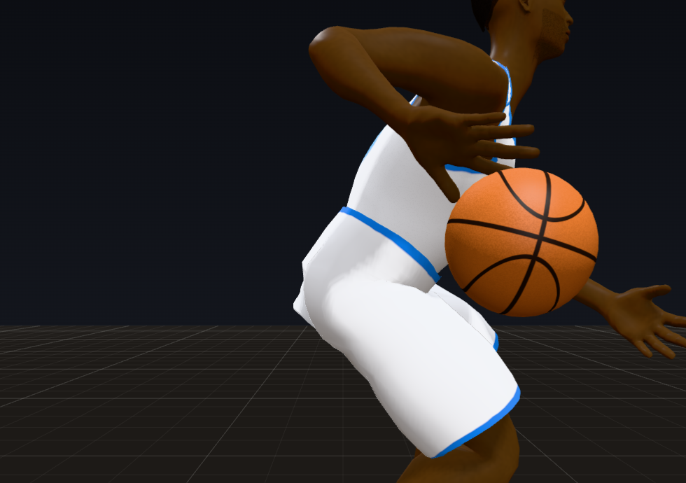
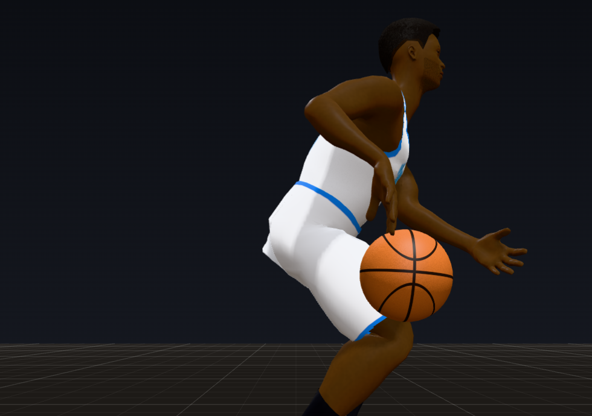
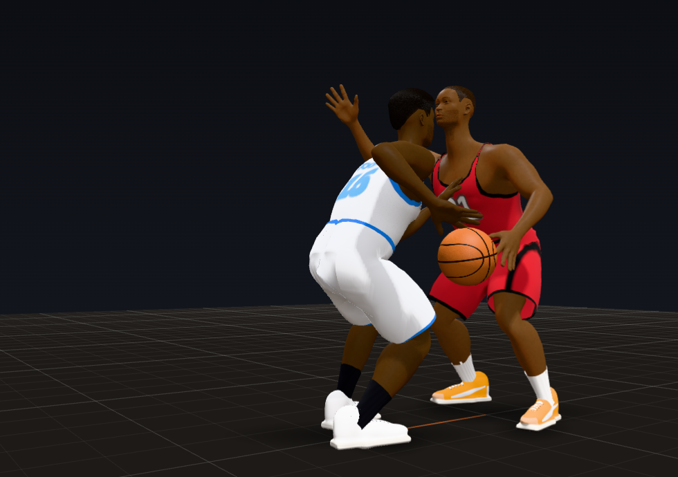
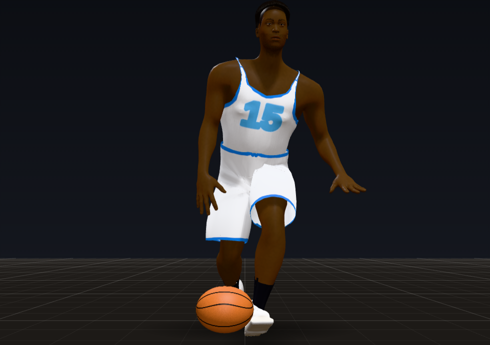
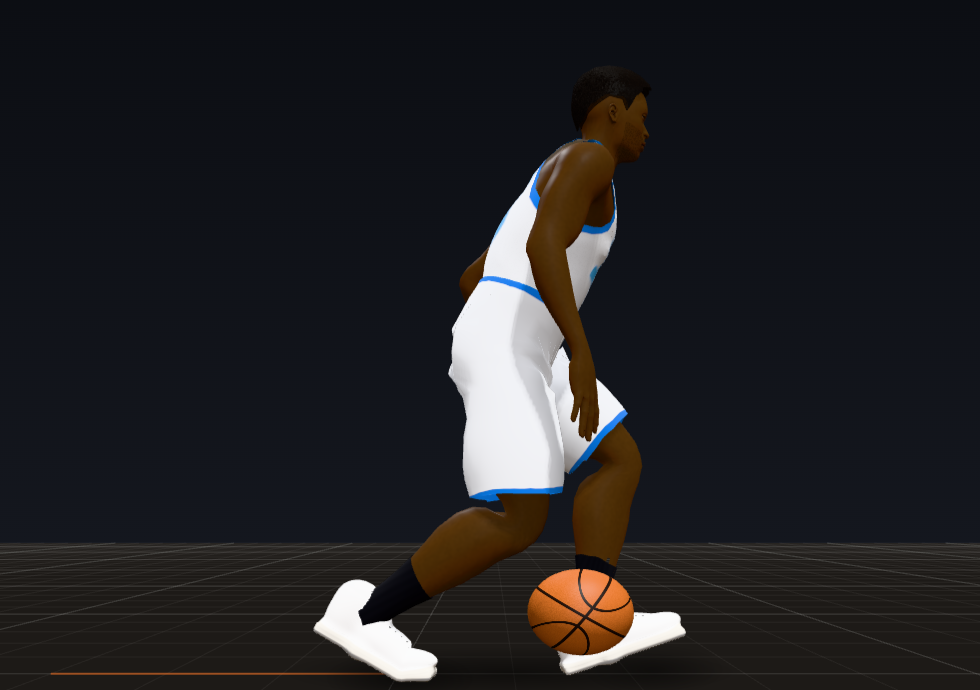
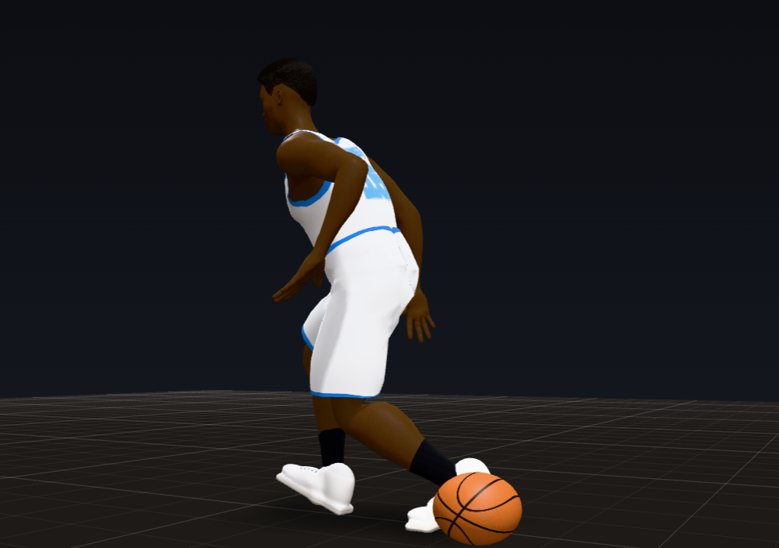
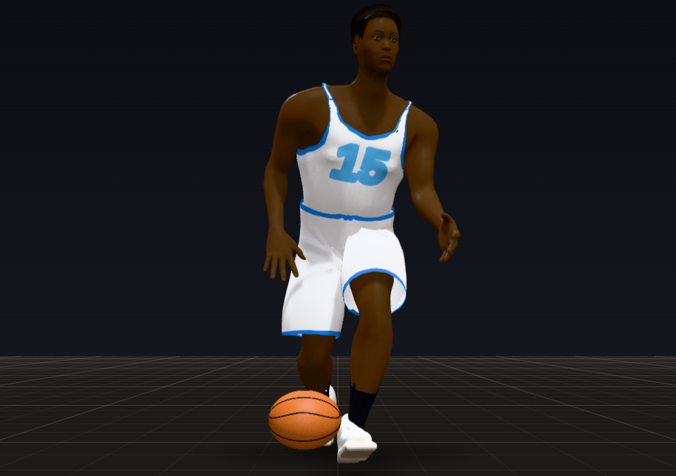
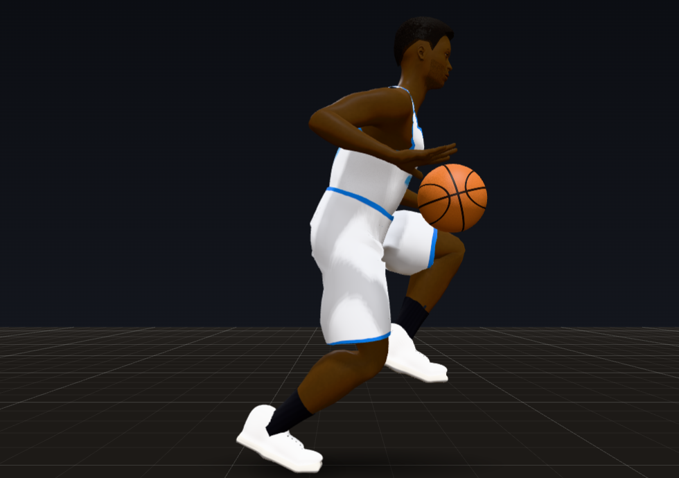
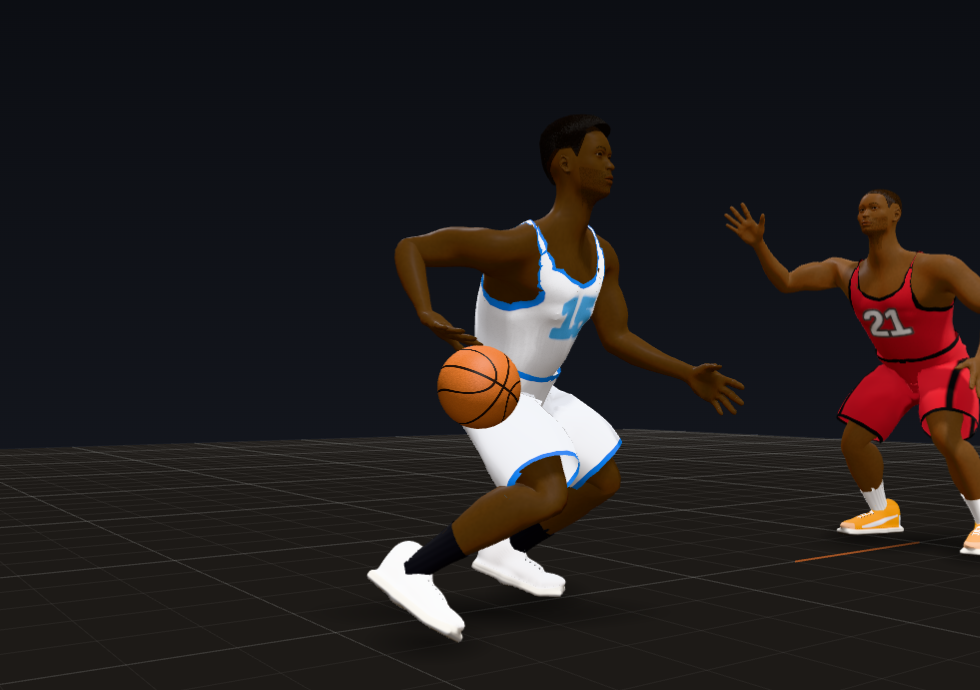

# Trial 8: The Handle

**Result: PASS in the lab (scripted), with live-game items carried to Trials 6, 7, 10 and 13.** In the 14 dribbling
scenarios of `tools/audit/handle.js` (standing open and with a defender up, walking, jogging, running, a speed dribble,
the crossover, between the legs, behind the back and the in and out three times each, the spin, the hesitation, the
retreat dribble and a dribble out of the hands), measured by the game's own meters and repeated at 10 different actor
ids (each body has its own dribble period):

- the hand is on the ball at every contact: 122 contacts, none off the ball by more than 0.25 in (worst 0.02 to 0.04 in);
- the ball is never inside a leg, the body or a hand: 0 frames in 13 scenarios at every id (the spin, whose footwork is
  Trial 7's, is allowed 2 frames and 1.5 in, and had 0 at the audit's id);
- the rhythm matches the feet: moving, the bounce comes with the landing of the inside foot (the one opposite the ball)
  90% of the time walking and 100% jogging, running and sprinting, and every move's bounce lands on a footfall (100%);
- the ball falls at g (32.174 ft/s^2) between hand and floor and comes off the floor at FIBA's restitution (within
  0.036); 1.5 bounces a second standing open, 2.3 to 2.5 with a defender up close, lower under pressure (31 in at the top
  against 34); eyes on the ball 0% of dribbling frames; the off arm up between the ball and the defender 98% (standing) and
  91 to 94% (retreating) of those frames.

On the Trial 5 code, with the same meters, the 11 scenarios both versions can run had the hand off the ball at 82 of 100
contacts, 36 frames of the ball inside a body, and 80 hand and elbow pops. Now: 0 of 102, 0 and 2 (the 2 in the spin).

Not zero yet in live 5-on-5 (three full quarters): 10 to 18% of contacts still have a frame with the hand more than
0.25 in off the ball (86% on the Trial 5 code; the median contact is now 0.01 in off), and the ball is inside a body in
3.0% of dribble frames (6.2%). What is left: the moves pushed while running or turning (their setup footwork is Trial
7's), the first dribble out of a catch's two-hand hold (the hold's grip is Trial 10's), defenders' hands and legs
reaching into the ball (Trial 6), and turns the game's decisions make while the ball is down (Trial 13).

| The palm on top | The release | The control dribble |
|---|---|---|
|  |  |  |

(Animation Lab, "Dribble in place" and "Dribble with a defender up on him". At the top of the bounce the palm is on the
ball (0.01 in), the wrist cocked back 32 degrees, the elbow bent 101, the ball 22 in out to the side and 11 in ahead,
33.5 in up. At the release, 0.07 s later, the wrist has snapped through to 25 degrees flexed and the elbow opened to 80,
the forearm going on toward the floor. With a defender 3.6 ft away: the top 31 in, the ball back and in (20 in out), the off
hand up at 46 in between the ball and the defender.)

| Crossover | Between the legs | Behind the back |
|---|---|---|
|  |  |  |

| In and out | Hesitation | Retreat dribble |
|---|---|---|
|  |  |  |

(Each move at its moment, walking at 3.3 ft/s unless noted. Crossover: just off the floor in front, 22 in ahead, on its
way to the other hand, which reaches for it from the push on. Between the legs: the bounce between the split feet, the
receiving foot forward. Behind the back: coming up 18 in behind the dribbler and 12 in to the other side, pushed as the ball-side
foot stepped. In and out: back up to the same hand, the palm on the inside of the ball, the shoulders faking the cross.
Hesitation at 11 ft/s: held at the top of the ride, 39 in up, before the low quick burst. Retreat: stepping back from a
defender 8.5 ft away, the ball on the hand at the hip, the off arm up.)

## How to see it

- **Animation Lab** (`lab.html`), the Dribbling group, at 0.25x:
  - "Dribble in place": the palm meets the ball at the top, the fingers spread; the wrist snaps through the push and the
    forearm follows toward the floor; nothing between palm and ball at the catch;
  - "Dribble with a defender up on him" (new, `dpress`): lower and quicker, the ball back and in, the off arm up;
  - "Dribble walking", "jogging", "running", "speed dribble": the bounce with the landing of the foot opposite the ball;
  - the moves (crossover, between the legs, behind the back, in and out (new, `inout`), spin, hesitation): each move's
    bounce on a footfall, the other hand reaching for the catch from the push on;
  - "Retreat dribble" (new, `retreat`) and "Catch and go" (new, `catchgo`: a dribble out of a two-hand hold).
- **Debug tools** (Shift+D in `match_test.html` or the live game): the selected player's panel shows the hand-to-ball gap;
  the session lines count contacts off the ball, the ball inside a body (by what it was in), the bounce rate and height
  open, pressed and moving, the bounce against the feet, eyes on the ball, the off arm, and the ball jolted in the air.
- **Headless:**
  - `node tools/audit/handle.js [--json out.json]` (new): the 14 scenarios with the game's meters, plus gravity and
    restitution checked on the ball's own path. It takes ~20 s.
  - `node tools/audit/quarter.js --seed 7` has a `handle` block in its scorecard: contacts, the ball inside a body,
    bounces, rhythm, rates and heights, eyes, the off arm, the ball in the air.
- **Tests:** `node tools/audit/check.js` (116 checks; 22 are this trial's).

## A. What changed

- **`js/match/tune.js`**: a `handle` group (every value below), `floor.swingMinClearFt`, and the handle meter's
  thresholds and body radii in `debug`.
- **`js/match/ball.js`**: the dribble.
  - **Real gravity.** Each bounce is planned as physics: the ball leaves the hand at the release, falls at g, comes off
    the floor at FIBA's restitution for the speed it came down at (a ball dropped from 1.8 m rises to 1.2 to 1.4 m), and
    rises at g to the catch. The period asked for is met by bisecting the catch speed.
  - **The rate and the height.** Standing, relaxed and high when open (~1.5 a second), low and quick when a defender is up
    close (~2.4 a second, a spring on the nearest opponent's distance); under pressure the ball goes back and in (a control
    dribble). Each body has its own period (0.64 to 0.71 s).
  - **With the feet.** Moving, a bounce every one or two steps, steered onto the landing of the inside foot. A move starts
    at a cycle's start and waits for its beat: behind the back is pushed as the ball-side foot steps, between the legs
    with the receiving foot forward (the coaching footwork for both), the others on the next footfall; a short hang at
    the top of the ride (up to 0.3 s) takes up the wait, and a move asked for while one waits goes after it.
  - **The moves** are variations of the same cycle: the crossover, between the legs and behind the back hand the ball
    to the other hand (it reaches for the catch from the push on, takes the dribble at the release, and the old hand
    follows through and lets go); the in and out keeps the hand (the palm from the inside of the ball, a shoulder fake);
    the hesitation hangs at the top and bursts out low; the retreat takes two dribbles back, low, away from the defender.
  - **In the air** the ball flies straight across the floor from the release to the bounce to the catch (a ball's
    horizontal speed does not change in flight), its spots fixed in the world where the body will be; the bounce and catch
    spots are chosen against where the dribbler's legs will be (`_clearPath`, the legs from `Actor.legsAt`), with a smooth look-ahead
    ease round them (`_airAvoid`) and the old hard push out of a leg left only as a last resort. The follow-through's
    travel is capped; the ride starts from where the ball really was caught.
- **`js/match/actor.js`**
  - **The palm on the ball.** Every frame of the push and the ride the palm is put on its spot by damped Newton steps on
    the wrist target (a finite-difference Jacobian on that arm alone, weighted to the ball's surface first, warm-started
    from the last frame); the wrist is cocked ~32 degrees at the top and snaps to ~25 flexed at the release, the fingers
    spread to take the ball and close as they push.
  - **Out of the hands**: a carry to the push's start that goes with the shoulders, the palm sliding over the ball from
    where the hold had it, the elbow blending from the hold's, the other hand letting go around the ball.
  - **Where the body will be** (`predictFrame`, `_faceAhead`, `legsAt`): the dribble's plans use the body's position and
    facing when the ball comes down and up. The facing is now predicted as the body turns (from the turn it has on,
    building up and braking to the facing it wants, as `_faceStep` turns it); kept as it faced, a body turning ~200
    degrees a second was 35 degrees off the prediction at the catch (median), now 3.
  - **The shoulders stay with the ball**: a ball coming up to be caught well behind the dribbling shoulder (the facing
    wanted changed while it was down) turns the chest back toward it, up to 35 degrees, held through the push. The
    chest's small turn toward the ball side goes over to the other side of a crossover on a spring instead of in a frame.
  - The off arm between the ball and the nearest defender (in front or out to the side, as far as the player's handling allows), eyes
    on the play, a dribbler never upright (the stance), ball-handling upper-body clips fading once the player dribbles, a retreat
    waiting for the catch, the ball kept out of the dribbler's own feet and other players' bodies.
  - **Two fixes to earlier trials' code** that this trial's regression check turned up (D): the planted-leg guard's last
    resort step is aimed where the body will face when it lands and tracks the turn in the air (aimed where it faced,
    turning ~200 degrees a second, the foot came down pigeon-toed, the hip at once past its range, and it stepped again 0
    to 2 frames after landing, a step with no stance); and every swinging foot clears the floor by ~1 in at mid-swing
    (`floor.swingMinClearFt`, sin^2 over the swing; small slow steps had cleared it by 0.2 to 0.7 in and read as feet
    dragged).
- **`js/match/rig.js`**: soft IK on the dribbling arms (Nicholls: the last 6% of the reach softens exponentially), so
  the elbow never snaps straight at full reach.
- **`js/match/debug.js`**: the handle meter: each contact's largest hand-to-ball gap, the ball inside a body (capsules
  round the skeleton's segments, by what it was in), bounces, rates and heights, each bounce against the feet, eyes on
  the ball, the off arm, and the ball jolted in the air.
- **`js/match/choreo.js`, `flow.js`, `view.js`**: the automatic dribbling no longer puts the ball down in the middle of
  a throw.
- **`js/lab/lab.js`**: the Dribbling group's new scenarios, the moves run long enough for three each.
- **`tools/audit/handle.js`** (new) and **`tools/audit/check.js`** (22 new checks, 116 in all): the meters' known
  answers (a ball set 2 in into a thigh reads 2 in; a 1 in step in the ball's path is a jolt, a 0.25 in step is not),
  every scenario's contacts, the ball never inside a body, gravity and restitution, the rates and the height with
  pressure, the rhythm, every move on a footfall, eyes up, the off arm, no hand or elbow pops, the ball in the air, and
  the body's predicted facing.

**How it is measured.**

- A contact is the span of frames the dribbling hand is on the ball (the push and the ride); its gap is the largest
  distance between the palm and the ball's surface over the span. Off means more than 0.25 in (the meter's tolerance).
- Inside a body: the ball against capsules round the skeleton's segments (trunk, head, thighs, shanks, feet, arms,
  hands), counted when it is more than 0.25 in inside one; the dribbling hand is left out while it is on the ball (its
  gap is measured instead), and so are a holder's gripping hands.
- The rhythm: moving, each bounce against the landing of the foot opposite the dribbling hand (within 0.067 s); a move's
  bounce against a footfall of either foot.
- The ball in the air: a jolt is a horizontal acceleration past 150 ft/s^2 over three frames in the same fall or rise.
- A pop is a joint accelerating past 1,500 ft/s^2 in the body frame in one step (Trial 1's meter).

## B. Scorecard

| Criterion | Grade | Evidence |
|---|---|---|
| Dribble is physics based: gravity, energy loss, floor contact | PASS | between hand and floor the ball falls at 32.17 ft/s^2 in every scenario (worst off 0.00); every bounce comes off the floor at FIBA's restitution for its speed, within 0.036 (0.79 to 0.85); the floor squashes the ball and the bounce is heard at contact |
| The hand meets the ball at the top, cups it, pushes it down, zero visible gap | PASS (lab), not yet in live play | 122 contacts, none off by over 0.25 in, worst 0.02 in (0.02 to 0.04 over 10 ids); the catch gap 0.00 to 0.01 in; image 1. In games: the median contact 0.01 in, p90 0.25 to 1.5 in, 10 to 18% of contacts off at some frame (86% on the Trial 5 code) |
| Wrist and fingers flex on each push, the forearm follows through toward the floor | PASS | the wrist cocked back ~32 degrees at the top, snapping to ~25 flexed at the release (images 1 and 2), the fingers spread as the ball comes up and closing through the push, the forearm going on toward the floor after the release (its travel capped); 0 hand or elbow pops in 13 scenarios |
| Rhythm syncs with the stride when moving | PASS (lab), 54 to 59% in live play | the bounce with the inside foot's landing 90% walking, 100% jogging, running and sprinting (Trial 5 code: 18, 0, 0 and 78%); every move's bounce on a footfall, 100% (33 to 67%). In games 54 to 59% of bounces with the inside step (28%) and 79 to 83% of moves on a footfall (44%) |
| Height changes: low and quick under pressure, higher and relaxed open | PASS | the top of the bounce 31.2 in with a defender up close against 33.5 open, 2.3 to 2.5 bounces a second against 1.5 (Trial 5 code: 33.5 and 1.5 both ways); running it is pushed ahead at thigh height (36 to 37 in at the top). In games, pressed tops 29 to 31 in against 30.5 to 35 open, 2.2 a second against 1.5 to 1.6 |
| The moves as procedural variations: crossover, between the legs, behind the back, hesitation, in and out, retreat, spin | PASS (spin: its footwork is Trial 7's) | each on the same bounce cycle, timed to the feet, the other hand reaching for the catch; images above. The spin has 24 leg and 2 arm pops, its planted feet and turn being Trial 7's |
| Ball protected with the off arm when a defender is close | PASS (lab), partly in live play | up between the ball and the defender 98.3 to 98.9% of those frames standing and 91.2 to 94.1% retreating (the Trial 5 code: 47% in games). In games 40 to 50% of the frames a defender is within 4.5 ft of the ball: 49% with the defender in front (65% for good ball handlers; poorer ones barely lift it, by design), under 1% with the defender on the ball's side or behind, where only turning the body or switching hands protects it (Trial 13) |
| Eyes up while dribbling | PASS | looking at the ball in 0% of dribbling frames in every scenario, 0.1 to 0.2% in games (experts fixate the defender's head while dribbling, novices the ball) |
| Starting values: 1.5 to 2.5 bounces a second standing, faster when low | PASS | 1.46 to 1.62 open and 2.31 to 2.5 pressed over the 10 ids |
| **PASS when:** the hand-to-ball meter shows zero gap at every contact | **PASS** (lab), not yet in live play | 122 of 122 contacts on the ball within 0.25 in, worst 0.02 in, at every one of 10 actor ids. In three full quarters 10.1, 17.7 and 12.2% of contacts are off at some frame: the moves' pushes while running or turning (the push reaching past the shoulder's range), the first dribble out of a catch's hold, and the ride after a turn decided while the ball was down |
| **PASS when:** the ball never passes through a leg, body or hand | **PASS** (lab), not yet in live play | 0 frames in 13 scenarios at every id (the spin 0 to 2, allowed 2). In a game (seed 7), 939 of 31,651 dribble frames (3.0%, from 6.2%): 433 are the first dribble out of a catch's two-hand hold (its forearm, Trial 10's grip), 331 defenders' legs and hands reaching in (Trial 6), 175 the dribbler's own body, 132 of them a thigh, mostly on a move pushed while running (Trial 7) |
| **PASS when:** the dribble rhythm matches the feet when moving | **PASS** (lab), 54 to 59% in live play | 90 to 100% with the inside step, every move on a footfall; in games 54 to 59% and 79 to 83% |

### The dribble (Animation Lab measures, 14 scenarios)

| Scenario | Contacts off | Worst gap (in) | Inside a body | Bounces/s | Top (in) | With the inside step | Moves on a footfall | Ball jolted in the air | Dribbler pops |
|---|---|---|---|---|---|---|---|---|---|
| In place, open | 0 / 9 | 0.02 | 0 | 1.46 | 33.5 | | | 0 / 160 | 0 |
| In place, a defender up close | 0 / 14 | 0.02 | 0 | 2.40 | 31.2 | | | 0 / 156 | 0 |
| Walking | 0 / 13 | 0.02 | 0 | 1.93 | 33.5 | 90% | | 0 / 186 | 0 |
| Jogging | 0 / 10 | 0.02 | 0 | 1.36 | 33.3 | 100% | | 0 / 188 | 0 |
| Running | 0 / 9 | 0.02 | 0 | 1.50 | 36.2 | 100% | | 0 / 185 | 0 |
| Speed dribble | 0 / 10 | 0.02 | 0 | 1.67 | 36.7 | 100% | | 0 / 190 | 0 |
| Crossover (three) | 0 / 9 | 0.02 | 0 | 1.15 | 33.5 | | 100% | 7 / 146 | 0 |
| Between the legs (three) | 0 / 9 | 0.02 | 0 | 1.18 | 33.5 | | 100% | 19 / 142 | 0 |
| Behind the back (three) | 0 / 9 | 0.02 | 0 | 1.58 | 33.5 | | 100% | 4 / 142 | 0 |
| In and out (three) | 0 / 9 | 0.02 | 0 | 1.15 | 33.5 | | 100% | 1 / 144 | 0 |
| Spin | 0 / 7 | 0.02 | 0 | 2.50 | 32.9 | | 100% | 30 / 85 | 24 (Trial 7) |
| Hesitation | 0 / 5 | 0.01 | 0 | 1.46 | 33.5 | | 100% | 0 / 94 | 0 |
| Retreat (a defender up close) | 0 / 6 | 0.02 | 0 | 2.22 | 31.2 | | | 0 / 85 | 0 |
| Catch and go | 0 / 3 | 0.02 | 0 | 1.11 | 33.9 | | | 0 / 63 | 0 |

(The two scenarios with a defender also count 11 leg pops each: the defender's, dropping into the defensive stance at the
start, Trial 6's; 12 on the Trial 5 code. `docs/gauntlet/baseline/trial08_handle_lab.json`.)

### Before and after

| Measure | Trial 5 code | Trial 8 |
|---|---|---|
| Scripted contacts with the hand off the ball (11 scenarios) | 82 of 100 | **0 of 102** |
| Scripted frames of the ball inside a body | 36 | **0** |
| Scripted hand and elbow pops | 80 | **2** (the spin) |
| With the inside step walking / jogging / running / sprinting | 18 / 0 / 0 / 78% | **90 / 100 / 100 / 100%** |
| Moves on a footfall (crossover, between the legs, behind the back) | 67 / 33 / 33% | **100 / 100 / 100%** |
| Pressure: top of the bounce, bounces a second (open, pressed) | 33.5 and 33.5 in, 1.43 and 1.50 | **33.5 and 31.2 in, 1.46 and 2.40** |
| Game contacts off the ball (seed 7) | 86.3% (p90 9.7 in) | **12.2%** (p90 0.45 in); 17.7 and 10.1% in seed 21 and the women's quarter |
| Game catch gap, p90 | 2.42 in | **0.00 to 0.01 in** |
| Game dribble frames with the ball inside a body (seed 7) | 6.2% (the dribbler's own body 1,132, 916 of them legs; others' 849) | **3.0%** (the dribbler's own body 175; others' 331; out of a hold 433) |
| Game bounces with the inside step, moves on a footfall | 28%, 44% | **54 to 59%, 79 to 83%** |
| Game frames of the ball in the air jolted | 24.9% | **11.1 to 14.7%** |

## C. Devil's advocate

1. **"It is clean in the lab and still misses in a real game."**
   - True: 10 to 18% of game contacts have a frame with the hand more than 0.25 in off the ball (the median is 0.01 in).
     They are not spread evenly. Turning slowly (under 60 degrees a second) 1.9% of contact frames miss; 60 to 150, 5.3%;
     faster, 9.9% (6 minutes of seed 7). What is left is mostly a move pushed while running or turning (behind the back
     especially: the push goes past the shoulder's range backwards), the first dribble out of a catch's two-hand hold
     (the hold's grip has the palm on the front of the ball and the wrist inside it, and the carry starts from there),
     and the ride after a turn the game decided while the ball was down.
   - What was done here: the body's turn is predicted (the median facing error at the catch 35 degrees to 3 for fast
     turns) and the chest turns back after a ball coming up behind the shoulder; missed contact frames fell from 3.8% to
     3.1%, and from 15.8% to 9.9% turning faster than 150 degrees a second. The moves' setup steps are Trial 7's, the hold's grip Trial 10's (its first item), and deciding a turn before
     pushing the ball, or switching hands away from a defender on the ball side, Trial 13's.
2. **"The ball is pushed around in the air."**
   - Plain dribbling, never: 0 jolts in 1,223 frames of flight over 8 scenarios (standing, walking to sprinting, the
     hesitation, out of the hands), and the flight is straight across the floor at g, as a ball's is.
   - The moves: 31 of 574 frames of flight (5.4%) in the lab, most in between the legs (19 of 142). There the rise after
     the bounce reaches thigh and shin height before it clears the leg line: at a 3.3 ft/s walk the stride's split is too
     narrow for a 9.4 in ball, and the last-resort push moves it up to ~4 in in a frame (a planner that expects planted
     feet to stay planted does not see the next step coming). Players lunge or widen the plant for this move: that setup
     step is Trial 7's. In games 11 to 15% of flight frames are jolted, from 25%.
3. **"The regression fixes changed earlier trials' code to make a check pass."**
   - The first-minute floor check (99.5% of steps with a clear plant, stance and lift) sat at 99.48 to 99.52% on both
     the Trial 5 code and this trial's, one step either side of the line. Two real causes were found and fixed rather than
     the line moved: a forced step aimed where the body faced (11 of the steps: the foot came down pigeon-toed and lifted
     again within 2 frames; ground contact in real sprinting lasts 80 to 110 ms), and small slow steps whose toes never
     cleared the floor by 0.75 in (people clear it by ~1.3 cm at the lowest point of a swing, far more early in it).
   - Over full quarters, where the check's one minute is noise: clear steps 99.60 to 99.72% before, 99.91 to 99.94% now;
     steps with too short a stance 52 to 62 a quarter before, 15 to 22 now, and with too low a lift 33 to 57 before, 0
     now; pops per minute of movement 4.1 to 4.7 before, 2.9 to 3.5 now.

## D. Regression check

- **Trial 1:** check.js 116 of 116 (the 94 of Trials 1 to 5 and this trial's 22); the determinism check gives 1500/1500
  identical steps at 1x, 0.25x, 0.1x, 144 Hz and a jittery frame rate. In the browser every debug layer toggles on and
  off during an engine game, the speeds step exactly (6, 15, 30 and 60 steps per 60 frames), pause and single steps work,
  rewinding 30 frames and stepping back returns to the identical live frame, isolate and orbit work, Shift+D opens and
  closes; no page errors; the overlay draws in 5.2 ms with every layer on (7.3 in Trial 5's run).
- **Trial 2:** 0 final poses past a human joint limit in all three quarters; knees caving in 0.04, 0.04 and 0.06% of
  planted frames (0.06, 0.05, 0.07); spine and neck pops 2.38, 2.64 and 2.40 per player-minute (2.52, 2.53, 2.81): a
  crossover's chest turn used to switch sides in a frame (13 chest pops in 6 minutes of seed 21, now none).
- **Trial 3:** no contact slid past 0.25 in (worst 0.11, 0.08 and 0.04 in; 0.11 to 0.12), no foot through the floor, no
  planted foot floating. Steps with a clear plant, stance and lift 99.94, 99.92 and 99.91% (99.72, 99.64, 99.60), and
  99.89% in the first minute of seed 7 (the check's line is 99.5%): the two fixes above.
- **Trial 4:** 0 acceleration snaps, 0 instant turns, 0 turn snaps and 0 hip jumps in all three quarters; every hard cut
  (258, 288 and 229) on a planted outside foot with the hips dropping.
- **Trial 5:** all 21 of its checks pass (72 steady runs and 11 scripted changes of gait with no pop); pops per minute
  of movement in games 3.27, 3.53 and 2.92 (4.15, 4.72, 4.05); pops after a change of gait 359, 413 and 306 a quarter
  (463, 574, 431); all joint pops 39.0, 45.0 and 34.4 per player-minute (39.7, 47.3, 36.3).
- **Cost:** the game step alone for 10 players is 2.22 to 2.45 ms at the median and 4.9 to 6.0 ms at p99, against 2.00 to
  2.08 and 4.4 to 5.2 on the Trial 5 code (the same machine, one process at a time, seed 7, three runs each): ~0.26 ms
  more a step, the dribbler's planning and the palm's solve; well inside a 60 fps frame (16.7 ms).
- Scorecards: `docs/gauntlet/baseline/trial08_*.json`.

## E. What to watch for

- In the Lab, the Dribbling group at 0.25x:
  - "Dribble in place": the palm meets the ball at the very top, nothing between; the wrist cocks back as it rides the
    ball up and snaps through the push, the forearm following toward the floor;
  - "Dribble with a defender up on him": the dribble drops and quickens, the ball goes back and in, the off arm comes up
    between the ball and the defender, the eyes stay on the defender;
  - "Dribble walking" to "speed dribble": each bounce lands as the foot opposite the ball lands; running, the ball is
    pushed out ahead at thigh height;
  - the moves: behind the back is pushed as the ball-side foot steps, between the legs with the receiving foot forward;
    the other hand is waiting before the ball gets there; the hesitation hangs at the top, then bursts out low.
- In a game, Shift+D: the handle lines count contacts off the ball, the ball inside a body and what it was in, and the
  ball jolted in the air.
- Still to come:
  - **Trial 7:** the moves' setup footwork (a wide plant or a lunge for between the legs and behind the back, the
    crossover's step), the spin's feet, and a walking crossover that stands a little tall.
  - **Trial 10:** the two-hand hold's grip (the palm on the front of the ball, the wrist inside it), which the first
    dribble out of a catch starts from; the holder's forearm in the ball.
  - **Trial 6:** the defender dropping into the defensive stance (leg pops), and defenders' hands and legs reaching into the ball.
  - **Trial 13:** turns decided while the ball is down, and switching hands away from a defender on the ball side.
  - `Tune.handle` holds every value of this trial.

## Sources

- The ball's bounce (dropped from 1,800 mm it must rebound to 1,200 to 1,400 mm, top of the ball): FIBA Official
  Basketball Rules 2024, basketball equipment,
  https://assets.fiba.basketball/image/upload/documents-corporate-fiba-official-rules-2024-official-basketball-rules-and-basketball-equipment.pdf
- Dribble rates (a control dribble at ~1.35 Hz) and hand use by guards: https://pmc.ncbi.nlm.nih.gov/articles/PMC10674553/
- Dribbling technique (the ball outside the foot, pushed ahead running, low when protected, the hand on the top of the
  ball, the wrist and fingers pushing it): https://www.coachesclipboard.net/Dribbling.html ,
  https://www.bgparks.org/wp-content/uploads/2021/12/4-Dribbling-the-Basketball.pdf
- Eyes up: experts fixate the defender's head while dribbling, novices the ball (eye-tracking review):
  https://pmc.ncbi.nlm.nih.gov/articles/PMC12025553/
- Behind the back (pushed from the middle of the body as the ball-side foot steps, the same footwork as between the
  legs): https://blog.skilldevelopmentcoach.com/the-behind-the-back-dribble-move ,
  https://hoopsking.com/blogs/default-blog/basketball-behind-the-back-dribble-dribbling-training-drills-tips ,
  https://basketballfundamentals.com/behind-the-back-dribbling-mastering-the-move/
- The crossover (snapped across below the knee): https://xbotgo.com/blogs/knowledge/crossover-dribble ; the in and out:
  https://www.breakthroughbasketball.com/training/in-and-out-move ; the retreat (escape) dribble:
  https://hoopstudent.com/basketball-escape-dribble/ , https://www.yoursportplanner.com/en/drill/basketball/retreat-dribble/
- Soft IK (the reach softening exponentially near full extension, so the elbow does not snap straight):
  https://www.nickyliu.com/2025/02/08/soft-ik-again/ , https://forums.unrealengine.com/t/tutorial-control-rig-5-3-soft-ik/1738801
- Planted feet released only past a radius and replanted inside a smaller one (game foot placement):
  https://dev.epicgames.com/documentation/en-us/unreal-engine/python-api/class/FootPlacementPlantSettings?application_version=5.3 ;
  ground contact in elite sprinting 80 to 110 ms: https://www.ncbi.nlm.nih.gov/pmc/articles/PMC8587724/
- Minimum toe clearance in walking (~1.3 cm at mid-swing): https://www.nature.com/articles/s41598-017-02189-y ,
  https://pubmed.ncbi.nlm.nih.gov/1728048/
- Critically damped springs for the eased values: D. Holden, "Spring-It-On", https://theorangeduck.com/page/spring-roll-call
