# Trial 10: The Pass and the Catch

**Result: PASS in the lab (scripted), with live-game items carried to Trials 6, 13 and the Final Eye Test, and two
earlier-trial game numbers that got worse (arm pops while moving, head and neck pops; see D).** In the 22 two-player
scenarios of `tools/audit/pass.js` (also the Animation Lab's "Passing (two players)" group: every pass kind and
variation, standing and on the move, catches into a dribble and into a pass, a give-and-go and four passes back and
forth), measured by the game's own pass meter:

- **Receivers always react before the ball arrives.** In all 26 passes the hands are set before the ball gets there
  (0.07 to 1.17 s before; a receiver standing for it 0.25 to 0.95 s) and the eyes are on the ball 0.18 to 0.95 s before.
  On the code before this trial the hands were set 0 to 0.03 s before (they came up as the ball arrived) and the eyes
  0 to 0.83 s.
- **The ball never passes through the hands on a catch.** 24 of 26 passes: no frame of the ball in a hand or forearm
  before the catch; 1 touches the fingers on the catch frame (0.47 in, less than a finger's own thickness); 1, an outlet
  thrown from behind to a receiver sprinting at 21 ft/s, clips a hand for one frame (2.6 in) as it arrives. Before this
  trial 8 of 17 passes had the ball in the hands before the catch (worst 1.4 in).
- The flight is its own ballistic path (with drag): bent onto the receiver's hands by 0 in in every pass (10 to 39 in
  before), a bounce pass bouncing off the floor, a lob arcing; the ball leaves the passer's hands at 56 to 750 ft/s^2
  (1,170 to 2,490 before) with the palms on it through the throw (within 0.6 to 2.1 in for the two-handed passes).
- Hand and elbow pops in the 14 scenarios both versions can run: 16, from 197.

**In live 5-on-5 (three full quarters: seed 7, seed 21, the women's league seed 7)** the same meter reads: hands set
after the ball arrived in 0, 3 and 0 passes (41, 24 and 16 before), the hands set 0.28 to 0.33 s before at the median
(0.02); the eyes late in 10, 12 and 10 (112, 99, 79); no flight bent onto the hands (181, 159, 126); release jolts 21,
33 and 21 (133, 118, 98); the ball in a hand before the catch in 52, 30 and 21 passes (113, 99, 61); the passer's palms
4.2, 4.3 and 3.7 in off the ball at the median of each throw's worst frame (18.0, 16.3, 16.8).

| Target hands as the passer winds up | The catch | The chest pass let go |
|---|---|---|
| 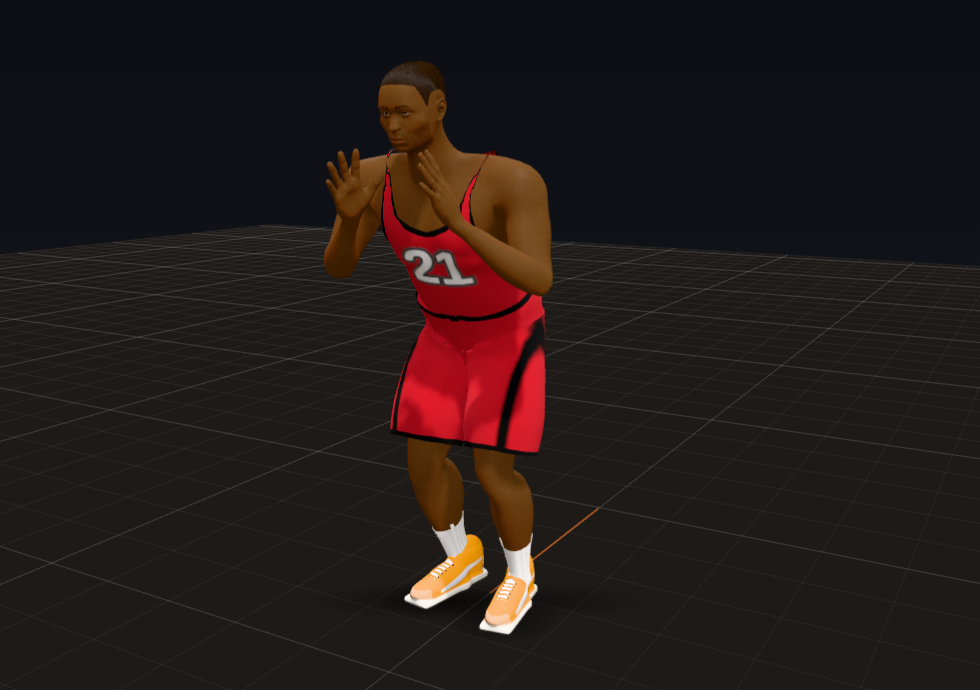 | 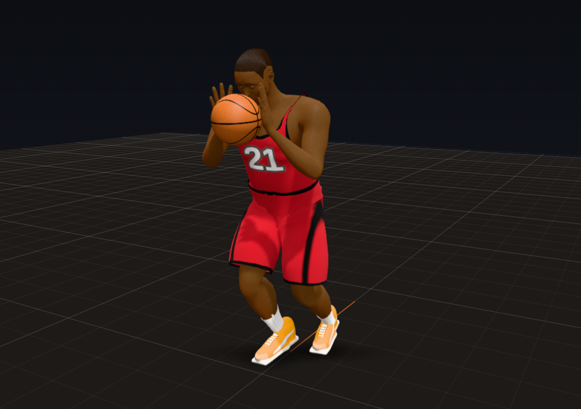 | 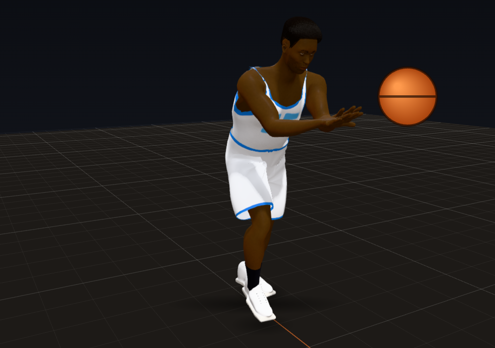 |

| Stepping into it | A bounce pass | The outlet, cocked |
|---|---|---|
| 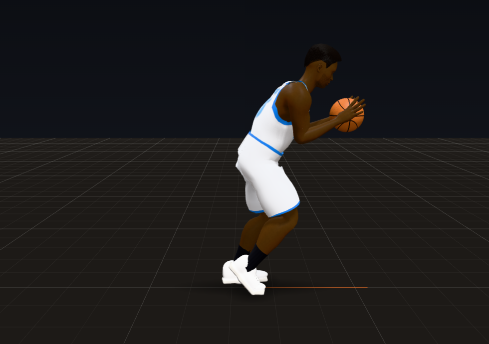 | 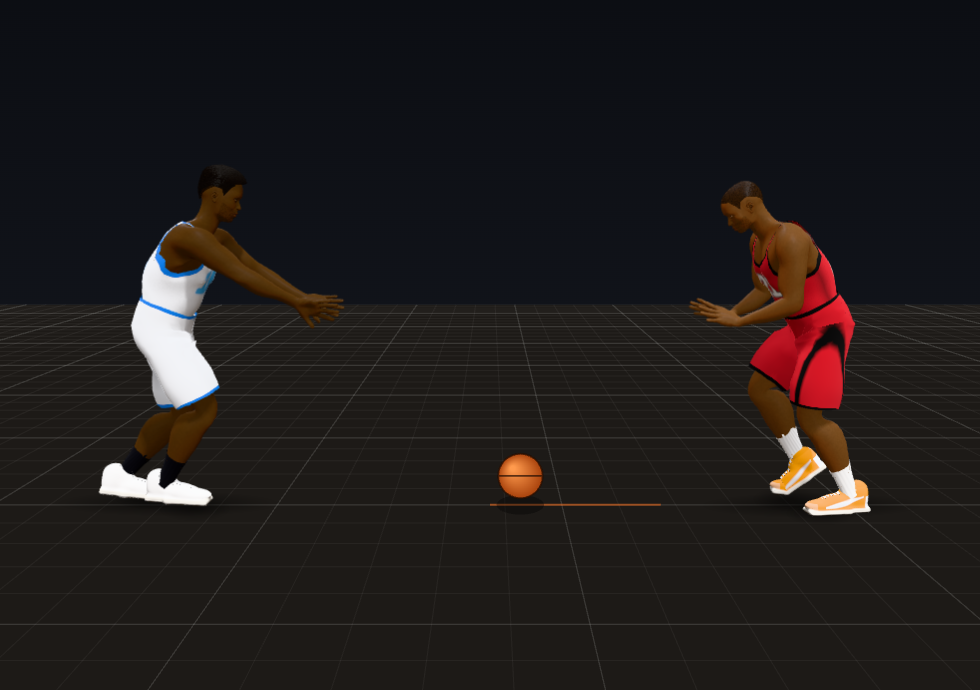 | 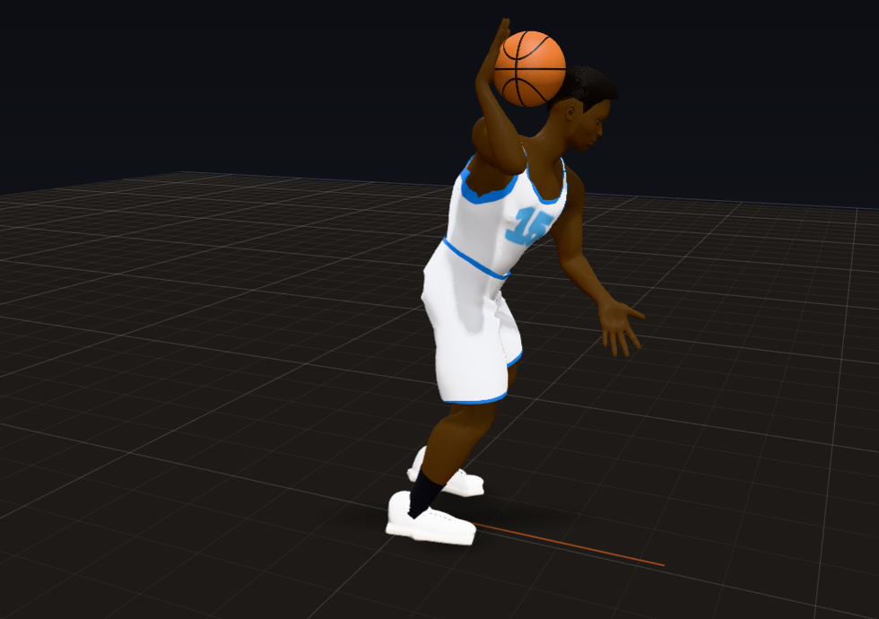 |

| Behind the back | One-handed whip | No-look |
|---|---|---|
| 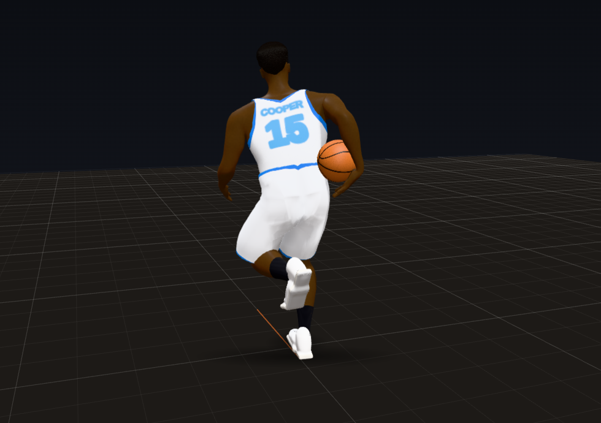 | 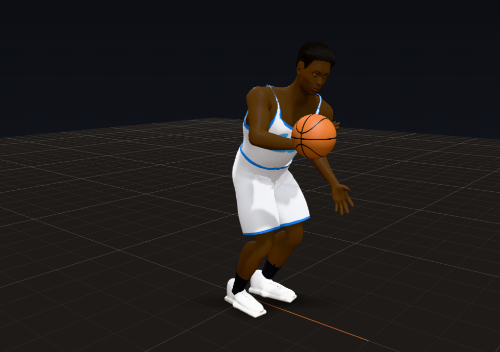 | 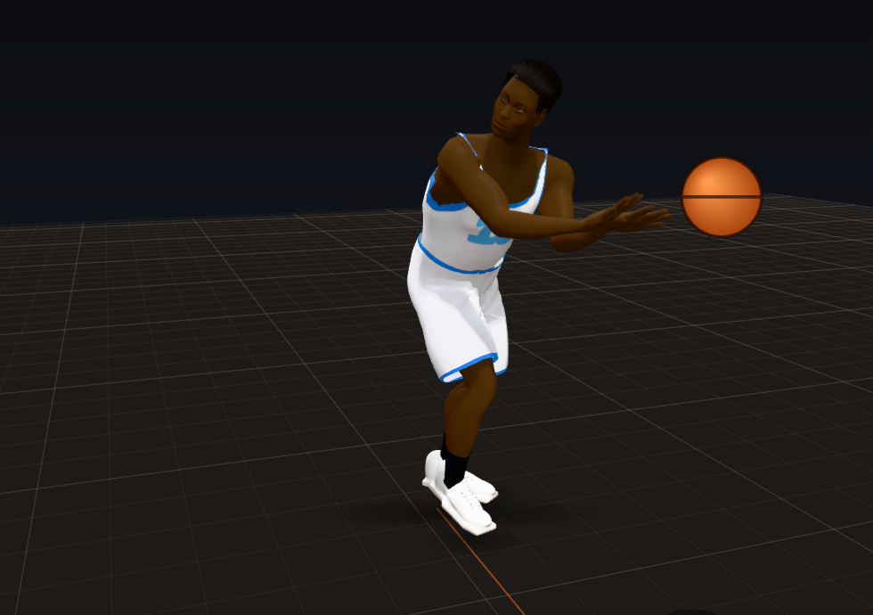 |

| Pass fake | A cutter taking it on the run |
|---|---|
| 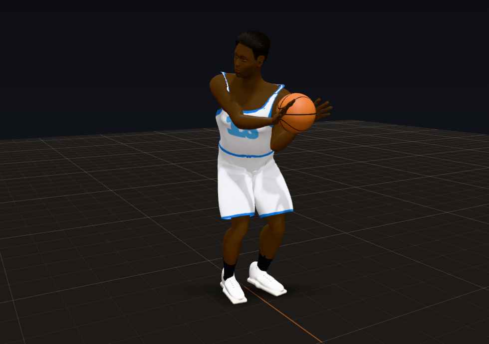 | 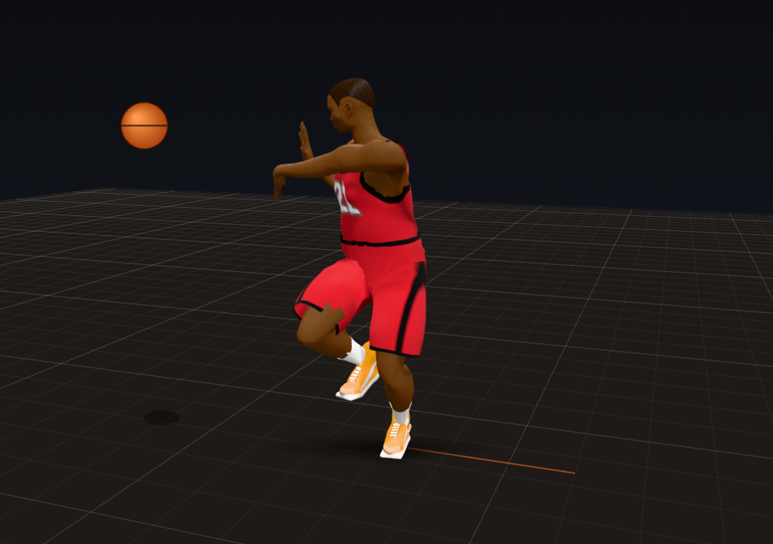 |

Rendered from the Animation Lab's "Passing (two players)" scenarios with the game's own code:

1. The receiver's target while the passer is still winding up (the ball not yet thrown): both hands up in front of the
   chest, 22 in out, fingers up and spread, thumbs in.
2. Two frames after the catch: the palms on the sides of the ball, 20 in out, on their way back toward the chest.
3. The chest pass 0.05 s after the release: the arms out, the forearms turned in, thumbs down and palms out.
4. The passer's step toward the target during the windup (the same moment as image 1, from the passer's side).
5. The bounce pass at its bounce, two thirds of the way; the receiver's hands already low for it.
6. The outlet cocked beside the right ear, the elbow up and out, the left hand out ahead.
7. Behind the back: the ball wrapped round the right hip, just behind the hip line, before it is let go.
8. The one-handed whip, the ball out to the right side before the snap.
9. The no-look: the ball on its way while the passer's eyes stay on the rim.
10. The pass fake: the ball pushed out toward the fake with the chest and eyes, before the pass goes the other way.
11. A cutter at 10.5 ft/s 0.1 s before the catch: the hands out to the side of the run, where the ball will be.

## How to see it

- **Animation Lab** (`lab.html`), the **Passing (two players)** group, at 0.25x (the camera follows the passer; turn
  it round the receiver to watch the catch):
  - "Chest pass, 15 ft, both standing": the receiver's hands come up as a target, fingers up and thumbs together, as soon
    as the pass is coming, and the eyes go to the ball; the passer steps toward the receiver, the arms extend and the
    forearms turn in through the release, thumbs down, palms out; the receiver steps toward the ball, the hands meet it
    out in front and give with it back toward the chest;
  - "Bounce pass", "Entry pass": the ball off the floor about two thirds of the way, the receiver's hands lower, taking it
    as it rises;
  - "Overhead pass", "Skip pass, 34 ft across", "Lob pass": over the forehead, out in front before it goes up (the lob);
  - "Outlet, 44 ft" and "Outlet ahead of a sprinter": taken up with both hands, cocked beside the right ear with the
    elbow out at the shoulder's height, thrown as the chest turns back;
  - "Behind the back", "A one-handed whip", "A no-look pass" (the eyes stay on the rim as the ball goes), "A pass fake,
    then the pass the other way" (the ball, chest and eyes go to the fake, then the pass goes the other way);
  - "Chest pass to a cutter", "... popping out to the wing", "... facing away (turned 120 deg)": the receiver turns to
    the ball as it comes (the one facing away turns round to the passer first); a cutter's hands wait out to the side
    of the run;
  - "The catch into a dribble", "Caught on the move into a dribble drive": the catch is secured, then the first push;
  - "Caught and swung straight on", "Passing back and forth, four passes".
- **Debug tools** (Shift+D in `match_test.html` or the live game): the session lines count passes, how early the hands
  were set and the eyes on the ball, the palms' gap at the catch, the ball in the hands before it and in the forearms
  after, how hard it stopped, how far its flight was bent, the passer's hands on it and the release.
- **Headless:**
  - `node tools/audit/pass.js [--json out.json]`: the 22 scenarios with the game's meters (~1 minute).
  - `node tools/audit/quarter.js --seed 7` has a `pass` block in its scorecard.
- **Tests:** `node tools/audit/check.js` (127 checks; 11 are this trial's).

## A. What changed

- **`js/match/tune.js`**: the `pass` group (every value below), `handle.gripBandDeg`, `handle.gripPassHz`,
  `limits.armBlendNearK` and `armBlendFarK`, and the pass meter's thresholds in `debug`.
- **The catch (`js/match/actor.js`, the receive controller).**
  - **React early.** As a pass is coming (the passer turning to it, before the windup) the receiver is told
    (`expectPass`): the hands come up in front of the chest toward the passer as a target, fingers up and thumbs
    together, and the eyes go to the passer, then to the ball from the release (a held look, so nothing else steals the
    gaze).
  - **Face the ball.** With the ball in the air to them, a receiver who is not running on through the catch turns toward
    it (no further than 60 degrees from the way to the passer, 90 on the move), the short way round, the passer coming
    round in front: a player walking off to take the ball out, or jogging to a spot, had turned away with the ball
    tossed to them, the passer crossing behind their back and the hands flipping from one side to the other (~4 ft in a
    frame).
  - **Where the ball will be.** The pass is planned as the push begins (`Director.planThrow`): where the receiver's body
    will be when it arrives (the steering run ahead, `predictSteer`, which no longer steers round its own body), the catch
    point out in front toward where the ball comes from, the flight to it. From the release the hands go from the target
    to that catch point in the world's axes about the body, set there before it arrives, and over the last 0.12 s onto the
    ball's own path. A receiver told to run elsewhere mid-flight keeps to the catch (`_rcHold`).
  - **Hands that can get there.** Before the throw the target is shown no further round than 60 degrees from the way the
    body faces (out at the side the far hand could not reach its place on the ball); when the way to the passer jumps
    (the passer crossing behind a turning body, a runner's limit changing) the shown side swings across the front at a
    limited rate instead of switching in a frame; in the air the hands wait no further out than 0.36 heights.
  - **Meet it.** A receiver standing for it takes a step toward the ball as it comes (0.9 ft, down just before it
    arrives), staying down in the stance; a man running to a catch spot runs through it rather than stopping and turning.
  - **Absorb.** The ball keeps part of its speed into the hands (half; far less for a ball going on away from the chest)
    and eases into the hold on a critically damped spring: the hands give with it back toward the chest. A dribble asked
    for as the ball is caught waits until the catch is secured (0.18 s) and starts from the hold.
  - **The hold after it** follows the chest's turn (a receiver running on with the chest still turned back had the far
    hand reaching across past its length); the wrist fit keeps the bent-back root (never the fingers curled round the
    ball's far side into the belly); target hands for a return pass wait until the player's own throw is finished.
- **The throw (`js/match/choreo.js`, `actor.js`, `ball.js`, `clips.js`, `anims.js`).**
  - The pass is planned before the push and the push brings the ball onto the flight at the launch speed
    (`passSoon`, `pushLead`, a push event on every pass clip); a dribbler gathers the ball on the dribble cycle before
    the pass (`gatherSoon`) instead of it appearing in the hands.
  - The passer steps toward the target for the two-handed passes and the outlet (6.4 in over the windup); the chest and
    bounce passes are let go as the arms reach extension (elbows ~60 degrees at the release) with the forearms turning
    in, thumbs down (forearm roll past 150 degrees).
  - **The hands stay on the ball through the windup.** The carry that moves a held ball to where gripping wrists can
    reach counts only the hands actually holding it (a hand letting go had dragged the ball 4 to 15 in off the push);
    the one-handed windups were re-authored so their grips are reachable: the kick pass with the ball out in front,
    the outlet (up in front of the right shoulder with both hands, cocked beside the ear with the right hand behind it,
    the chest turning right and then back; it had turned the wrong way, bringing the right shoulder past the ball), behind
    the back (the chest kept turned right, the hand behind and right of the ball), the overhead held over the forehead,
    the lob out in front before the push up. The wrist fit now runs through a pass's windup and push, faster, and takes
    up the clip's own wrist changes while the ball is held.
  - **Variations** (chosen per pass, flair from the player's ratings): the one-handed whip, behind the back, the no-look
    (the eyes held on a decoy through the release), the pass fake (ball, chest and eyes to the fake; the nearest
    defenders bite, stepping toward it), plus the skip (overhead across), lob, outlet and bounce passes.
  - A quick throw (the implicit pass that moves the ball to whoever the next event needs) holds its receiver where they
    are until the catch: the spacing had sent a set's ball handler off to the corner at ~12 ft/s with the ball in the air
    to them, their hands held out ~3 ft for a catch point their run had left behind.
- **The arms (`js/match/rig.js`).** An arm part way onto its IK target has its wrist blended from where the animation
  has it to the target. In a straight line, a hand swinging by the hip on its way to a target over the head passed ~9 in
  from the shoulder: the elbow folded to ~140 degrees and the shoulder flipped to its other solution, a 10,000 to 17,000
  ft/s^2 jolt. Where the straight line passes that close, the wrist now goes round the shoulder (the way from the shoulder
  turned from one to the other, the reach blended), as rigs blend FK and IK by rotations rather than positions.
- **The head (`actor.js`, `_applyLook`).** The gaze is sprung in the world's axes only for a held look (the ball in the
  air to a receiver, a no-look's decoy): every look held in the world had put each turn of the body into the neck in a
  frame (~23 head and neck pops a player-minute). A held look now starts moving the way the gaze already was (started
  still, a look held as the body turned ~5.7 rad/s jolted the neck the other way), and after one the head's angle comes
  from the free look (it had stood on the held look's last angle while the chest's turn eased off after a catch, then
  jumped).
- **`js/match/ball.js`**: a pass flies its planned segments without being re-anchored, `isPass` tells passes from shots
  for the meter, the catch's give, `gatherSoon`, and the secured catch before a dribble.
- **`js/match/debug.js`**: the pass meter (per pass: hands set and eyes on before the arrival, the palms' gap at the
  catch, the ball in the hands or forearms before it and the forearms after, how hard it stopped, the flight bent off its
  own path, the passer's hands on it through the throw, the release jolt).
- **`js/match/passlab.js`** (new): the 22 scenarios and their staging, shared by the Animation Lab and the audit.
- **`js/lab/lab.js`, `lab.html`**: the "Passing (two players)" group.
- **`tools/audit/pass.js`** (new) and **`tools/audit/check.js`** (11 new checks, 127 in all).

**How it is measured.**

- Hands set: how long before the ball got there the palms stopped moving about the body (world axes, so a body turning
  under still hands still counts as set), within 0.5 ft of where they took it. Eyes on: the gaze within 30 degrees of the
  ball.
- The palm gap at the catch: each palm's distance from the ball's surface as it is caught (near and far hand).
- The ball in the hands: frames of the flight with the ball inside a hand or forearm capsule by more than 0.25 in; the
  forearms after: the next 0.3 s, forearms only.
- Stop: the ball's deceleration in the frame it is caught. Bent: the flight's largest distance from its own ballistic path.
- The passer's hands: the largest palm gap to the ball while the pass clip holds it. Release: the ball's acceleration over
  the three frames round the release. A pop: a joint accelerating past 1,500 ft/s^2 in one step (Trial 1's meter).

## B. Scorecard

| Criterion | Grade | Evidence |
|---|---|---|
| Passer steps into chest and bounce passes, arms extend, thumbs roll down | PASS | the passer steps 6.4 in toward the target over the windup (chest, bounce, entry), 9.4 in for the outlet; at the release the elbows are at 59 to 65 degrees (chest) and 57 to 62 (bounce), 9 to 23 degrees 0.15 s later; the forearms roll to 159 to 166 degrees (76 is the thumb up, past 150 the thumb points down); images 3 and 4 |
| Whip, skip, lob, outlet, no-look and behind the back passes as variations | PASS | each thrown and caught in the lab (table below); in the three quarters: 3 behind the back, 3 whips, 12 no-looks, 7 lobs, 31 outlets, 35 bounce passes, 33 kick passes, 3 overhead, 5 entry passes and 32 swing passes round the arc |
| Passer's eyes and body can sell a fake before the pass | PASS | the pass fake: the ball pushed toward the fake with the chest and eyes, pulled back, then the pass the other way (image 10), the nearest defenders stepping toward the fake; the no-look: the eyes held on the rim through the release (image 9) |
| Receiver shows a target hand before the catch, steps toward the ball | PASS | the hands up as a target 0.25 to 0.95 s before the ball arrives for every standing receiver (image 1), from the moment the pass is coming; a standing receiver steps 10 in toward the ball over its flight; with the ball in the air a receiver turns to it |
| Catch absorbs: hands meet the ball, pull back toward the chest | PASS (lab) | the hands meet it out in front (palm gaps at the catch 0.04 to 0.55 in standing) and give with it back into the hold: the ball stops at 200 to 1,500 ft/s^2 standing (a dead stop from 38 ft/s in one frame is ~2,300) and settles into the hold over ~0.15 s (image 2). Open: caught on the move, the palms trail the ball through the give (C3) |
| Ball flight is realistic: arc, speed, a bounce off the floor for bounce passes | PASS | ballistic with drag from the release: bent 0 in in every pass and every game flight (10 to 39 in on the old code in the lab, 19 to 23 in at the median in games, where it was steered onto the hands over its last two thirds); chest passes ~38 ft/s, outlets ~44, lobs arc; the bounce pass bounces off the floor at FIBA's restitution (image 5) |
| **PASS when:** the ball never passes through the hands on a catch | **PASS** (lab), not yet everywhere in live play | 24 of 26 passes 0 frames; 1 touches the fingers on the catch frame (0.47 in); 1 frame at 2.61 in for an outlet caught from behind at a sprint (open). In three quarters: 52, 30 and 21 of 167, 146 and 112 passes (113, 99 and 61 before), 86, 51 and 49 frames (273, 211, 141), see C1 |
| **PASS when:** receivers always react before the ball arrives, not after | **PASS** | every lab pass: hands set 0.07 to 1.17 s before, eyes on 0.18 to 0.95 s before. In three quarters: hands set after the ball arrived in 0, 3 and 0 passes (41, 24, 16 before), the eyes late in 10, 12 and 10 (112, 99, 79) |

### The passes (Animation Lab measures, 22 scenarios)

| Scenario | Pass | Flight (s) | Hands set before (s) | Eyes on before (s) | Palms at the catch (in, near / far) | Ball in the hands (frames, worst in) | Stop (ft/s^2) | Passer's hands (in) | Release (ft/s^2) | Arm pops |
|---|---|---|---|---|---|---|---|---|---|---|
| Chest pass, 15 ft, both standing | chest | 0.395 | 0.4 | 0.4 | 0.07 / 0.12 | 0 | 391 | 0.98 | 145 | 0 |
| Bounce pass, 13 ft, both standing | bounce | 0.433 | 0.4 | 0.433 | 0.2 / 0.2 | 0 | 344 | 0.63 | 243 | 0 |
| Overhead pass, 20 ft, both standing | overhead | 0.5 | 0.5 | 0.5 | 0.16 / 0.18 | 0 | 1030 | 3.94 | 422 | 2 |
| Lob pass, 18 ft, both standing | lob | 0.95 | 0.95 | 0.95 | 0.02 / 0.07 | 0 | 482 | 2.14 | 384 | 0 |
| Kick pass, 16 ft, both standing | kick | 0.4 | 0.4 | 0.4 | 0.12 / 0.12 | 0 | 869 | 3.13 | 576 | 2 |
| Entry pass, 12 ft, both standing | entry | 0.375 | 0.333 | 0.383 | 0.19 / 0.2 | 0 | 424 | 0.74 | 296 | 2 |
| Skip pass, 34 ft across | overhead | 0.85 | 0.85 | 0.85 | 0.07 / 0.15 | 0 | 1255 | 3.92 | 573 | 2 |
| Outlet, 44 ft, the receiver running up the floor | outlet | 1.016 | 0.433 | 0.883 | 0.28 / 0.47 | 0 | 1232 | 1.85 | 433 | 1 |
| Outlet ahead of a sprinter, caught on the run | outlet | 1.2 | 1.167 | 0.267 | 2.52 / 2.56 | 1 (2.61) | 2577 | 2.25 | 571 | 4 |
| Chest pass to a cutter, caught on the run | chest | 0.428 | 0.1 | 0.433 | 0.99 / 1.17 | 0 | 426 | 0.97 | 213 | 1 |
| Chest pass to a man popping out to the wing | chest | 0.403 | 0.383 | 0.317 | 0.21 / 0.52 | 0 | 1187 | 1.47 | 185 | 0 |
| Chest pass to a man facing away (turned 120 deg) | chest | 0.395 | 0.4 | 0.4 | 0.09 / 0.09 | 0 | 399 | 0.98 | 158 | 0 |
| A pass off the dribble (kick-out) | kick | 0.4 | 0.4 | 0.4 | 0.11 / 0.12 | 0 | 869 | 2.83 | 579 | 2 |
| The catch into a dribble | chest | 0.395 | 0.4 | 0.4 | 0.07 / 0.12 | 0 | 391 | 0.96 | 145 | 0 |
| Caught on the move into a dribble drive | chest | 0.441 | 0.067 | 0.45 | 0.25 / 0.93 | 0 | 758 | 1.09 | 205 | 6 |
| Caught and swung straight on (catch and pass) | chest | 0.395 | 0.4 | 0.4 | 0.08 / 0.12 | 0 | 391 | 0.97 | 145 | 0 |
| (the pass on) | chest | 0.38 | 0.383 | 0.383 | 0.02 / 0.1 | 0 | 303 | 0.98 | 134 | |
| An inbound pass from out of bounds | chest | 0.395 | 0.4 | 0.4 | 0.03 / 0.17 | 0 | 352 | 2.09 | 234 | 2 |
| Behind the back to a man on the left, off the dribble | btb | 0.32 | 0.333 | 0.317 | 0.11 / 0.41 | 0 | 1497 | 3.67 | 746 | 3 |
| A one-handed whip to the corner on the right | whip | 0.358 | 0.333 | 0.367 | 0.47 / 0.55 | 0 | 817 | 2.57 | 354 | 0 |
| A no-look pass (the eyes on the rim) | nolook | 0.377 | 0.383 | 0.383 | 0.05 / 0.09 | 0 | 467 | 0.97 | 151 | 0 |
| A pass fake, then the pass the other way | chest | 0.402 | 0.417 | 0.417 | 0.05 / 0.1 | 0 | 1137 | 0.95 | 144 | 2 |
| Passing back and forth, four passes | chest | 0.368 | 0.383 | 0.383 | 0.01 / 0.04 | 0 | 1049 | 0.98 | 128 | 4 |
| (second pass) | chest | 0.315 | 0.317 | 0.317 | 0.01 / 0.04 | 0 | 419 | 0.97 | 110 | |
| (third pass) | bounce | 0.33 | 0.3 | 0.333 | 0.2 / 0.2 | 0 | 203 | 0.89 | 343 | |
| (fourth pass) | overhead | 0.25 | 0.25 | 0.183 | 0.03 / 0.2 | 1 (0.47) | 456 | 3.96 | 56 | |

(`docs/gauntlet/baseline/trial10_pass_lab.json`. The standing receivers are set 0.25 s or more before in every pass;
the two on the move that are set late (the cutter 0.1 s, the drive 0.07 s) have their hands tracking the catch spot
until the last moment, still before the ball arrives.)

### Before and after

The Lab, the 17 passes in the 14 scenarios both versions can run (the code before this trial is d7893d7):

| Measure | Before | After |
|---|---|---|
| Hands set before the ball arrives | 0 to 0.03 s (median 0.02) | 0.1 to 0.95 s (median 0.4) |
| Eyes on the ball before it arrives | 0 to 0.83 s (median 0.37) | 0.18 to 0.95 s (median 0.4) |
| Passes with the ball in a hand before the catch | 8 of 17 (11 frames, worst 1.39 in) | 1 of 17 (1 frame, 0.47 in: the fingers, on the catch frame) |
| Far palm's gap at the catch | 0.33 to 3.98 in (median 0.61) | 0.04 to 1.17 in (median 0.15) |
| How hard the ball stops in the hands | 603 to 2,541 ft/s^2 (median 1,409) | 203 to 1,255 (median 456) |
| Flight bent onto the hands | 10 to 39 in (median 11) | 0 |
| The passer's palms off the ball, worst frame of the throw | 3.0 to 17.3 in (median 3.3) | 0.63 to 3.96 in (median 0.98) |
| Release jolt | 1,166 to 2,494 ft/s^2 (median 1,716) | 56 to 579 (median 243) |
| Hand and elbow pops | 197 | 16 |

Three full quarters (seed 7 / seed 21 / women's league seed 7):

| Measure | Before | After |
|---|---|---|
| Passes | 183 / 165 / 128 | 167 / 146 / 112 |
| Hands set after the ball arrived | 41 / 24 / 16 | 0 / 3 / 0 |
| Hands set before it arrived, median | 0.02 s | 0.28 / 0.30 / 0.33 s |
| Eyes on the ball late | 112 / 99 / 79 | 10 / 12 / 10 |
| Passes with the ball in a hand before the catch (frames) | 113 (273) / 99 (211) / 61 (141) | 52 (86) / 30 (51) / 21 (49) |
| Flights bent onto the hands | 181 / 159 / 126 | 0 / 0 / 0 |
| Caught with a dead stop | 86 / 67 / 50 | 42 / 32 / 23 |
| Release jolts | 133 / 118 / 98 | 21 / 33 / 21 |
| The passer's palms off the ball, median of each throw's worst frame | 18.0 / 16.3 / 16.8 in | 4.2 / 4.3 / 3.7 in |

(`docs/gauntlet/baseline/trial10_seed7.json`, `trial10_seed21.json`, `trial10_seed7_women.json`.)

## C. Devil's advocate

1. **"It is clean in the lab, and the game still has the ball in the hands before some catches."**
   - True: in the quarter of seed 7, 52 of 167 passes had the ball in a hand before the catch: 26 of them one frame of the ball
     against the fingers (1 in or less) on the catch frame, 14 one frame deeper (1.1 to 2.5 in; six are long outlets,
     23 to 46 ft, taken on the run from behind), 12 two frames or more. Of the 86 frames, 16 are in 3 passes between
     players standing within 4 ft of each other (the deepest, 10 frames at 4.5 in, a swing between two players 1.9 ft
     apart: the ball starts inside the receiver's waiting hands).
   - Passes between two players standing within a few feet of each other should be handoffs, not passes: which pass the
     game throws is Trial 13's.
2. **"The passer's hands are not really on the ball through every pass."**
   - The two-handed chest, bounce and entry passes keep the palms within 0.6 to 1.0 in; the lob 2.1. The overhead,
     skip and one-handed passes are 2.3 to 4.0 in off at their worst frame: their wrists turn quickly through the
     windup (the forearm rolling ~60 degrees in 0.1 s) and the wrist fit, which only bends the wrist, trails the roll.
     Their windups were re-authored so the grips are reachable (a hand letting go no longer drags the ball off its
     path, and no arm folds shut or flips), but a proper fit of those poses to the rig (the forearm's roll as well as the
     wrist's bend) is still to do, with the Final Eye Test. In games the median throw's worst frame is 3.7 to 4.3 in
     (16 to 18 before): most game passes come off the one-handed push.
3. **"The give is not clean on the move."**
   - Standing, the palms stay on the ball through the give. Caught on the move, the ball easing back into the hold
     leaves the palms behind it (or has one dip into it) for about a fifth of a second: in games the hand gap in the 0.3 s
     after a catch on the move is 1.3 in at the median and 5.7 in at p90, which is most of why the held-ball hand gap
     over a quarter went from 1.1 to 1.8 in at p90 to 1.8 to 2.3. Holds at the chest are where they were; the triple
     threat and the overhead hold standing are a little further off than before (p90 0.3 to 1.1 in and 1.0 to 1.4 in in
     a 3-minute sample). The wrist fit and the grip's frame have to follow the ball through the give, not only to it:
     the next item for this catch.
   - The forearms after the catch: in the lab, the catch that is passed straight on has 10 frames of the forearms within
     the ball's reach as the pass winds up; in games 634, 428 and 316 frames a quarter (560, 386 and 395 before). Most of
     it is the uniform forearm capsule the meter uses (a mid-forearm's radius all the way to the wrist, where a real
     wrist is ~0.6 in thinner). The meter was not changed to make the number smaller.

## D. Regression check

- **Trial 1:** check.js 127 of 127; the determinism check gives 1500/1500 identical steps at 1x, 0.25x, 0.1x, 144 Hz
  and a jittery frame rate.
- **Trial 2:** 0 final poses past a human joint limit in all three quarters; knees caving in 0.03, 0.03 and 0.05% of
  planted frames (0.02, 0.04, 0.04). Joints held at a limit 6.9 to 7.2% of player frames (5.4 to 5.7%) and arms out of
  reach 1.1 to 1.4% (0.7 to 0.9%): the target hands. **Spine and neck pops 3.10, 2.94 and 2.89 per player-minute
  (2.09, 2.14 and 2.01 before; Trial 2 passed at 5.6 to 6.6)**, nearly all the head and neck turning to a new look
  (six seeds of 3 minutes: 2.9 against 2.0). The ones this trial added (a held look's start, the head after a catch)
  are gone; what is left is the head easing off its twist limit when the look changes, more often now that receivers
  and passers look at more. Carried as an open item (below).
- **Trial 3:** no contact slid past 0.25 in (worst 0.11, 0.10 and 0.11 in; 0.10 to 0.13 before), no foot through the
  floor, no planted foot floating.
- **Trial 4:** 0 acceleration snaps and 0 instant turns in all three quarters.
- **Trial 5:** all 21 of its checks pass (72 steady runs and 11 scripted changes of gait with no pop). **Pops per minute
  of movement in games 4.97, 4.83 and 5.05 (2.78, 3.62 and 3.58 before; six seeds of 3 minutes: 5.3 against 3.3),
  and pops after a change of gait 512, 538 and 457 a quarter (308, 413, 277).** These are the receivers' hands: before
  this trial nobody moving held their hands up for a pass; now receivers show a target while they walk, jog or run to
  the ball. This trial took the worst of them out (hands flipping from one side of the body to the other, 4 ft in a
  frame; the far arm straight across the chest; the wrist's straight path past the shoulder), but the rest is still 1 to
  2 pops a minute of movement more than Trial 8 left it. Carried as an open item. All joint pops, every body and every
  joint: 32.6, 34.1 and 30.7 per player-minute (36.0, 38.0 and 36.1), lower than before.
- **Trial 8:** all of its checks pass; dribble contacts off the ball 14.9, 17.5 and 14.1% (16.2, 17.7, 15.3); frames of
  the ball in a body 4,441, 4,687 and 3,298 (4,597, 4,598, 3,707); jolts in the air 1,428, 1,534 and 1,464 (1,344,
  1,569, 1,439).
- **Cost:** a step of the headless quarter (10 players and the meters) is 3.11 to 3.31 ms at the median and 8.9 to
  12.8 ms at p99, against 2.81 to 3.21 and 7.8 to 13.4 on the code before this trial (the same machine, one process at a
  time, seeds 7 and 21, twice each): ~0.17 ms more a step, the receive controller and the throw's planning; inside a
  60 fps frame (16.7 ms).
- The audio session's commits on this branch (its Trial 2) touch only the audio and the page's script list; this trial's
  checks and quarters were run on the branch with them in.
- Scorecards: `docs/gauntlet/baseline/trial10_*.json`.

## E. What to watch for

- In the Lab, "Passing (two players)" at 0.25x:
  - the receiver's hands come up as soon as the passer turns to pass, not as the ball arrives; the eyes find the ball
    as it leaves the hands and stay on it into them;
  - the receiver's small step toward the ball, and the give: the hands meet the ball out in front and come back toward
    the chest with it;
  - the passer's step and the arms reaching extension as the ball goes, the thumbs turning down, palms out;
  - the outlet cocked beside the ear, the behind the back wrapping round the hip and let go past the spine, the no-look's
    eyes on the rim, the pass fake's ball, chest and eyes going one way before the pass goes the other;
  - "Chest pass to a man facing away": the receiver turns round to the passer before the ball comes;
  - "Caught on the move into a dribble drive": the catch secured for a moment before the first push (6 hand and elbow
    pops remain here, the drive's first dribble).
- In a game at 0.25x: a player walking off to take the ball out who gets it tossed to them turns to it; receivers
  jogging to a spot turn their chest and hands to the ball, never with it behind them. Shift+D: the pass lines.
- Still to come:
  - **Trial 13:** passes between players standing within a few feet of each other (should be handoffs); which pass, when.
  - **Trial 6:** defenders reading the fake beyond a step toward it; deflections.
  - **Open items from this trial:** arm pops while moving with the hands up for a pass (1 to 2 a minute of movement
    more than before this trial); head and neck pops as looks change (about 0.9 a player-minute more); the palms
    following the ball through a give on the move.
  - **Final Eye Test:** the overhead and one-handed passes' forearm roll fitted to the rig (the palms 2 to 4 in off at
    their worst frame); the forearms after a catch that is passed straight on; the outlet caught from behind at a
    sprint (one frame of the ball in a hand); 2 pops in each overhead lift.
  - `Tune.pass` holds every value of this trial.

## Sources

- The chest pass (step toward the target, extend, thumbs down, palms out, the ball released as the arms lock out):
  https://www.pecentral.org/lessonideas/cues/chestpass.html , https://www.basketballforcoaches.com/chest-pass/ ,
  https://functionalbasketballcoaching.com/teaching-chest-pass/
- Receiving (a target with both hands, fingers up and thumbs together, step to meet the pass, eyes on the ball into the
  hands, give with it toward the chest): https://www.coachesclipboard.net/Passing.html ,
  https://us.humankinetics.com/blogs/excerpt/principles-of-passing-and-catching , https://hoopstudent.com/basketball-catching/ ,
  a coaches' forum thread on catching drills: https://www.breakthroughbasketball.com/forum/viewtopic.php?f=48&t=339 ,
  a video on pass catching: https://www.youtube.com/shorts/BSX6AF99eZE
- Facing the passer (feet squared, a target shown with the hands toward the passer, hands ready before the ball
  arrives; from the search excerpts of these drill pages, which this environment could not open):
  https://avcssbasketball.com/basketball-passing-drills/ , https://www.coachesclipboard.net/PassingDrillsHalfCourt.html ,
  https://www.basketballforcoaches.com/basketball-passing-drills/
- The baseball (outlet) pass (the ball back beside the ear, the elbow up at the shoulder's height, the step with the
  opposite foot, the wrist snap): https://www.basketballforcoaches.com/baseball-pass/ ,
  https://hoopstudent.com/basketball-baseball-pass/ , https://www.sikana.tv/en/sport/learn-to-play-basketball/learn-how-baseball-pass
- Behind the back (wrapped round the hip close to the lower back, released behind the back past the spine, the wrist
  flick): https://www.fillingthelane.com/fiba/behind-the-back-pass-skill-breakdown-advanced/ ,
  https://www.sportplan.net/drills/Basketball/Passing-Technique/Behind-the-back-pass-bg0009.jsp
- The no-look and the pass fake (eyes, head and shoulders one way, the ball the other; defenders read the passer's
  eyes): https://hoopstudent.com/basketball-no-look-pass/ ,
  https://basketballfundamentals.com/the-art-of-using-your-eyes-how-to-fake-out-defenders-without-moving-your-body/ ,
  https://pgcbasketball.com/blog/pass-fake-like-rondo/ , https://functionalbasketballcoaching.com/teaching-pass-fake/ ,
  https://www.coachesclipboard.net/CuttingAndFaking.html
- The eyes when catching (the gaze tracks the ball, then a predictive saccade to where it will be caught, waiting there):
  https://www.cs.ubc.ca/research/eyecatch/eyecatch.pdf , https://jov.arvojournals.org/article.aspx?articleid=2504108 ,
  https://pubmed.ncbi.nlm.nih.gov/41117597
- Animation on top of IK (the animation carries the motion, IK only adjusts it to the target):
  https://www.gameanim.com/2016/09/30/common-mistakes-game-animation/
- Blending an arm between animation and IK by rotations, not positions, and the flips when the chain passes through a
  critical zone (from the search excerpts; the pages could not be opened from this environment):
  https://download.autodesk.com/global/docs/softimage2013/en_us/userguide/files/ik_BlendingBetweenFKandIKAnimation.htm ,
  https://ianimate.net/more/articles/mastering-the-fk-ik-transition-and-parenting-in-maya ,
  https://patents.google.com/patent/US10818065
