# Trial 11: The Glass and the Contest

**Result: PASS in the lab, every one of its 15 scenarios, and in three live quarters for both PASS criteria: no carom
is steered, so every rebounder goes after the ball's real path, and every block and all but one contest in 96 reach
toward the ball.
Open: live blocks mostly do not touch the ball (the arm points at it, the hand 2 to 24 in short, C1), and a few
earlier-trial numbers are worse than the code before this trial (D).** In the 15 scenarios of `tools/audit/glass.js`
(also the Animation Lab's "Rebounds, blocks and steals (the glass lab)" group: misses off the rim and the glass taken by
either side, a long rebound, a weak-side carom, three box-outs at once, a miss nobody gets to in the air, a tight, a
contested and a rim contest, a block at the rim and one on a jumper, a poke steal, a picked-off pass and a reach-in),
measured by the game's own glass meter:

- **Rebounders react to the actual ball trajectory.** All 10 caroms and loose balls fly on their own path from the rim,
  the glass or the hand that knocked them (bent 0 in; the code before this trial steered 8 of 10 by up to 15 in onto a
  hand). Nobody sets off after one before it comes off (0; 1 before), and every one is taken with the hands on it: both
  palms 0.1 to 3.0 in off the ball at the take (before, 7 of 10 were pulled into hands 0.2 to 3.0 ft away, a hand up to 38
  in off it).
- **Contests and blocks always reach toward the ball.** All 11 contests: the high hand 1.1 to 10.6 degrees off the line to
  the ball as it goes (16.7 to 85.7 before; 1 of 11 within 25). Both blocks: the palm on the ball as it is hit (3.6 and 0.1
  in into it; 12.4 and 42.5 in off it before), the arm 1.4 to 3.1 degrees off the line to it (27 and 83 before).
- **Jump rebounds at the top of the jump, chinned.** All 6 are taken 0.017 s after the top of the jump (before: 3 of 6,
  one 1.2 s after), brought under the chin 0.15 to 0.17 s later with the elbows 1.8 to 1.9 times the shoulders apart.
- **Box-outs.** 6 of 6 in contact, the back into the man (the man 0 to 1 degree off straight behind, the bodies touching),
  the arms out (elbows 2.4 times the shoulders); before, 0 of 7 in contact, 13 to 30 in apart, 4 of them with the man in
  front (176 degrees off behind).
- **Steals and reach-ins.** The swiping hand gets to within 0.1 ft of the ball (touching it on the reach-in); before,
  1.4 and 2.5 ft at their nearest. **Loose balls:** 40 random loose balls (`tools/audit/chase.js`), each run down by a
  player already on the move: 38 taken by hand within the 5 s the test allows (3 caught at a bounce, 35 picked up; 3.0 s
  at the median), both hands within 0.7 in at the median and 3.4 in at most, the chaser at 0.5 ft/s at the median as
  they take it; the other 2 roll away at 13 ft/s from 17 and 18 ft off and are picked up past the sideline at 5.2 and
  5.3 s.

**In live 5-on-5 (three full quarters: seed 7, seed 21, the women's league seed 7)** the same meter reads: caroms steered
0, 0, 0 (19, 15, 15 on the code before this trial, bent up to 19, 14 and 14 in at p90); caroms pulled into a hand 0, 0, 0
(10, 16, 13); every take right by the meter (read off the rim, not steered, the hands on it, and a jump rebound two-handed
at the top and chinned) 22 of 22, 21 of 24 and 21 of 24 (1, 3 and 5); box-outs in contact 35 of 38, 24 of 28 and 17 of
22 (1 of 57, 4 of 54, 1 of 46); contests toward the ball 34 of 35, 35 of 35 and 26 of 26 (17 of 34, 15 of 35, 8 of 24);
blocks with the arm toward the ball 2 of 2 and 5 of 5 (0 of 2, 1 of 5); swipes that get to the ball 2 of 3, 6 of 7 and 3
of 7 (0 of 6, 0 of 2, 0 of 5).

| The box-outs as the shot comes down | Both hands on it at the top of the jump | Under the chin, the elbows out |
|---|---|---|
| 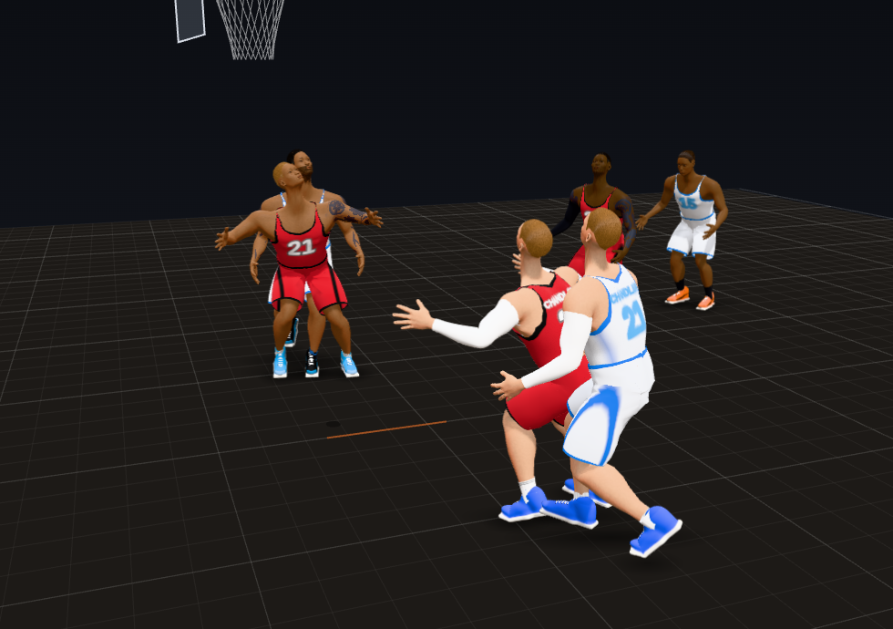 | 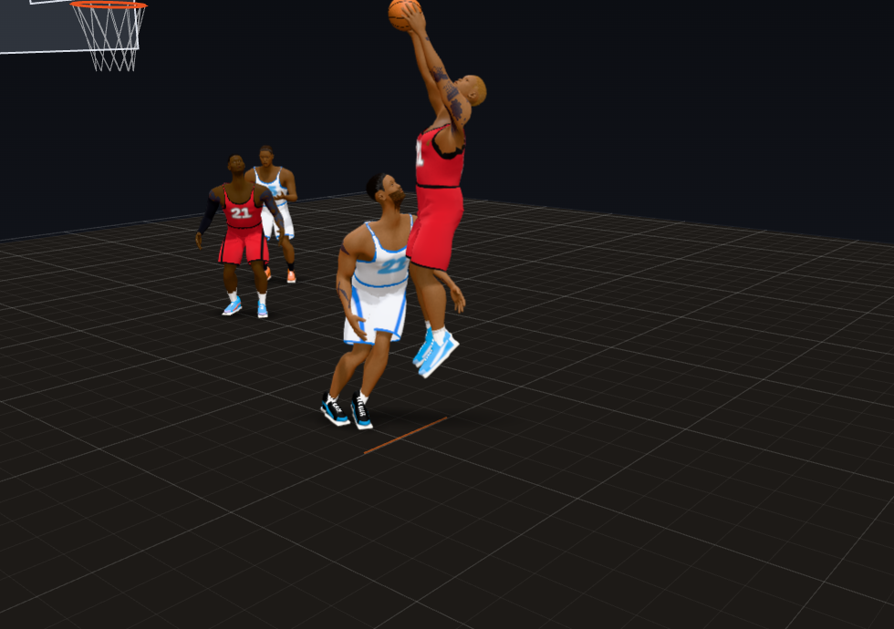 | 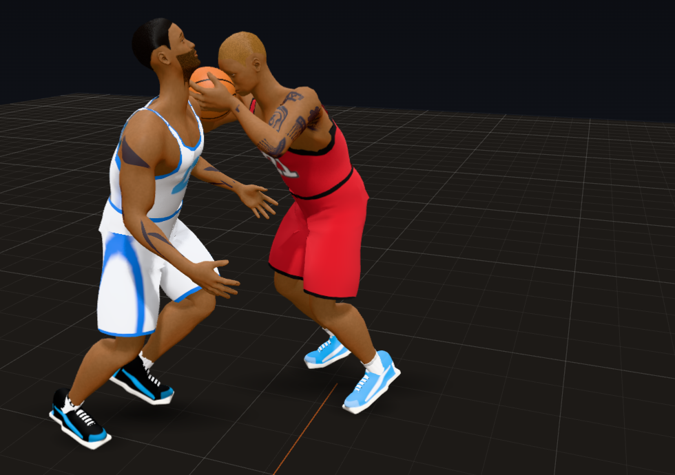 |

| A long rebound caught on the run | A tight contest: the hand at the release point | Verticality at the rim |
|---|---|---|
| 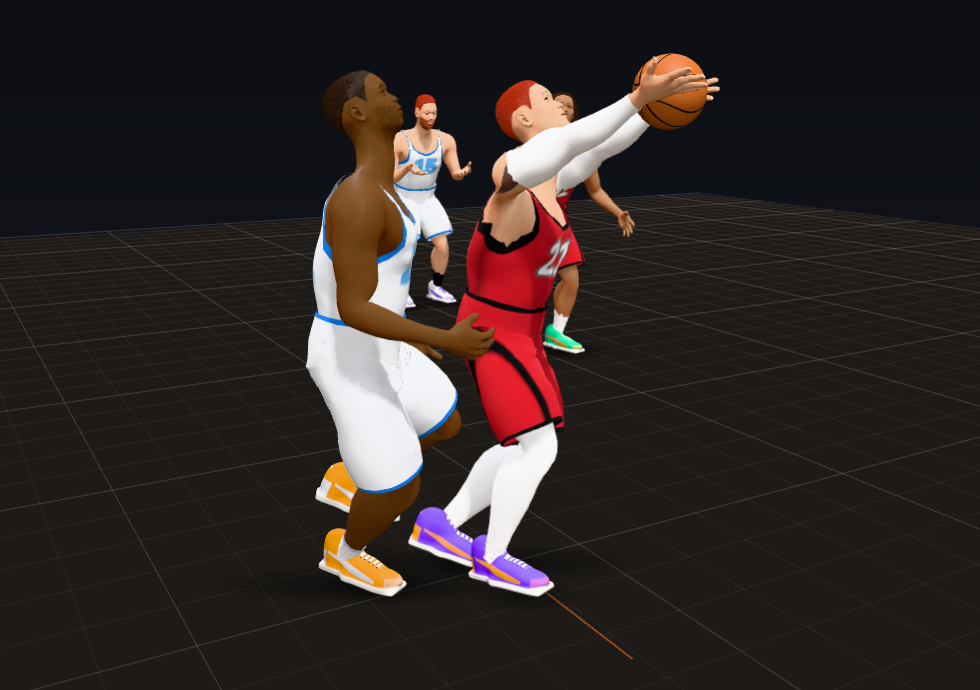 | 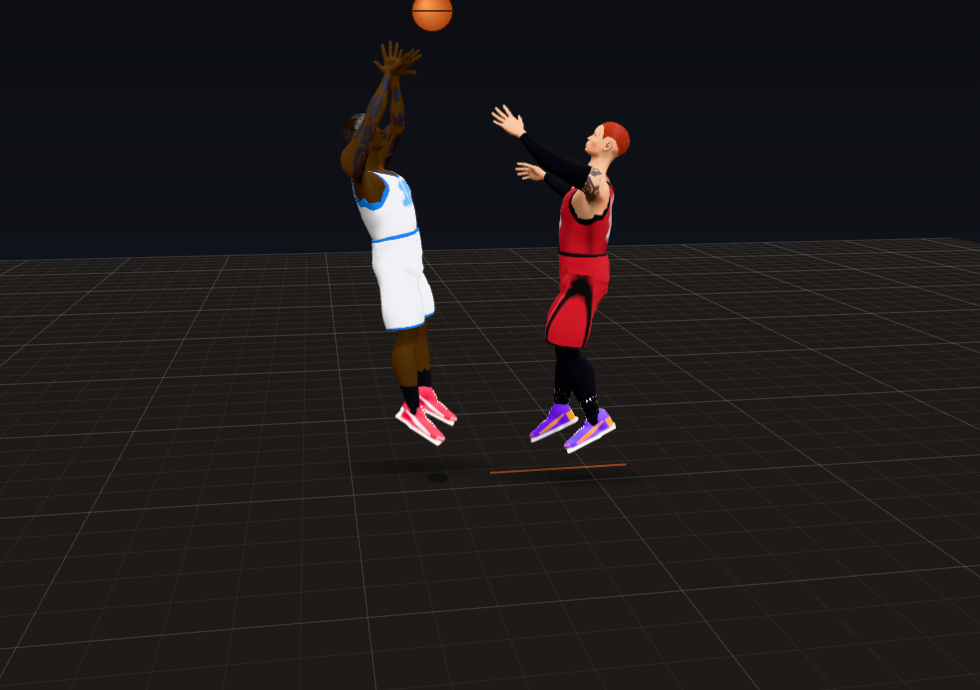 | 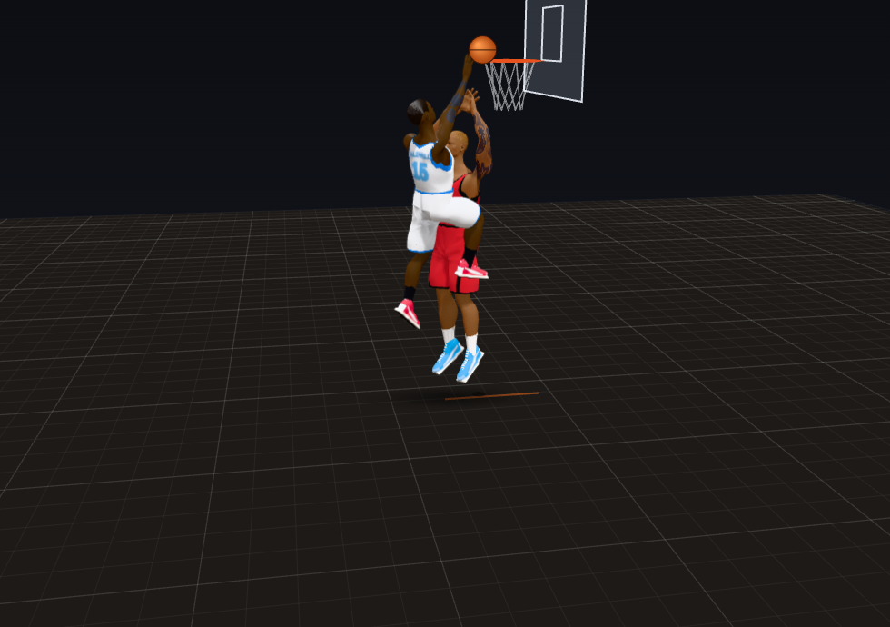 |

| A block at the rim: the palm on the ball | A block on a jumper | The poke: the hand on the ball |
|---|---|---|
| 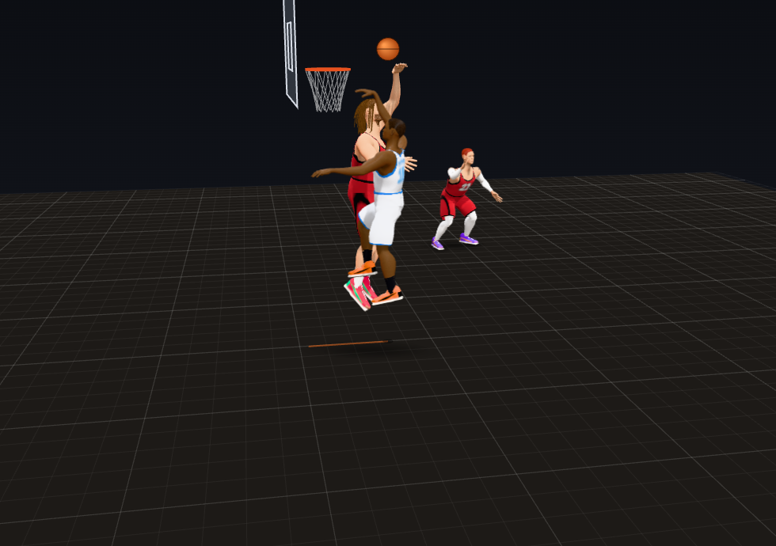 | 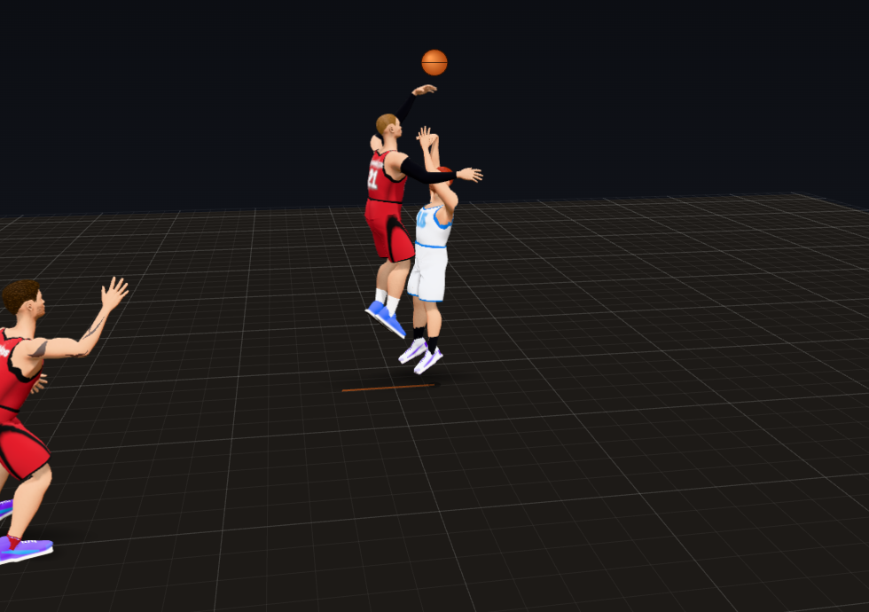 | 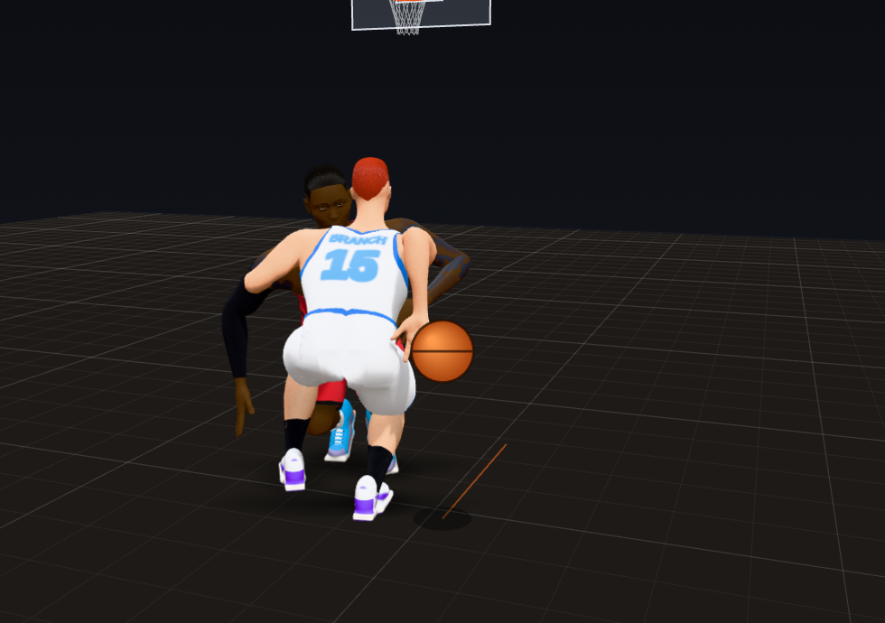 |

| The loose ball picked up | A floor rebound caught at a bounce | The reach-in: the hand at the ball |
|---|---|---|
| 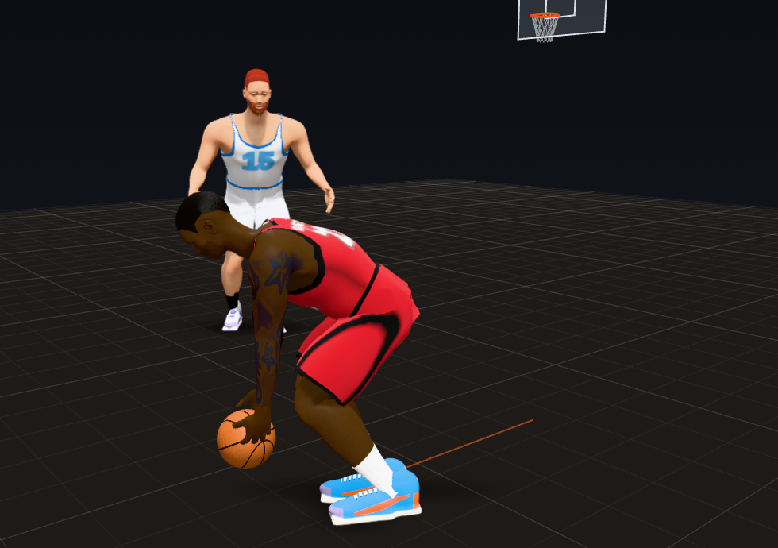 | 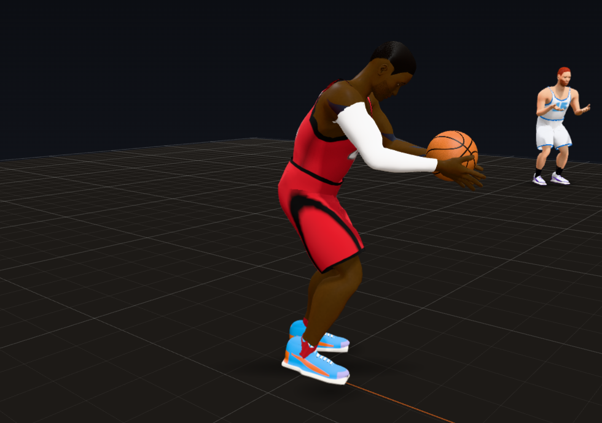 | 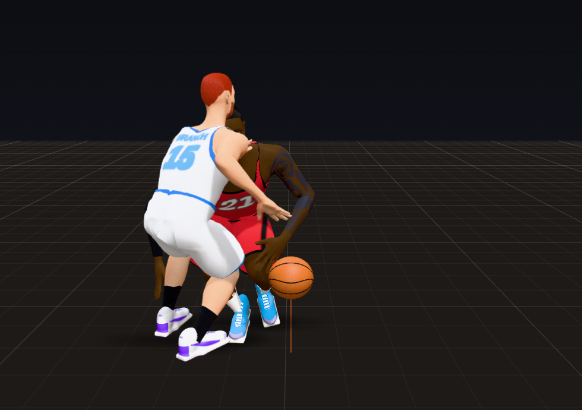 |

Rendered from the Animation Lab's glass lab scenarios with the game's own code: "three on three" as the shot comes down
on the rim; "a missed jumper from the wing" at the take (0.017 s after it) and in the rebound move's landing (0.78 s
into it); "a missed three from the top" as the guard catches it; the tight and the rim contest 0.02 and 0.05 s after the
release; both blocks at the swat; "a poke steal" as the ball is knocked loose and as the stealer picks it up; "a miss
nobody gets to in the air" as the guard catches it; "a reach-in" 0.2 s into the swipe.

## How to see it

- **Animation Lab** (`lab.html`), the **Rebounds, blocks and steals (the glass lab)** group, at 0.25x (the hoop is
  drawn; turn the camera round the rim to watch a carom):
  - "a missed jumper from the wing": while the shot is up the bigs box out (the back into the man, the arms out, the man
    leaning in); nobody moves toward where it will come down until it is off the rim; then the rebounder runs to it and
    goes up, both hands onto the ball at the top of the jump, and brings it down under the chin, elbows out;
  - "the same miss: the offense's big beats the box-out", "a miss off the glass", "a missed corner three" (the weak side),
    "three on three" (a man who runs back up the floor is let go), "a missed three from the top" (caught on the run);
  - "a miss nobody gets to in the air": the guard runs it down, slowing to a stop a reach short of it;
  - "a tight closeout", "a contested three": the high hand goes up at the shooter's release point, timed to the release,
    held there as the ball goes; "verticality at the rim": both arms straight up;
  - "a layup blocked at the rim", "a jumper blocked by the closeout": the running jump into the shooter's face, the palm
    onto the ball, the ball off the way the swat goes;
  - "a poke steal", "a reach-in": the swipe goes once the ball is within reach, the hand onto it; the poked ball is run
    down and picked up with the hand on it.
- **Debug tools** (Shift+D in `match_test.html` or the live game): the glass lines count caroms, steered and pulled
  ones, reads, two-handed and timed takes, box-outs in contact, contests and blocks toward the ball, swipes to it.
- **Headless:**
  - `node tools/audit/glass.js [--only id] [--pops] [--json out.json]`: the 15 scenarios with the game's glass meter.
  - `node tools/audit/chase.js [N] [--json out.json]`: N random loose balls run down.
  - `node tools/audit/quarter.js --seed 7` has a `glass` block in its scorecard.
- **Tests:** `node tools/audit/check.js` (144 checks; 9 are this trial's).

## A. What changed

- **`js/match/tune.js`**: the new `glass` group (every value below: the carom's read and range, the rebound's run, jump and
  take, the box-out, the contest, the block, the steal, the loose-ball gather and a ball off a body), `gait.stopSwingS`,
  and the glass meter's thresholds in `debug` (`gl*`).
- **The carom, read off the rim (`js/match/rebound.js`).** A miss's carom is the ball's own flight and nothing steers it
  (before, the carom was bent up to ~2 ft onto the rebounder's hands). Its way off is settled the frame before the ball
  comes off the rim or the glass (`settleCarom`): of the caroms a miss like it makes (about the shot's natural carom
  distance, 3.6 ft at the rim to 8 ft from three, off the side it was going, within `coneDeg`, no faster off the rim than
  it came in), the one the engine's rebounder can get to from where the rebounder really is, as near the natural one as
  can be. A reaction later (`readS`, 0.18 s) the players near it read it (`readCarom`, `chaseCarom`); nobody sets off for
  the ball before it comes off (before, the rebounder was on the way to the spot before the ball hit the rim).
- **The rebound.** The rebounder runs to where the ball will meet the hands and goes up in a running jump over what is
  left of the way (`travelFt`, the move's `travel`), timed so both hands meet the ball at the top of the jump
  (`Actor.reachFor`: both palms onto its sides); the ball is theirs only when both palms are within `takeGapIn` of it
  (`handsOn`), then it is ripped down under the chin with the elbows out through the landing (the move's grab key moved
  into the arms' reach, 1.3 heights; the take eased out of the grab; the chin keys kept on the chin as the body lands). A
  long carom is caught on the way down, on the run. A ball nobody can get to in the air bounces on and is run down.
- **The box-out (`js/match/choreo.js`, `crashBoards`, `boxOut`; `actor.js`, `view.js`).** While the shot is up each
  defender finds their man (the eyes first) and, if the man is coming to the glass, turns their back into the man between
  the man and the rim (a reverse pivot, not held back to wait for a stride), the bodies touching (a contact pair that the
  collision avoidance and the view's separation let touch, `touchH`), the base wide, the knees bent, the arms up and out,
  facing the rim with the eyes going to the ball; the man leans into it; the boxer sits in it and goes with the man if
  moved; a man who runs back up the floor is let go (`boxLetGoFt`); no box-out on a blocked shot or on one off the rim
  before a box-out could be made (`boxMinS`), and one on a make ends once the ball is through. A foot stopped in the
  middle of a gait swing comes down (`stopSwingS`: at a standstill it had hung in the air ~0.4 s). On a missed last free
  throw each lane defender boxes out the man beside them, one each, the nearest pairs first (`laneCrash`; before, they
  only took the stance and stepped in, 20 to 55 in from anyone).
- **The contest.** The hand nearer the ball goes up at the shooter's release point (`Actor.releasePoint`: the ball of the
  shooter's own move at its release, in the jump, with a finish's reach to the rim), along the line from its shoulder,
  never onto the ball, timed to the shot's real release (`whenRelease`: a shot held up on its way, a drive's run or a slow
  gather, is waited for), held there as the ball goes (in the defender's own frame, so it stays up as the body lands) and
  let down over `contestDownS`. The closeout's hand already up is the one that contests (before, the move started again
  from the bottom and the arm went up ~40 ft/s); the hand-up move raises it over ~0.3 s; any other defender within
  `lateContestFt` gets a late hand up over `lateLeadS` (0.2 s) at where the ball will be as the hand gets there, a point
  that stays put (following the ball up and then stopping, the hand had gone up in 0.12 s at 2,000 to 4,000 ft/s^2). At
  the rim both arms go straight up (verticality, `wallUp`).
- **The block.** A running jump into the shooter's face (`blockFaceFt` toward the rim from where the shooter's own move
  has them as the ball goes, once that move is under way: a finish started short of its planned spot lets the ball go
  short of it, and the blocker had gone on under the rim, 2 ft out of reach), started for the shot's real release; the
  ball is hit where the shot's own path first comes inside the blocker's reach (`blockHit`, from `blockMinS`, up to
  `blockLateS` for a blocker a step late), the palm onto its near side (`reachFor` touch, taking the hand over from the
  contest), and it goes off the way the swat goes, from the hit (before, the ball went to a fixed spot ~2 ft on and 1.4 ft
  up wherever the hand was, 1 to 8 ft off it). The blocker gets no contest move of their own first.
- **Steals and reach-ins (`swipeAt`, `p_turnover`, `p_foul`).** The swipe goes once the ball is within `swipeFt` of the
  defender, the hand on the ball's side onto the ball (a touch); the poke comes at the swipe's contact and the ball squirts
  off the way the hand was going (`pokeFtps`); a reach-in's whistle waits for the contact; a stealer who never gets to the
  ball does not swipe at the air (the dribbler loses it toward the stealer instead). An off-ball foul keeps its old
  staging (the fouler to the man first).
- **Loose balls, floor rebounds and the inbounder's pickup (`runDown`, `gatherPlan`, `arriveTime`, `standOff`).** Pursuit,
  then arrival: the gather is planned on the ball's own way (the soonest moment it is at a height the hands take it and the
  chaser can be there): caught with both hands at a bounce (going along with a ball moving away), or picked up off the
  floor with the chaser stopped a reach short of it (`gatherStopK`: the run brakes early and gently), or, for a ball
  rolling on, cut off from beside its way; the plan is kept while it can be made and made again when the ball's way
  changes or the chaser falls behind; the steal beat and the rebound beat wait for the ball to be in the hands
  (`beat.maxWait`). Anyone running at a free ball stops a reach short of it (`standOff`: the inbounder after a make ran
  at 14 ft/s onto the ball's own spot and through it, the ball bouncing in their legs for up to half a second; the
  scramblers on a loose ball knocked it on). The pick-up move's ball comes up in front of the knees (straight up, it went
  through them and the body's push-out flipped it over a thigh, ~1 ft in a frame).
- **The throw-in after a make (`p_inbound`).** The ball stays in the inbounder's hands and their role's own play is held
  off until the throw-in, which waits until they are out of bounds and stopped, the receiver kept at their spot facing
  them (before, with the ball run down later than the old catch, the inbounder had gone into a dribble out of bounds, or
  thrown the moment they crossed the line still backing out at 8 ft/s, the ball carried back and then thrown the other
  way, and the receiver had been left standing where the made shot left them). A ball handler in the middle of a throw is
  left to finish it (`ambient`: the next beat's roles set free as a throw-in went had the thrower off up the floor at
  15 ft/s, dribbling, mid-throw).
- **A free ball off a body (`ballBodies`, `Actor.ballHit`).** A carom, a make coming down out of the net, a blocked or a
  loose ball that comes into someone's trunk or head at `bodyHitFtps` (2 ft/s) or more comes off them (`bodyE` of its
  speed along the hit back, `bodyMu` of the rest lost, their own speed added) and goes on as a loose ball, whoever is
  after it planning again. The arms and legs are left out (a hand takes it or tips it; legs had kicked a rolling ball
  along, three times in a third of a second), and so is whoever is reaching for it or running it down. 1 to 5 times a
  quarter.
- **`js/match/actor.js`**: `reachFor` (the hands onto a ball in the air or on the floor, a grip turned with the body or a
  touch), `contestBall` (with a fixed point to go up at, `at`), `releasePoint`, `contestSide`, `touching` (contact pairs),
  `clipBodyAt`, `ballHit`, the moves' `travel` (a running jump's way to its spot), the arrival's braking share (`moveTo`
  `brakeK`).
- **`js/match/defense.js`**: the gameplay AI's `crashBoards` passes the blocked flag on (dropped there, a blocked shot's
  defenders boxed out anyway).
- **`js/match/debug.js`**: the glass meter (per miss or loose ball: the ball's bend off its own ballistic path, when the
  one who takes it sets off against the ball coming off the rim, both hands' gap to the ball at the take, the take against
  the top of the jump, the ball under the chin with the elbows out, the times it came off someone's body; per box-out:
  contact, the man behind, the base, the elbows; per contest: the higher hand against the line to the ball at the release
  and just after; per block: the hand at the ball and the arm against the line to it at the hit; per swipe: the hand's
  nearest to the ball; interceptions), `glassSummary`; `ballInBody` exported for the tools.
- **`js/match/glasslab.js`** (new): the 15 scenarios, shared by the Animation Lab (`js/lab/lab.js`, `lab.html`) and the
  audits. **`tools/audit/glass.js`** and **`tools/audit/chase.js`** (new), **`tools/audit/check.js`** (9 new checks, 144
  in all). **`js/match/ball.js`**: `DRAG` and `RIM_Z` exported.

**How it is measured** (the glass meter, `Tune.debug.gl*`):

- Steered: the ball more than 1 in off its own ballistic path (with drag) between the rim and the take. Pulled: taken with
  neither palm within 3 in of the ball (it flies the rest of the way into the hold). Two hands: both palms within 3 in.
- Read off the rim: the run to it sets off 0.1 s or more after the ball comes off the rim, the glass or the blocker's
  hand, or closes no more than 2 ft on the take spot before that.
- Timed: the take within 0.1 s of the top of a jump of 3 in or more. Chinned: the top of the ball within 0.3 ft of the
  chin and 1.2 ft of the neck, the elbows 1.3 times the shoulders apart, within 0.45 s of the take.
- Box-out: a man within 6 ft, in contact within 0.15 ft, the man within 50 degrees of straight behind; wide base 1.3 times
  the shoulders; a man who ends up 3 ft further from the rim than at the start is let go, not counted.
- Contest: the nearest defender within 6 ft at the release; toward the ball when the higher hand is within 25 degrees of
  the line from its shoulder to the ball, at the release or over the ball's first 0.2 s in the air. Block: the hand on the
  ball within 2 in, the arm toward it within 25 degrees. Swipe: goes to the ball when the hand comes within 0.5 ft of it.
- A pop: a joint accelerating past 1,500 ft/s^2 in one step (Trial 1's meter).

## B. Scorecard

| Criterion | Grade | Evidence |
|---|---|---|
| Boxing out: find the man, contact with the backside, wide base, arms out | PASS (the base: see note) | lab: 6 of 6 in contact (0 of 7 before), the man 0 to 1 degree off straight behind, elbows 2.4 x the shoulders, knees 75 to 88 degrees (image 1); live: in contact 35 of 38, 24 of 28, 17 of 22 (1 of 57, 4 of 54, 1 of 46), the gap -0.7 in at the median (19 to 28 in before), the man 3 to 7 degrees off behind at the median (135 to 147 before), elbows 2.4 to 2.6 x the shoulders. The base is 1.1 to 1.3 x the shoulders at the median (1.0 to 1.3 in the lab), wider than the shoulders in 65 of 88, and past the meter's 1.3 in 34 of 88: one shuffling with a man who moves it goes at a walk's width |
| Rebounding: read the ball off the rim, jump with timing, two hands high, chin it with the elbows out | PASS | lab: all 10 read (0 set off early), all 6 jump rebounds taken 0.017 s after the top (3 of 6 before), both hands 0.1 to 3.0 in off the ball (up to 38 in before), chinned 0.15 to 0.17 s after the take, elbows 1.8 to 1.9 x (images 2, 3); live: read 22 of 22, 21 of 24, 21 of 24 (11, 16, 14), every jump rebound at the top of the jump and chinned (8, 6, 7), both hands within 2.9 in of the ball in every take in the air (up to 22, 42 and 21 in before) |
| Blocks: timing based arm IK toward the ball, jump, swat or tip | PASS in the lab; live: the arm toward it, the hand mostly short (C1) | lab: the palm on the ball in both (3.6 and 0.1 in into it), the arm 1.4 to 3.1 degrees off the line to it, the hit 0.15 s before the top of an 18 in jump, the ball off the way the swat goes (images 7, 8); live: 7 blocks, the arm within 15.4 degrees of the ball in all 7 (1 of 7 before, the arm up to 120 degrees off), the hand on it in 1, 2.4 to 8 in short in 5 and 24 in short in 1 (66 to 103 in before) |
| Contests: hand up toward the shooter's release point | PASS | lab: all 11 within 1.1 to 10.6 degrees of the line to the ball (1 of 11 before), images 5 and 6; live: 34 of 35, 35 of 35 and 26 of 26 toward the ball (17 of 34, 15 of 35, 8 of 24), 5.4, 5.9 and 3.8 degrees off at the median (37, 29, 54) |
| Steals and reach-ins: hands go to the ball path | PASS | lab: the swipe's hand within 0.1 ft of the ball at its nearest, touching it on the reach-in (1.4 and 2.5 ft before), images 9 and 12; live: 2 of 3, 6 of 7 and 3 of 7 swipes get to the ball (0 of 13 before), -0.1, -0.05 and 1.05 ft at the median (2.7, 2.6, 1.5) |
| Loose balls: players dive, scramble, or chase | PASS (chase and scramble; no dive) | 40 random loose balls: 38 taken by hand within 5 s, the other 2 at 5.2 and 5.3 s; the man who lost it and the nearest of their side scramble after it and stop a reach short of it; in the three quarters 4 of 5 loose balls taken, 3 of them by hand (every one pulled into the hands before). There is no dive: a player going to the floor is Trial 12's |
| **PASS when:** rebounders react to the actual ball trajectory | **PASS** | no carom steered in the lab (8 of 10 before) or in three quarters (19, 15, 15 before); in the lab nobody sets off before it comes off; in the quarters the one who takes it reads it in 64 of 70 (the other 6 had closed 2 ft or more on it while the shot was up, crashing or going in with their man), and of the others near it 2 set off early in one quarter; every ball taken with the hands on it (pulled 0, 0, 0 against 10, 16, 13) |
| **PASS when:** contests and blocks always reach toward the ball | **PASS** (every block, all but one contest in 96) | lab: 11 of 11 contests, 2 of 2 blocks; live: 95 of 96 contests (the other a contested one that comes up 33 degrees off), 7 of 7 blocks |

### The scenarios (Animation Lab measures, 15 scenarios)

| Scenario | Taken by (in the air or off the floor) | Both palms off the ball at the take (in) | Steered (in) | Contest (deg off the line) | Box-outs | Pops |
|---|---|---|---|---|---|---|
| A missed jumper from the wing, the defense's big takes it | air, 0.017 s after the top of a 20.6 in jump | 1.4 / 1.1 | 0 | 8.4 | 1 in contact, the man straight behind | 31 |
| The same miss, the offense's big beats the box-out | air, at the top of a 20.3 in jump | 0.7 / 1.3 | 0 | 8.4 | 1 in contact | 26 |
| A miss off the glass from the left baseline | air, at the top of a 20.6 in jump | 0.4 / 1.7 | 0 | 8.1 | 2 in contact (one on the shooter, made as the ball came off) | 38 |
| A missed three from the top: a long rebound caught at the free throw line | air, on the run | 0.1 / 0.2 | 0 | 8.5 | | 21 |
| A missed corner three off the far side to the weak side | air, at the top of a 20.1 in jump | 1.4 / 1.9 | 0 | 4.3 | 1 in contact | 34 |
| Three on three: every defender boxes out their man | air, at the top of a 20.6 in jump | 1.8 / 1.0 | 0 | 8.6 | 1 in contact, 1 let go (their man ran back up the floor) | 39 |
| A miss nobody gets to in the air, run down | off the floor, caught at a bounce 2.5 s after it came off | 2.8 / 3.0 | 0 | | | 0 |
| A tight closeout on a jumper | | | | 2.0 | | 9 |
| A contested three | | | | 1.1 | | 5 |
| Verticality at the rim | | | | 10.6 (both arms up) | | 21 |
| A layup blocked at the rim | the palm 3.6 in into the ball, the arm 3.1 degrees off; the ball picked up off the floor | 1.2 / 2.9 | 0 | 6.8 | | 19 |
| A jumper blocked by the closeout | the palm 0.1 in into the ball, the arm 1.4 degrees off; picked up | 2.6 / 1.3 | 0 | 7.2 | | 27 |
| A poke steal, run down | the swipe 0.1 ft from the ball; picked up off the floor | -0.3 / 1.0 | 0 | | | 8 |
| A bad pass picked off | caught by the defender | 2.0 / 2.2 | | | | 1 |
| A reach-in | the swipe's hand on the ball (0.07 ft into it) | | | | | 10 |

(`docs/gauntlet/baseline/trial11_glass_lab.json`.)

### Before and after

The Lab, the 15 scenarios on the code before this trial (3d65fd9, the same glass lab and meter) and after:

| Measure | Before | After |
|---|---|---|
| Caroms and loose balls steered off their own path | 8 of 10 (up to 14.8 in) | 0 of 10 |
| Taken with both palms within 3 in of the ball | 3 of 10 (a hand up to 37.8 in off) | 10 of 10 (0.1 to 3.0 in) |
| Pulled into the hands | 7 of 10 (from 0.2 to 3.0 ft) | 0 |
| Set off for it before it came off | 1 | 0 |
| Jump rebounds taken at the top of the jump | 3 of 6 | 6 of 6 |
| Brought under the chin | 3 of 10 | 7 of 10 (every jump rebound and the floor rebound; not the pick-ups after a block or a steal) |
| Box-outs in contact | 0 of 7 (13 to 30 in apart) | 6 of 6 (the bodies touching) |
| The man behind the boxer | 16 to 176 degrees off | 0 to 1 degree off |
| Contests within 25 degrees of the line to the ball | 1 of 11 (16.7 to 85.7) | 11 of 11 (1.1 to 10.6) |
| Blocks: the hand at the ball | 12.4 and 42.5 in off it | on it (3.6 and 0.1 in into it) |
| Blocks: the arm against the line to the ball | 27 and 83 degrees | 1.4 and 3.1 degrees |
| Swipes: the hand at its nearest to the ball | 1.4 and 2.5 ft | 0.1 ft and touching |
| Joint pops (all 15 scenarios) | 246 | 289 (see D) |

Three full quarters (seed 7 / seed 21 / women's league seed 7):

| Measure | Before | After |
|---|---|---|
| Caroms (misses and blocks) | 25 / 27 / 25 | 25 / 27 / 25 |
| Steered onto someone's hands | 19 / 15 / 15 | 0 / 0 / 0 |
| Pulled into the hands | 10 / 16 / 13 | 0 / 0 / 0 |
| Taken right by every measure | 1 / 3 / 5 of 22 / 24 / 24 | 22 / 21 / 21 |
| Read off the rim | 11 / 16 / 14 | 22 / 21 / 21 |
| Taken in the air / off the floor | 18 / 18 / 16 and 4 / 6 / 8 | 12 / 8 / 12 and 10 / 16 / 12 (C2) |
| Both palms at the take in the air, the worst | 21.9 / 42.3 / 21.4 in | 2.9 / 2.9 / 2.8 in |
| Box-outs in contact | 1 of 57 / 4 of 54 / 1 of 46 | 35 of 38 / 24 of 28 / 17 of 22 |
| Box-out gap, median | 19.2 / 25.4 / 27.9 in | -0.7 / -0.7 / -0.8 in (touching) |
| Contests toward the ball | 17 of 34 / 15 of 35 / 8 of 24 | 34 of 35 / 35 of 35 / 26 of 26 |
| Contests at the release point as the ball goes | 1 / 4 / 3 | 26 / 29 / 21 |
| Blocks: the arm toward the ball | 0 of 2 / 1 of 5 | 2 of 2 / 5 of 5 |
| Blocks: the hand at the ball, median | 99.9 / 66 in | 23.9 / 6.3 in (C1) |
| Swipes that get to the ball | 0 of 6 / 0 of 2 / 0 of 5 | 2 of 3 / 6 of 7 / 3 of 7 |
| A free ball off someone's trunk or head | | 3 / 5 / 1 |

(`docs/gauntlet/baseline/trial11_seed7.json`, `trial11_seed21.json`, `trial11_seed7_women.json`.)

## C. Devil's advocate

1. **"The blocks still don't touch the ball in a real game."**
   - True for most: of 7 live blocks, the hand is on the ball in 1; 5 are 2.4 to 8 in short and 1 is 24 in short. The
     arm points at the ball in all 7 (within 15.4 degrees), the jump is timed to the release and the ball goes off the
     way the swat goes, so it reads as a block at speed, but at 0.25x the ball leaves before the palm gets there. The lab
     blocks touch because the blocker is set up in reach; in games the engine calls blocks the choreography did not see
     coming (a help defender 5 to 7 ft away as the shooter goes up). This trial moved the blocker's aim onto the shot's
     real release (in the traced case a finish started short of its planned spot had the blocker run on under the rim,
     the hand 23 in off the ball as it was hit); the rest needs the hit timed to the moment the hand really gets to the
     ball, not a moment planned from where the blocker was going to be. Carried to Trial 6 (the defense).
2. **"More rebounds bounce on the floor now."**
   - Yes: 10, 16 and 12 of 22, 24 and 24 caroms were taken after a bounce (4, 6 and 8 before), because the carom is no
     longer steered into a pair of hands in the air: a carom the rebounder cannot get to in the air bounces and is run
     down, taken with the hands on it every time. NBA optical tracking has misses at the rim coming off within ~4 ft
     about half the time and long rebounds after ~40 % of missed threes (the sources below), so some bouncing balls are
     right; whether this many is right is a question for the rebounding engine's own numbers and for Trial 13 (which
     plays happen).
   - Related: a carom or a make coming down onto someone now comes off their trunk or head (1 to 5 a quarter), but a
     ball can still pass through legs (the legs are left out, or a rolling ball was kicked along). Frames of the ball in
     a body over a quarter: 4,646, 4,867 and 3,282, against 4,411, 4,302 and 3,126 before (D).
3. **"Somewhere else got worse."**
   - The lab's pops are up, 246 to 289: the running jump rebounds (the hands going onto the ball and the rip down to the
     chin, 21 to 39 a scenario) and the reach-in (the hand onto the ball, 10). In games all joint pops are 27.7, 29.0
     and 27.7 a player-minute against 29.5, 30.5 and 26.5 before: lower in two quarters, 4 % higher in the third.
   - Joints held at their limits went from 7.1, 6.9 and 7.0 % of player frames to 8.2, 7.6 and 8.0 %: the rise is the
     head and neck tilted to their limits looking up at the ball (the head's tilt alone from 0 to 1.2 to 1.7 % of player
     frames): players under the rim follow the ball up in the air now, and the eyes have to do the rest. No pose is past a
     human limit (0 in every quarter).
   - The shot lab's step-back has 19 pops against 11: the new rule that brings down a foot left hanging mid-swing fires
     0.1 s before the step-back starts, and the move begins in the middle of that step. The shot itself is the same
     (every phase, the same numbers).

## D. Regression check

- **Trial 1:** check.js 144 of 144; the determinism check gives 1500/1500 identical steps at 1x, 0.25x, 0.1x, 144 Hz
  and a jittery frame rate.
- **Trial 2:** 0 final poses past a human joint limit in all three quarters; knees caving in 0.03, 0.03 and 0.05 % of
  planted frames (0.03, 0.03, 0.04). Joints held at a limit 8.2, 7.6 and 8.0 % of player frames (7.1, 6.9, 7.0: the head
  and neck looking up at the ball, C3); arms out of reach 1.37, 1.14 and 1.32 % (1.33, 1.10, 1.27). Spine and neck pops
  2.73, 2.62 and 2.73 per player-minute (2.94, 2.39, 2.38; Trial 2 passed at 5.6 to 6.6).
- **Trial 3:** no contact slid past 0.25 in (worst 0.12, 0.11 and 0.09 in; 0.09 to 0.13 before), no foot through the
  floor, no planted foot floating; 99.9 % of steps with a clear plant, stance and lift.
- **Trial 4:** 0 acceleration snaps, 0 instant turns, 0 turn snaps and 0 hip jumps in all three quarters.
- **Trial 5:** all of its checks pass. Pops per minute of movement 4.63, 5.24 and 4.55 (5.20, 5.40, 5.41 before);
  pops after a change of gait 538, 626 and 448 a quarter (619, 563, 486); pops just after a move ends 28, 71 and 21 (22,
  37, 28: more moves now, the rebounds, pick-ups and blocks, and seed 21's are open). All joint pops 27.7, 29.0 and 27.7
  per player-minute (29.5, 30.5, 26.5).
- **Trial 8:** all of its checks pass; the dribble lab's 14 scenarios: every contact within 0.01 in as before, the spin
  move's worst air jolt 1,784 to 1,814 ft/s^2, the catch-and-go's first bounces nearer its steps; dribble contacts off the ball 13.8, 17.7 and 14.3 % (15.3, 17.2, 14.4); jolts in
  the air 1,541, 1,689 and 1,432 (1,461, 1,743, 1,277). **Frames of the ball in a body 4,646, 4,867 and 3,282 (4,411,
  4,302, 3,126): 5, 13 and 5 % more**, the free-flying caroms and makes coming down among the players under the rim
  (C2). The holder's hands on the ball: p90 gap 1.83, 1.47 and 1.74 in (1.99, 1.71, 2.04).
- **Trial 9:** all of its checks pass; jump shots with every phase 27 of 30, 24 of 24 and 21 of 21 (28, 22, 21), layups
  with the right footwork 9 of 9, 16 of 16 and 15 of 15 (9 of 9, 15 of 16, 17 of 17), free throws with a routine 28 of 28;
  the shot lab's numbers unchanged except the step-back's pops (11 to 19, C3) and one pop in "open".
- **Trial 10:** all of its checks pass; the pass lab's 22 scenarios within 0.03 in of their baseline. In games: hands
  set after the ball arrived 3, 1 and 0 (1, 2, 1); the eyes late 8, 12 and 10 (8, 10, 6); passes with the ball in a hand
  before the catch 46, 32 and 18 (38, 37, 22); caught with a dead stop 31, 31 and 25 (30, 39, 20); release jolts 14, 19
  and 9 (16, 28, 14); flights bent onto the hands 0. The throw-in after a make (now run down and picked up instead of
  caught out of the net) had 14 to 18 release jolts a quarter until the inbounder was kept still, holding the ball, and
  left to finish the throw: 1 in 33 now.
- **Cost:** a step of the headless quarter (10 players and the meters) is 3.01 ms at the median and 13.4 ms at p99,
  against 2.89 and 13.0 on the code before this trial (the same machine, the two run side by side): ~0.12 ms more a step,
  inside a 60 fps frame (16.7 ms).
- Scorecards: `docs/gauntlet/baseline/trial11_*.json`.

## E. What to watch for

- In the Lab, "Rebounds, blocks and steals (the glass lab)" at 0.25x:
  - the box-outs while the shot is up: the eyes find the man, then the back goes into him, the arms out, the man
    leaning in; nobody moves toward the carom until the ball is off the rim;
  - the rebounder's run and running jump: both hands meet the ball at the top, then the rip down to the chin, elbows out,
    through the landing; "a missed three from the top": the guard catches it on the run;
  - "a miss nobody gets to in the air": the guard slows to a stop a reach short of the bouncing ball and takes it with
    the hands on it (it is never pulled into them);
  - the contests: the high hand goes up at the release point as the ball goes, not after it; at the rim both arms go
    straight up;
  - the blocks: the jump into the shooter's face and the palm meeting the ball; the ball goes off the way the swat goes;
  - the poke and the reach-in: the hand to the ball, the loose ball run down and picked up.
- In a game at 0.25x: a miss, the box-outs and the read; a make coming down onto a player under the rim bounces off
  them; the inbounder after a make stops a reach short of the ball, picks it up, walks out, stops and throws. Shift+D:
  the glass lines.
- Still to come:
  - **Trial 6:** blocks that meet the ball in games (the hit timed to the hand really getting there, C1).
  - **Trial 12:** dives to the floor for a loose ball and getting up; the ball through legs under the rim (5 to 13 % more
    frames of the ball in a body than before).
  - **Trial 13:** the eyes doing the rest when the head is at its limit looking up at the ball.
  - **Trial 18:** how often caroms bounce against how often they are taken in the air (C2).
  - **Trial 7:** the step-back's pops from the swing brought down just before it (C3).
  - `Tune.glass` holds every value of this trial.

## Sources

- Where misses go (misses at the rim come off within ~4 ft about half the time; long rebounds follow ~20 % of missed
  twos and ~40 % of missed threes; the average carom ~8 ft even from deep): https://grantland.com/features/how-rebounds-work/ ,
  https://fansided.com/2020/01/28/nylon-calculus-nba-rebound-tracking/ , https://kenpom.com/blog/charting-3point-rebounds/ ,
  https://www.firstteaminc.com/articles/basketball/where-do-missed-shots-go
- Reading the ball off the rim, the rebound (go up for it at the top of the jump with both hands, rip it down under the
  chin, elbows out): https://www.breakthroughbasketball.com/fundamentals/rebounding-fundamentals-and-tips ,
  https://www.coachesclipboard.net/Rebounding.html , https://www.basketballforcoaches.com/rebounding-drills/ ,
  https://coach.pgcbasketball.com/rebound-like-a-champion/
- The box-out (find the man, the reverse pivot, the back into him, a wide base, the arms up and out, hold your ground):
  https://www.basketballforcoaches.com/box-out-basketball/ ,
  https://www.hoopcoach.org/basketball-box-out-defensive-fundamentals-and-teaching-points-i/ ,
  https://functionalbasketballcoaching.com/rebounding-for-success-the-technique-of-boxing-out/ ,
  https://www.breakthroughbasketball.com/drills/reversepivot
- Free throw rebounds (the defenders on the lowest lane spaces block out the opponents beside them, the arms up, the
  foot slid into the lane in front of the man as the ball hits the rim):
  https://hooptactics.net/premium/defense/defsit/defsituationsft1.php ,
  https://canada.humankinetics.com/blogs/excerpt/defensive-rebounding-tactical-fundamentals
- The contest (closeout, the hand up at the ball at the release, verticality at the rim):
  https://www.coachesclipboard.net/teaching-closeouts.html ,
  https://www.hooperuniversity.com/breakdowns/the-right-way-to-closeout-and-contest ,
  https://hoopmentality.com/blogs/basketball/basketball-contesting-shots-defense
- The block (time the jump, meet the ball just after it leaves the hand, the palm on it):
  https://functionalbasketballcoaching.com/the-forgotten-art-of-shot-blocking-technique-breakdown/ ,
  https://en.wikipedia.org/wiki/Block_(basketball) , https://basketballarmy.com/how-to-block-in-basketball/
- Steals and reach-ins (swipe at the ball, not the man; the reach-in foul):
  https://en.wikipedia.org/wiki/Steal_(basketball) , https://hoopstudent.com/basketball-steal-basics/ ,
  https://www.thestadiumsguide.com/nba/what-is-reach-in-foul-in-basketball/
- Loose balls (pursuit and arrival, Reynolds' steering behaviours; hustle for loose balls):
  https://www.red3d.com/cwr/steer/ , https://www.red3d.com/cwr/papers/1999/gdc99steer.pdf ,
  https://www.coachesclipboard.net/Hustle.html , https://www.online-basketball-drills.com/loose-ball-scramble-drill
- The throw-in after a made basket (from out of bounds, the thrower may run the baseline, five seconds):
  https://www.livestrong.com/article/141805-basketball-inbound-rules/ ,
  https://forum.officiating.com/basketball/104575-throw-question.html
- A ball off a body (the coefficient of restitution applies along the hit, the part across goes on less friction; a soft
  body absorbs most of it): https://mechanicsmap.psu.edu/websites/11_impulse_momentum_particle/11-3_surface_collisions/surface_collisions.html ,
  https://topendsports.com/biomechanics/coefficient-of-restitution.htm
